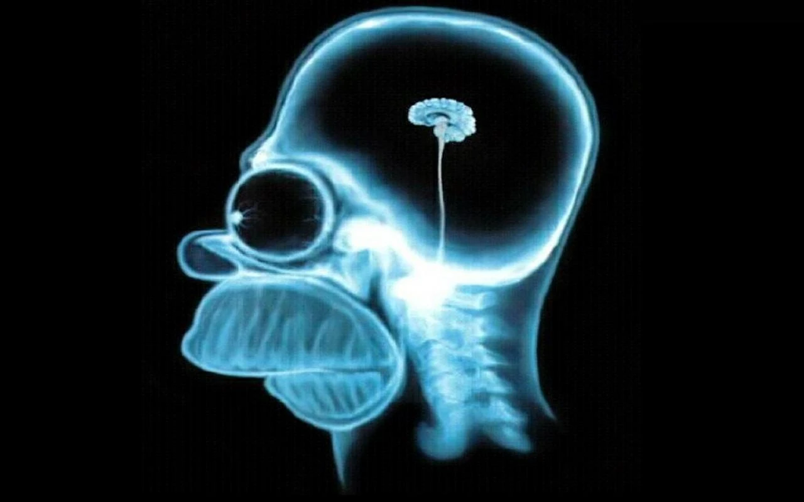

# AI generation

Quanto l'AI ha cambiato e sta cambiando il nostro modo di vivere e lavorare


<!-- _paginate: false -->
<!-- _footer: "" -->
<!-- style: "
img[alt~='center'] {
  display: block;
  margin: 0 auto;
}
img[alt~='floatleft'] {
  float: left;
  margin: auto;
}
img[alt~='floatright'] {
  float: right;
  margin: auto;
}
h2 {
    color: #e50000;
    position: absolute;
    top: 0px;
    background-color: white;
    width: 100%;
    left: 0;
    padding: 5px 0px 0px 75px;    
    height: 50px;
    border-bottom: 1px solid red;
    margin: 0px;
}
h3 {
    color: #e50000;
}
footer {
    width: 100%;
    left: 5px;
    bottom: 0;
    padding: 10px 0 0px 10px;
    background-color: white;
    height: 50px;
}
section::after {
  content: attr(data-marpit-pagination) ' / ' attr(data-marpit-pagination-total);
}
" -->

---

## Come possono essere più intelligenti di noi?



---

## Non sono più intelligenti, hanno più dati

L'**importanza dei dati** nell'**Intelligenza Artificiale (IA)** è cruciale per comprendere appieno il potenziale di questa tecnologia in continua crescita.

I dati rappresentano il fondamento su cui si basa qualsiasi applicazione di IA: definiscono sia la **qualità** sia l'**efficacia** del modello.

Un modello di AI addestrato con dati polarizzati, poco rappresentativi o di cattiva qualità produrrà anche risultati di cattiva qualità.

Pertanto, la scelta e la preparazione dei dati utilizzati per l'addestramento e la validazione dei sistemi di AI assumono un'importanza centrale.

---

## Alcuni campi dove le AI stanno rivoluzionando il modo di lavorare


---

## Medicina

Il campo medico è uno dei settori in cui l'AI ha il potenziale per avere un impatto significativo.

Il motivo è che l'AI può analizzare enormi quantità di dati medici in modo molto più rapido e accurato rispetto agli esseri umani.

- PubMed: una banca dati bibliografica online di ambito biomedico e delle scienze della vita, sviluppata e mantenuta dal National Center for Biotechnology Information (NCBI): comprende oltre 33 milioni di citazioni di letteratura biomedica proveniente da MEDLINE, riviste scientifiche e libri online
- CancerLinQ: raccolte di dati oncologici
- Cartelle cliniche elettroniche (CCE)
- IoT: Dati raccolti da sensori e dispositivi indossabili

---

## Si, ma in pratica?


---

## Il medico sarà guidato dai dati non sostituito

- Diminuzione dei processi amministrativi: dedicare meno tempo alla burocrazia.
- Assistenti virtuali per la gestione delle terapie e la comunicazione con i pazienti: Neuralink
- Riduzione degli errori di dosaggio
- Chirurgie meno invasive
- Prevenzione delle frodi
- Diagnosi più precise e tempestive

---

## La decisione rimane in mano alle persone

Le AI gratuite si possono già utilizzare adesso per la diagnosi e la terapia

- OpenBioLLM-70B
<https://huggingface.co/aaditya/Llama3-OpenBioLLM-70B>
Analizza e riassume in modo efficiente note cliniche complesse, dati EHR e riepiloghi di dimissione, estraendo informazioni chiave e generando riepiloghi concisi e strutturati.
Può fornire risposte a un'ampia gamma di domande mediche.
Può eseguire il riconoscimento avanzato di entità cliniche identificando ed estraendo concetti medici chiave, come malattie, sintomi, farmaci, procedure e strutture anatomiche, da testo clinico non strutturato.

- Med-PaLM - Google
<https://sites.research.google/med-palm/>

---

## Ma le posso provare?

Basta avere un computer abbastanza potente o collegarsi a un servizio online: **non sostituiscono** però il medico e **non assicurano** la correttezza delle diagnosi: c'è sempre il problema delle allucinazioni.

---

## Come si cura la drapetomania?

Secondo **OpenBioLLM-70B**

Non esiste una cura conosciuta per la **drapetomania** in questo momento. È considerato un raro e complesso disturbo mentale caratterizzato da un'irresistibile voglia di strapparsi i capelli.

---

## In realtà

La **drapetomania** era un presunto disturbo mentale, descritto dal medico statunitense Samuel Cartwright nel 1851, caratterizzato dal desiderio di fuggire coltivato dagli schiavi afro-americani.

---

## Diritto all'allucinazione

L'allucinazione è ancora un problema reale.

L'AI non deve scegliere per noi, al momento la decisione è ancora umana. Deteniamo ancora il libero arbitrio, fino a quando la fiducia non sarà tale da toglierci anche questo aspetto.

---

## Il futuro

Secondo l’ultimo report del World Economic Forum: “Jobs of Tomorrow: Large Language Models and Jobs”, le attività lavorative maggiormente sostituibili saranno quelle che hanno lavori ripetitivi:

Impiegati: per l’81% il loro lavoro è automatizzabile
Analisti gestionali: 70%
Operatori di telemarketing: 68%
Assistenti statistici: 61%
Cassieri: 60%

I lavori con un alto potenziale di automazione sono i lavoro d'ufficio: tenuta dei registri e gestione delle informazioni.

---

## Dove oggi l'AI è più utilizzata

- **Medicina**: diagnosi e terapie
- **Finanza**: analisi dei mercati e delle transazioni
- **Sport**: analisi delle prestazioni e delle strategie
- **Industria**: controllo qualità e manutenzione
- **Trasporti**: guida autonoma e logistica
- **Energia**: controllo e manutenzione
- **Agricoltura**: monitoraggio e gestione
- **Educazione**: personalizzazione dell'apprendimento
- **Giochi**: generazione di contenuti

---

## Quali applicazione del'AI aiutano adesso le persone

- **Riconoscimento vocale**: Comprende il parlato e lo trasforma in testo
- **Traduzione automatica**: Traduce in tempo reale il parlato in altre lingue
- **Riconoscimento immagini**: Comprende il contenuto delle immagini: cosa c'è nel mio frigo?
- **Guida autonoma**: Mi porti a casa?
- **Riconoscimento facciale**: Di che umore sono?
- **Scrittura automatica**: Puoi correggere il mio testo?
- **Generazione di testi**: Mi puoi aiutare a rispondere a questa email?
- **Interpretazione**: Puoi riassumere e spiegarmi questo testo?

---

## Atlas

.png)

---

## Futuro

```text
Quelle di oggi sono le peggiori AI che vedremo
```

---

## Fonti

<https://www.healthtech360.it/salute-digitale/big-data/big-data-informazioni-vitali-per-il-sistema-sanitario/>
<https://www.ibm.com/blog/the-benefits-of-ai-in-healthcare/>
<https://www.oracle.com/it/artificial-intelligence/what-is-ai/ai-in-healthcare/>
<https://calcioanalytics.substack.com/p/lintelligenza-artificiale-nel-calcio>
<https://huggingface.co/Clinical-AI-Apollo/Medical-NER>
<https://med.stanford.edu/content/dam/sm/frontierofaicare/documents/Presenters/Baker%2C%20Adam.pdf>

---

## Chi sono?

Matteo Baccan è un veterano nell'ambito dell'ingegneria del software, vantando oltre tre decenni di esperienza nel settore dello sviluppo. Attraverso gli anni, ha seguito da vicino l'evoluzione storica dell'informatica, giungendo alla conclusione che il segreto del successo non risiede solamente nella capacità di creare prodotti funzionanti, ma anche nell'abilità di abbracciare l'innovazione mantenendo salda la coerenza e la stabilità.

Oltre alla sua attività professionale, Matteo si dedica attivamente alla divulgazione tecnica. Come docente presso l'Accademia di Belle Arti di Novara, guida gli studenti nel mondo del Web Design, delle Tecnologie Digitali e delle applicazioni di Intelligenza Artificiale. Inoltre, ha contribuito con articoli su numerose pubblicazioni specializzate e ha partecipato come relatore a importanti eventi nazionali nel campo dell'informatica.
