# Corso AI

Entriamo nel mondo delle AI

<!-- _paginate: false -->
<!-- _footer: "" -->
<!-- style: "
img[alt~='center'] {
  display: block;
  margin: 0 auto;
}
" -->

---

## Genesi di queste slide

Parallelamente all'esplosione dei prodotti dotati di AI, ho deciso di sintetizzare, all'interno di alcune slide, la storia di questi prodotti e parte della terminologia utilizzata nel descriverli.

Ho anche iniziato a sperimentare, all'interno del mio lavoro giornaliero, una serie di soluzioni che mi permettessero di essere più efficace e di lavorare più in fretta e meglio.

Ho quindi aggiunto altre slide che spiegassero quali prodotti utilizzare e con quale scopo.

Spero che questo lavoro possa far comprendere ad altre persone i vantaggi che l'intelligenza artificiale può offrire e possa aiutare a capire quali prodotti utilizzare nel lavoro di tutti i giorni.

---

## AI - di cosa si tratta?

__Artificial Intelligence__ è una disciplina di informatica che include metodi di apprendimento automatico, visione artificiale, linguaggio naturale e robotica.

L'obiettivo dell'AI è sviluppare algoritmi che consentano ai computer di eseguire compiti che, in precedenza, erano possibili solo per essere eseguiti da esseri umani.

AI è una disciplina interdisciplinare che coinvolge la teoria, la metodologia, la sintassi e l'ingegneria per creare sistemi intelligenti in grado di prendere decisioni complesse in ambienti complessi.

AI è spesso usata per migliorare la produttività e l'efficienza dei processi aziendali.

---

## Filosofia dell'AI

La sviluppo della AI è nato per una esigenza ben precisa: creare in una macchina un'intelligenza simile a quella di un uomo.

---

## Obiettivi dell'AI

Una AI si prefigge quindi di creare sistemi esperti: qualcosa in grado di mostrare un comportamento intelligente, in grado di imparare e consigliare  i propri utenti.

---

## Cosa contribuisce all'AI?

Esistono più discipline in grado di contribuire alla creazione di una AI: informatica, biologia, psicologia, linguistica, matematica e ingegneria.

---

## Evoluzione dell'Intelligenza Artificiale

L'Intelligenza Artificiale è stata una delle aree più innovative della scienza e della tecnologia negli ultimi decenni. La storia dell'AI può essere divisa in quattro periodi principali.

---

## 1948-1965

La fase iniziale (1948-1965): è iniziata con la pubblicazione del programma di gioco di scacchi di Alan Turing nel 1948 (Turochamp). Una serie di sviluppi di software di AI hanno seguito, come la programmazione della logica e l'apprendimento automatico.

---

## 1965-1980

Il periodo della simulazione (1965-1980): è stata la prima vera fase di ricerca. I ricercatori hanno iniziato a esplorare temi come l'elaborazione del linguaggio naturale, la visione artificiale e l'intelligenza artificiale distribuita.

---

## 1980-1990

La fase dell'intelligenza distribuita (1980-1990): è stato un periodo di enormi progressi nell'apprendimento automatico e nella ricerca sulla rete neurale artificiale.

---

## 1990-oggi

La fase moderna (1990-ad oggi): è stata una grande era di innovazioni nell'AI, con una profonda comprensione dei più importanti problemi computazionali. Le reti neurali artificiali e l'apprendimento automatico hanno portato ad alcuni dei più importanti risultati nell'AI.

---

## Capacità di calcolo

Con l'aumento delle capacità di calcolo, la ricerca ha iniziato a muoversi verso la robotica, l'intelligenza artificiale generale e l'analisi dei dati. Sono stati fatti progressi significativi nei settori della visione artificiale, della produzione automatizzata e della guida autonoma.

L'AI è diventata una parte importante della vita quotidiana, con applicazioni in tutti i campi, dal riconoscimento vocale alla diagnostica medica.

---

## Tipi di intelligenza artificiale

---

### ANI (Artificial Narrow Intelligence)

L'intelligenza artificiale stretta è un tipo di IA in cui una tecnologia ha la capacità di superare gli esseri umani in un compito ben definito. Si concentra su un singolo sottoinsieme di abilità cognitive, come la guida autonoma o il riconoscimento facciale.

---

### AGI (Artificial General Intelligence)

L'intelligenza artificiale forte o intelligenza artificiale generale è la capacità di un agente intelligente di apprendere e capire un qualsiasi compito intellettuale che può imparare un essere umano.
È l'obiettivo principale di alcune delle ricerche nell'intelligenza artificiale e un argomento comune nella fantascienza e nella futurologia.
Alcune fonti accademiche riservano il termine "IA forte" (strong AI) a quei programmi informatici in grado di essere senziente e di avere una coscienza.

<https://it.wikipedia.org/wiki/Intelligenza_artificiale_forte>

---

### ASI (Artificial Super Intelligence)

AI che è più intelligente dei migliori esseri umani in termini di velocità di elaborazione, abilità di apprendimento e capacità di risolvere problemi.

---

## AI Generativa

L'AI generativa è un tipo di AI che utilizza algoritmi di apprendimento automatico per creare nuovi contenuti, come immagini, video, testi e suoni.

Esempi di AI generative includono reti generative avversariali (GAN), reti neurali ricorrenti (RNN) e reti neurali convoluzionali (CNN).

---

## Reti Generative Avversariali

Un generative adversarial network (GAN) è un tipo di AI generativa che utilizza due reti neurali per generare nuovi contenuti. Una rete genera nuovi contenuti e l'altra rete cerca di rilevare se il contenuto è stato generato o meno.

---

## Reti neurali ricorrenti

Le reti neurali ricorrenti (RNN) sono una classe di algoritmi di apprendimento automatico che sono particolarmente adatte ai problemi di classificazione e previsione su dati sequenziali. Si basano su una tecnica di apprendimento automatico chiamata "Backpropagation Through Time" (BPTT) che consente alle reti di imparare le relazioni tra gli input e gli output nel tempo. Le RNN possono essere utilizzate per problemi di classificazione, previsione, riconoscimento delle parole e altro ancora.

---

## Reti neurali convoluzionali

Le reti neurali convoluzionali (ConvNets o CNN) sono un tipo di reti neurali profonde che sono state progettate per elaborare dati strutturati come immagini, suoni ed altri tipi di dati. Sono costituite da una serie di strati di neuroni, ciascuno dei quali è responsabile della rilevazione di caratteristiche specifiche nei dati di input. Queste caratteristiche vengono poi elaborate dai successivi strati di neuroni in modo da ottenere una rappresentazione dei dati di input.

---

## Utilizzo

Le reti generative sono state utilizzate per creare nuovi contenuti in una varietà di settori, tra cui la produzione di film, la produzione di musica, la produzione di videogiochi e la produzione di arte.

---

## Come valutiamo le AI?

---

## Test di Turing

Il test di Turing è un modo per determinare se un computer è in grado di pensare in modo intelligente come un essere umano. Il test è stato sviluppato da Alan Turing, un matematico britannico, nel 1950 ed è considerato uno dei primi esempi di intelligenza artificiale.

Il test di Turing è una conversazione tra un giudice umano e due partecipanti, un umano e un computer. Il giudice non sa quale delle due parti è l'umano e quale il computer. Se il giudice non è in grado di determinare la differenza, viene considerato che il computer è intelligente come un essere umano.

---

## Qualche software ha passato il test di Turing?

Nel dicembre 2022, ChatGPT è diventato il secondo chatbot ad aver superato il Test di Turing, secondo Max Woolf, uno scienziato dei dati di BuzzFeed.
ChatGPT ha vinto il test di Turing, mentre l'IA di Google, LaMDA, ha superato il Test di Turing nell'estate del 2022.

<https://mpost.io/chatgpt-passes-the-turing-test/>

---

## Alan Turing

Alan Turing è stato un noto matematico, filosofo, criptoanalista, e informatico inglese.

Ha ideato diversi importanti concetti di informatica, tra cui l'algoritmo di decifrazione della macchina di Enigma durante la Seconda Guerra Mondiale.

Ha contribuito allo sviluppo del computer e del calcolatore moderno. Ha anche lavorato alla teoria della computabilità e ha sviluppato alcune delle prime teorie sull'intelligenza artificiale.

---

## La morte di Alan Turing

L'8 giugno 1954, la domestica di Turing, Eliza Clayton, lo trovò morto nel suo letto.

Il medico legale stabilì che la morte era avvenuta il giorno prima. Un esame post mortem stabilì la causa del decesso nell'avvelenamento da cianuro di potassio.

Al momento della scoperta, vicino al letto, accanto al suo orologio, fu trovata una mela, come era sua abitudine, non terminata.

---

## Leggenda urbana

<https://it.wikipedia.org/wiki/Apple>

---

## Applicazioni della AI

---

## Applicazioni dell'AI - 1

- Gioco - La macchina può pensare a un gran numero di possibili posizioni basate sulla conoscenza.
Magnus Carlsen : Elo 2800-2900
Per quanto riguarda i software: Stockfish 11 ha un ELO di 3500, mentre lo Komodo 13.1 ha un ELO di 3477.

- Elaborazione del linguaggio naturale - È possibile interagire con il computer che comprende il linguaggio naturale parlato dagli esseri umani.

- Sistemi esperti - Forniscono spiegazioni e consigli agli utenti.

- Sistemi di visione − Riconoscimento di oggetti

---

## Applicazioni dell'AI - 2

- Diagnosi - I medici utilizzano il sistema esperto clinico per diagnosticare il paziente.

- Riconoscimento facciale - I software usati dalla polizia per convertire i ritratti di artisti forensi in foto

- Riconoscimento vocale - come Alexa e Siri

- Riconoscimento della scrittura a mano - Google translate

- Robot intelligenti - Robocup, robot autonomi in grado di giocare a pallone

---

## Metodi fondamentali per un meccanismo di AI

---

## Natural Language Processing (NLP)

Si riferisce al metodo AI di comunicare con un sistema intelligente utilizzando un linguaggio naturale.

---

## Natural Language Understanding (NLU)

La comprensione implica i seguenti compiti:

- Mappare l'input dato in linguaggio naturale in rappresentazioni utili.
- Analizzare diversi aspetti della lingua.

---

## Natural Language Generation (NLG)

È il processo di produzione di frasi e frasi significative sotto forma di linguaggio naturale da una rappresentazione interna.

- Pianificazione del testo: include il recupero del contenuto pertinente dalla knowledge base.

- Pianificazione della frase - Include la scelta delle parole richieste, la formazione di frasi significative, l'impostazione del tono della frase.

- Realizzazione del testo - È la mappatura del piano della frase nella struttura della frase.

---

## Servizi basati su AI

---

## Servizi di supporto ai testi

---

## ChatGPT

- ChatGPT : lo scopo è quello di creare un chatbot che risponde in modo fluido che risponda come se fosse una persona

GPT è l'acronimo di __Generative Pre-trained Transformer__, una nuova classe di modelli di linguaggio naturalmente sviluppati da OpenAI utilizzati per generare testo.

---

## AI Parameters

<https://www.merkle.com/in/blog/ai-search-what-openais-gpt-3-means-google-and-seo-0>

---

## e domani?

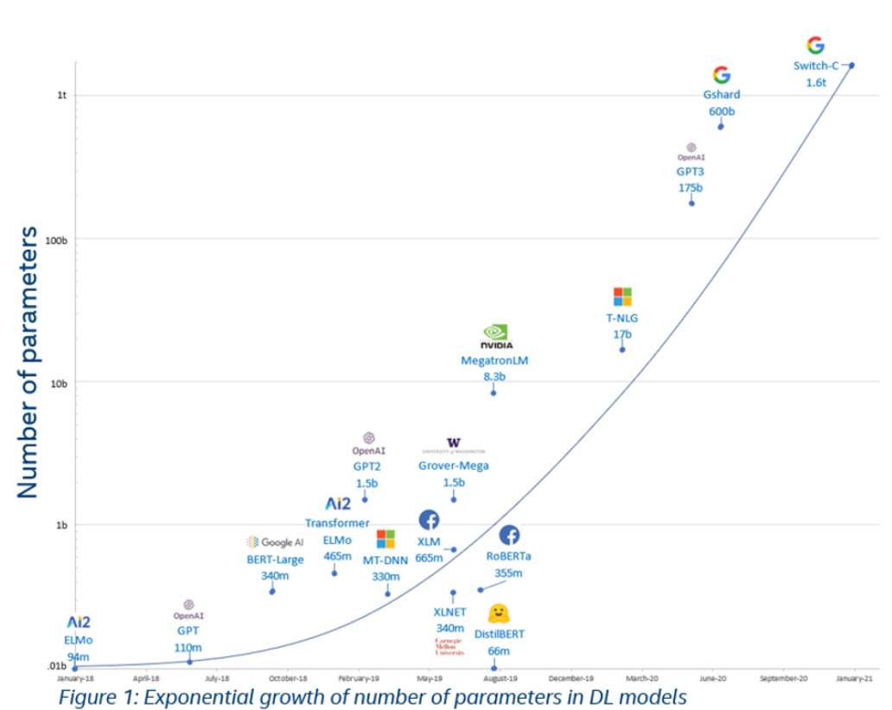

<https://spyro-soft.com/blog/tomasz-smolarczyk-the-future-of-ai>

---

## ChatGPT - perché SI

- Definizioni tecniche
- Spiegazioni: è possibile modificare il target
- Riduce la distanza fra domanda e risposta: meno click per la risposta
- Riesce a produrre del codice in base a una richiesta: interpreta il testo e scrive il codice
- Traduzioni: compresi i dialetti
- Sintesi di un testo
- Supporto alla creazione di slide, documenti, esercizi, testi teatrali, poesie, canzoni.

---

## ChatGPT - perché NO

- La sua conoscenza è ferma al 2021
- Non è in grado di fare analisi di dati
- Il codice prodotto deve essere analizzato e integrato
- A volte inventa le risposte e lo dichiara su richiesta
- Non ha accesso a internet per attingere a nuove informazioni
- I testi che scrive al momento sono discreti, meglio estenderli ed adattarli
- Troppo rispettoso del suo utilizzatore

---

## Scrivi il testo di una canzone di Tiziano Ferro?

    Non me lo so spiegare

    Qualcosa dentro me che
    Non riesco a spiegare
    Sono le parole che
    Non riesco a trovare
    Sento dentro me
    Che qualcosa non va

    Ma non me lo so spiegare

    Sono parole che
    Non riesco a dire
    Sono sogni che
    Non riesco a fare
    Sento dentro me
    Che qualcosa non va

    Ma non me lo so spiegare

    Eppure mi sento come in cielo
    Sento una voce dentro che mi dice

---

## Scrivi una cold letter sulla vendita del mio servizio di conteggio delle macchie dei panda?

    Gentile cliente,

    Siamo lieti di presentarvi il nostro servizio di conteggio delle macchie dei panda.

    Il nostro servizio è unico nel suo genere ed è stato progettato appositamente per aiutarvi a monitorare i panda
    in modo accurato e efficiente. Utilizziamo una tecnologia avanzata di intelligenza artificiale che monitora
    costantemente i panda per contare le macchie sulla loro pelliccia. Inoltre, offriamo una vasta gamma di
    funzionalità che vi permetteranno di ottenere una migliore comprensione dei vostri panda.

    Con il nostro servizio, potrete:

    Monitorare i panda in tempo reale
    Contare le macchie dei panda in modo preciso
    Ottenere statistiche dettagliate sui vostri panda
    Ricevere notifiche quando ci sono cambiamenti significativi
    Accedere a risultati storici sui vostri panda
    Siamo convinti che il nostro servizio vi aiuterà a monitorare meglio i vostri panda, rendendo più semplice
    la gestione delle loro macchie. Se avete domande o desiderate saperne di più, non esitate a contattarci.

    Cordiali saluti,
    Il team di conteggio delle macchie dei panda

---

## Dobbiamo fidarci?

"È importante essere prudenti con qualsiasi software di terze parti, incluso ChatGPT. Prima di fidarsi di un programma, è consigliabile esaminare attentamente le sue funzionalità e le sue politiche sulla privacy. Inoltre, è importante assicurarsi di disporre di una solida conoscenza dei termini di servizio del programma e di avere sufficienti conoscenze tecniche per configurarlo correttamente."

Ho chiesto direttamente a __ChatGPT__

---

## ChatGPT sostituisce Google?

Al momento (gennaio 2023) non sostituisce Google ... __al momento__

---

## Integrazioni

- Plugin per browser
- Generatori di libri <https://github.com/mikavehns/BookGPT>
- Tastiera IOS <https://auri.ai/>
- Raccolte di prompt <https://flowgpt.com/>
- Text Editor

Per approfondimenti

<https://discord.com/channels/974519864045756446/1037561385070112779/threads/1062015322699354173>

---

## SudoWrite - l'aiuto ai copywriter

" SudoWrite is the best AI tool for creative writers"

<https://www.sudowrite.com>

Il suo compito è quello di: riscrivere, ampliare, continuare dei testi scritti dagli utenti.
Utile al lavoro di copywriter: permette di espandere le proprie idee e superare i momenti di blocco.

---

## Era una notte buia e tempestosa

    Era una notte buia e tempestosa e i nostri eroi si trovavano isolati in una
    tranquilla villetta ai piedi di un promontorio inesplorato.

    La mattina successiva Pippo avrebbe scalato per la prima volta il promontorio,
    ma qualcosa non lo fece dormire la notte.

---

## Era una notte buia e tempestosa - riscritta ed ampliata

    Era una notte buia e tempestosa, ed i nostri eroi si trovavano in un grazioso cottage alla base di un
    promontorio inesplorato. Pippo avrebbe scalato il promontorio la mattina seguente, ma non riusciva a prendere
    sonno. La tempesta ululava fuori come un lupo alla ricerca della preda e il vento soffiava sempre più forte
    finché qualcosa penetrò nella finestra e cadde con un tonfo a terra.

    "Pippo!" gridò Maria. "Credo che ci stiano derubando!"

    Il vento urlava attraverso il cottage, aprendo porte, frantumando finestre, disperdendo fogli per terra. Uno
    dei fogli galleggiò verso Pippo, soffiando nei suoi occhi. Lo spinse via e mentre lo faceva un volto apparve
    dietro di esso.

    "Saluti", disse il volto in un'antica lingua che nessuno di loro riconobbe. Si guardarono l'un l'altro per
    qualche istante finché Pippo non tese la mano per stringere quella dell'altro.

---

## Heypi.com

Il funzionamento è simile a CharGTP, ma oltre a scrivere è in grado di parlare.

Si puo' chattare con Heypi, ma non è in grado di scrivere codice o di dare informazioni in modo approfondito come ChatGPT

<https://heypi.com/talk>

---

## SlidesAI.io

Permette di risparmiare tempo per creare presentazioni professionali e coinvolgenti.
Con pochi clic è possibile trasformare qualsiasi parte di testo in diapositive visivamente accattivanti, perfette per ogni occasione.

Esempio: SlidesAI.io/Esempio.pdf

---

## Beautiful.ai

Permette di creare delle slide, partendo da delle descrizioni

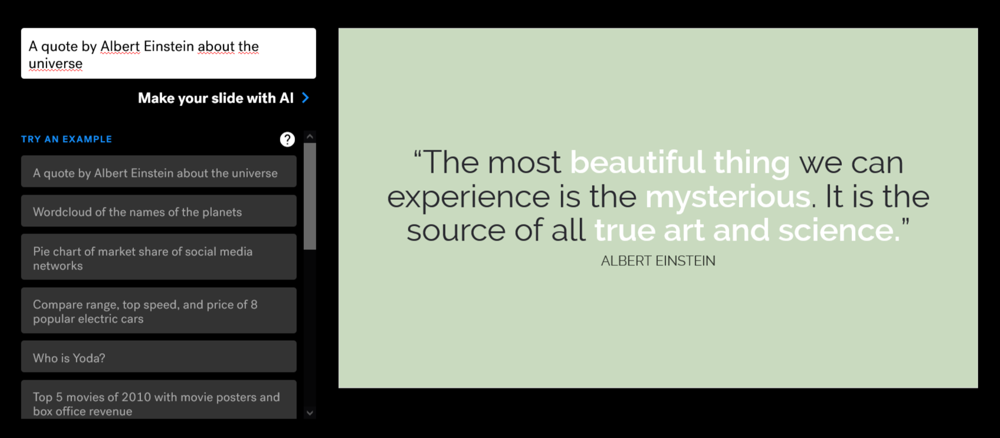

<https://www.beautiful.ai/>

---

## ChatPDF

ChatPDF prende in input un documento PDF, lo analizza e permette successivamente di fare domande sul testo analizzato

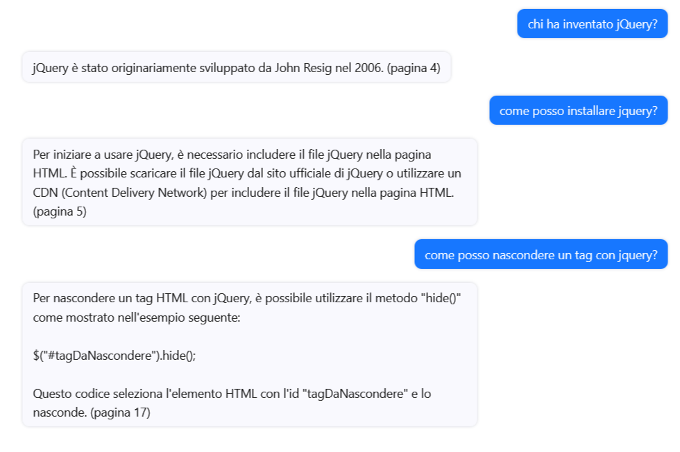

<https://www.chatpdf.com/>

---

## Alternative a ChatPDF

<https://lightpdf.com/chatdoc>

---

## Servizi di supporto alla creazione di video

---

## Synthesia

Crea un video, partendo da un testo in pochi minuti.

Synthesia è la piattaforma di creazione di video tramite AI. I video sono creabili in 120 lingue diverse, con avatar diversi.

<https://www.synthesia.io/>

---

## Synthesia e il nostro corso

<video src="img/Synthesia%20STUDIO%20Your%20AI%20video.mp4" controls width="900px"/></video>

---

## Fra fantascienza e realtà

Chi ha seguito la serie TV: Upload?

Upload è una serie televisiva statunitense di fantascienza drammatica creata da Greg Daniels per Amazon Prime Video. La serie segue il protagonista Nathan Brown che, dopo aver avuto un incidente, viene caricato in un paradiso digitale. Una volta lì, gli viene dato l'accesso a una vita virtuale con l'aiuto di un'intelligenza artificiale chiamata Nora

E Avatar 2?

Il colonnello Miles Quaritch viene clonato in un corpo Na'vi e dotato degli stessi ricordi del suo sé originale, che aveva caricato su un hard drive prima di morire.

---

## DeepBrain

Qualcuno ha pensato che l'idea era interessante e ha creato un servizio basato su AI. che cattura la vostra immagine, le espressioni del vostro volto, la vostra voce e dopo qualche ora di chiacchierata anche i vostri ricordi.

A cosa server? A creare un vostro io virtuale col quale i vostri famigliari potranno parlare dopo la vostra morte.

Quanto costa: i costi oscillano fra 12 e 20 mila dollari.

<https://www.deepbrainai.io>

---

## Neural Frames

Grazie alle AI è possibile convertire del testo in un video.

<video src="img/NeuralFrames.mp4" controls width="400px"/></video>

<https://www.neuralframes.com/>

---

## Neural Frames2

<video src="img/NeuralFrames2.mp4" controls width="500px"/></video>

---

## Servizi di supporto alla creazione di immagini

---

## AI e immagini digitali

Una delle applicazioni più interessanti dell'AI è la capacità di trasformare le immagini.

Le tecniche di AI possono essere utilizzate per aumentare le prestazioni delle immagini, ridurre il rumore, migliorare la nitidezza e l'accuratezza e persino modificare la struttura dell'immagine. Una delle applicazioni più comuni dell'AI nell'elaborazione delle immagini è il riconoscimento delle immagini, che consente di identificare determinati oggetti all'interno di un'immagine.

Altre applicazioni in questo campo sono

- la generazione di immagini
- la classificazione delle immagini
- la segmentazione delle immagini

---

## DALL·E 2 - AI Generativa

DALL·E 2 può creare immagini e opere d'arte originali e realistiche a partire da una descrizione testuale. Può combinare concetti, attributi e stili.

---

## “disegna giorgia meloni in stile simpson”

---

## “High quality photo of a panda astronaut”

---

## Midjourney

Midjourney è un laboratorio di ricerca indipendente che produce un programma di intelligenza artificiale con lo stesso nome che crea immagini da descrizioni testuali, simile a DALL-E e Stable Diffusion di OpenAI.

Si ipotizza che la tecnologia sottostante sia basata sulla Stable Diffusion.

---

## Midjourney - come funziona?

Midjourney è attualmente accessibile solo tramite un bot Discord sul loro Discord ufficiale, inviando messaggi diretti al bot o invitando il bot a un server di terze parti.

Per generare immagini, gli utenti utilizzano il comando

    /imagine

e digitano un prompt; il bot restituisce quindi un set di quattro immagini.

Gli utenti possono quindi scegliere quali immagini desiderano eseguire l'upscaling.

---

## Super realistic Italian Boy

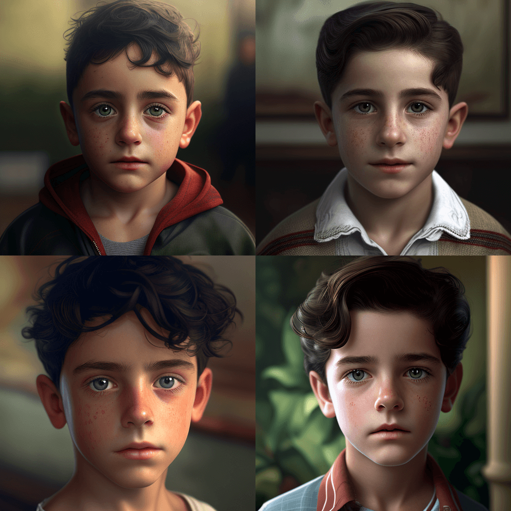

---

## Super realistic Italian Boy - upscale

---

## Realistic image of a luxurious bedroom with a soft bed, gray comforter and white white pillows

---

## Laughing dinasours

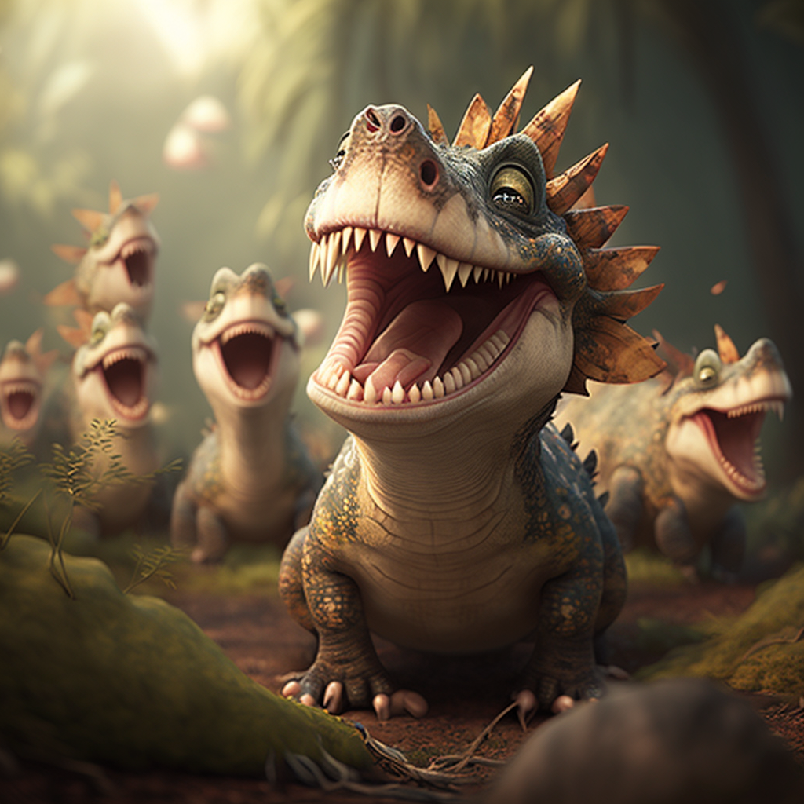

---

## Un uomo di mezza età, intenso, con luci da cinema, visione a mezzo busto,  inquadra la telecamera e un volto molto dettagliato unreal engine --q 2

---

## Midjourney Cheat Sheet

Per migliorare la qualità dei vostri lavori, c'è chi ha iniziato a raccogliere dei prompt

<https://arjenharris.notion.site/arjenharris/Midjourney-Cheat-Sheet-271922c6869549898ead33eaf79517fa>

---

## TikTok filtro AI Manga - AI Trasformativa

Il filtro di TikTok di "Ai Manga" è un filtro creativo, basati sull'intelligenza artificiale, progettato per aiutare gli utenti a creare contenuti coinvolgenti.

Questo filtro consentono agli utenti di trasformare le loro foto in stili manga, anime o persino fumetti.

---

## Huggy Wuggy - Originale

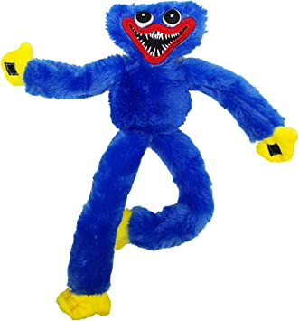

---

## Huggy Wuggy - by mia figlia

---

## Huggy Wuggy - by AI Manga

---

## Proviamo il filtro con un'immagine migliore

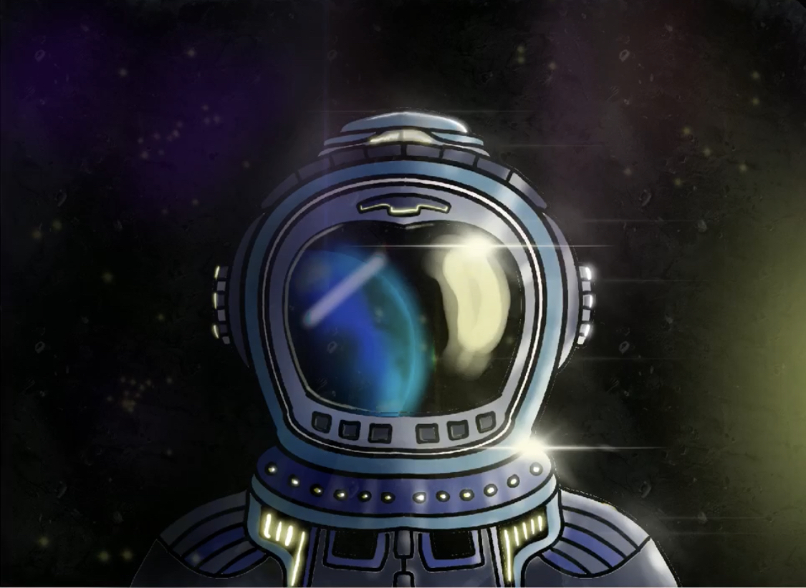

---

## Astronauta AI Manga

---

## DreamStudio

Dream Studio è un'interfaccia facile da usare per la creazione di immagini usando l'ultima versione del modello di generazione di immagini Stable Diffusion. Stable Diffusion è un modello veloce ed efficiente per creare immagini da testo che comprende le relazioni tra parole e immagini. Può creare immagini di alta qualità di qualsiasi cosa si possa immaginare in pochi secondi - basta digitare un prompt di testo e premere Dream.

<https://beta.dreamstudio.ai>

---

## Kandinsky

Disegni l'immagine un gatto in stile Kandinsky

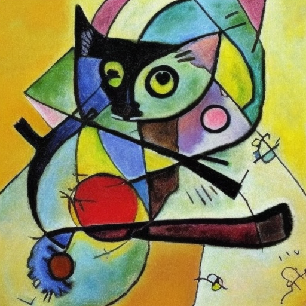

---

## Van Gogh

Disegni l'immagine un gatto in stile Van Gogh

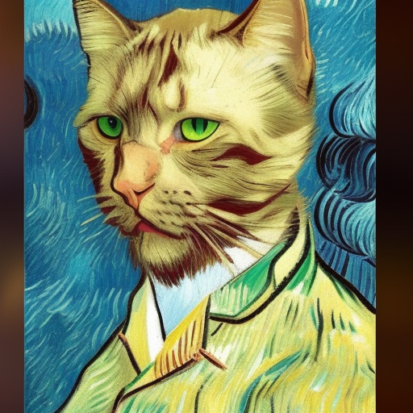

---

## Andy Warhol

Disegni l'immagine un gatto in stile Andy Warhol

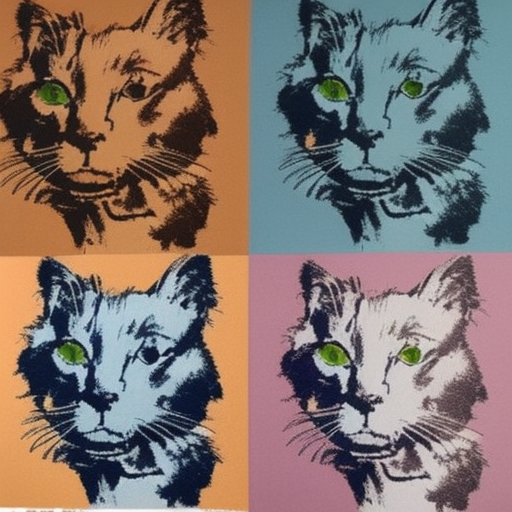

---

## Edvard Munch

Disegni l'immagine un gatto in stile Edvard Munch

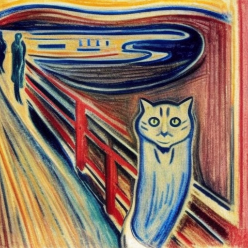

---

## Valentino Rossi

Realizzi __Valentino Rossi__ che mangia un gelato

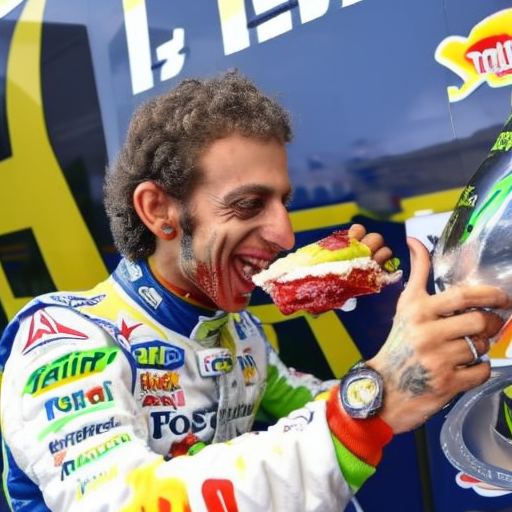

---

## This *** does not exist

Sono una serie di siti web in grado di generare persone, gatti, cavalli e strutture chimiche che non esistono, basandosi su una AI alimentata da StyleGAN, una rete neurale di Nvidia sviluppata in 2018.

GAN consiste di 2 reti neurali concorrenti, una genera qualcosa e la seconda cerca di trovare se i risultati sono reali o generati dal primo.

L'allenamento termina quando la prima rete neurale inizia a ingannare costantemente il secondo.

---

<https://thispersondoesnotexist.com/>

---

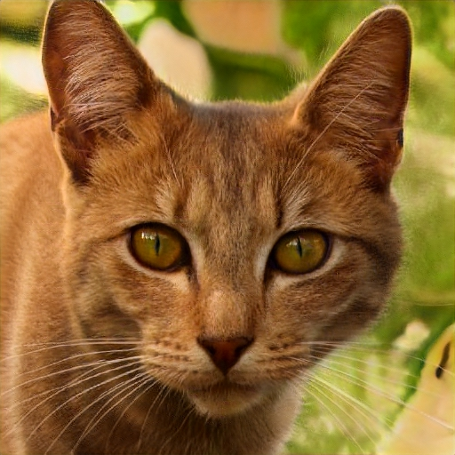

<https://thiscatdoesnotexist.com/>

---

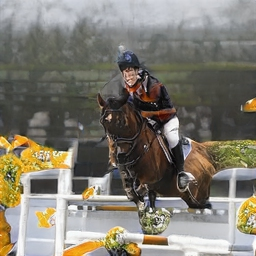

<https://thishorsedoesnotexist.com/>

---

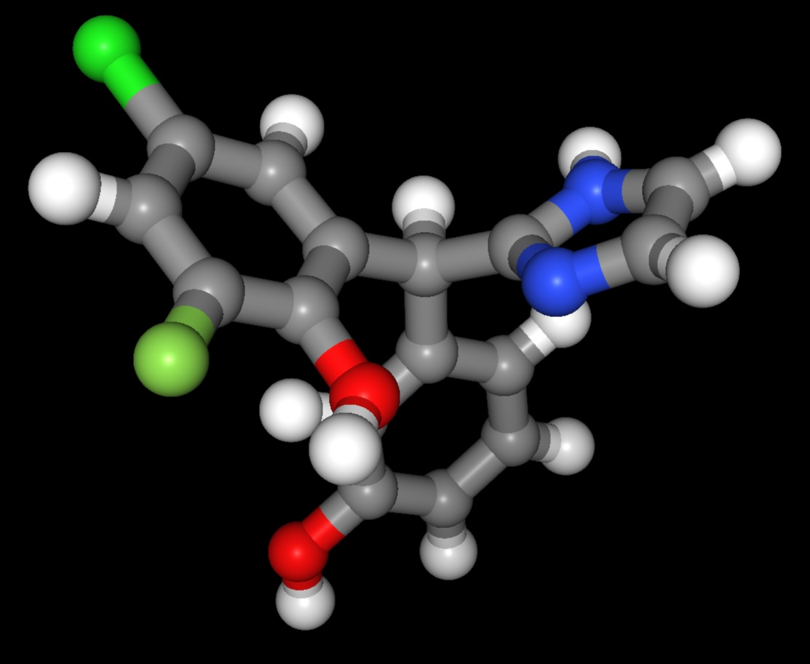

<https://thischemicaldoesnotexist.com/>

---

## Servizi di supporto alla creazione di audio

---

## Vocal Remover

Vocal Remover: tramite una AI è possibile separare la musica dalla parte cantata.
Si poteva fare anche prima, ma ora si puo' fare online, con una AI.

<https://vocalremover.org/it/>

---

## FakeYou

La tecnologia deep fake di FakeYou permette di far dire ai tuoi personaggi preferiti qualsiasi frase.

Oltre a questo è possibile caricare un audio e farlo pronunciare ad una serie di personaggi: l'aspetto interessante è la sincronizzazione fra parole e movimenti delle labbra.

<https://fakeyou.com/>

---

## FakeYou - esempio

L'intelligenza artificiale è una disciplina informatica che include metodi di apprendimento automatico, visione artificiale, linguaggio naturale e robotica.

Papa Francesco apprezza il corso di AI

---

## MusicLM

MusicLM, un modello che genera musica di alta fedeltà da descrizioni testuali come "una melodia rasserenante suonata al violino accompagnata da un riff distorto di chitarra".
MusicLM considera il processo di generazione di musica condizionata come un compito di modellazione sequenza-sequenza gerarchico e genera musica a 24 kHz che rimane coerente per diversi minuti.
MusicLM può essere condizionato sia al testo che alla melodia in quanto può trasformare le melodie fischiate e cantate secondo lo stile descritto in una didascalia.

__Al momento__ il progetto non è ancora pubblico, se non per i risultati ottenuti.

<https://google-research.github.io/seanet/musiclm/examples/>

---

## Soundraw.io

Si tratta di una intelligenza artificiale in grado di creare delle music partendo dal genere, ritmo e durata. Ogni pezzo creato può essere successivamente customizzato.

I brani prodotti sono senza copyright e possono essere liberamente utilizzati.

<https://soundraw.io/>

---

## WebDesign e AI

Esistono alcuni strumenti che possono rendere obsoleto il lavoro del WebDesign, almeno in alcuni contesti.

---

## Durable

Durable è un site builder basato su AI. Può costruire un sito completo in 30 secondi utilizzando gli spunti generati da una AI.

Verifica la provenienza della richiesta, il settore di appartenenza e genera un sito vetrina in pochi secondi inventando completamente i contenuti.

<https://durable.co>

---

## Uizard.io

Uno strumento che permette di creare un sito web, partendo da un'immagine.

Rappresenta un valido aiuto per chi vuole disegnare l'interfaccia ed utilizzare successivamente uno strumento in grado di trasformala in codice.

<https://uizard.io/>

---

## Dove studiare per approfondire l'argomento

---

## Libri dove approfondire - 1

Questa lista deriva da un post di [Matteo Flora](https://matteoflora.com/) come spunto nello studio delle AI

- Per imparare le basi dell'AI: "Artificial Intelligence: A Modern Approach" di Stuart Russell e Peter Norvig. Copre tutti gli aspetti dell'intelligenza artificiale, dalle tecniche di base alle applicazioni più avanzate. Il libro discute in modo dettagliato le tecniche di apprendimento automatico, l'elaborazione del linguaggio naturale, l'ottimizzazione dei sistemi di ricerca, la visione artificiale, la robotica, l'intelligenza artificiale distribuita e le reti neurali.

- "GPT-3: Building Innovative NLP Products Using Large Language Models".
Questo libro offre una panoramica dei modelli di linguaggio di grandi dimensioni, come l'utilizzo di GPT-3, nonché esempi pratici di come tali modelli possano essere usati per lo sviluppo di prodotti di Natural Language Processing (NLP).

---

## Libri dove approfondire - 2

- Per capire come l'IA sta cambiando il mondo attuale "The Fourth Industrial Revolution" di Klaus Schwab.
Esplora come la tecnologia stia trasformando il mondo in cui viviamo. In particolare, Schwab si concentra su come la tecnologia sta cambiando la natura del lavoro, la società, la politica ed economica.

- "The Future of Work: Robots, AI, and Automation" di Darrell M. West è un libro che esplora l'IA e la robotica
In questo libro vengono esaminate le questioni tecnologiche e le implicazioni sociali legate a lavori come l'intelligenza artificiale (AI), la robotica, l'automazione e l'Internet of Things (IoT).

---

## Libri dove approfondire - 3

- "The Age of Spiritual Machines" di Ray Kurzweil è un libro che esplora come l'IA potrebbe influire sull'umanità in un futuro prossimo.
Un libro di riferimento per gli studenti, i ricercatori e gli sviluppatori di intelligenza artificiale. Copre tutti gli aspetti dell'intelligenza artificiale, dalle fondamenta teoriche ai sistemi di intelligenza artificiale più avanzati.

- "The Singularity is Near", di Ray Kurzweil.
Kurzweil affronta la possibilità di un "singularity" tecnologico, in cui la tecnologia supera l'intelligenza umana, diventando la forza dominante nella società.

---

## Libri dove approfondire - 4

- "The Future of Humanity" di Michio Kaku è un libro che esplora come la scienza e la tecnologia stanno influenzando il futuro dell'umanità.
Una guida dettagliata su come l'intelligenza artificiale, la biologia sintetica, l'ingegneria genetica e altre tecnologie futuristiche potrebbero cambiare il nostro futuro

- "Superintelligence: Paths, Dangers, and Strategies" il libro scritto da Nick Bostrom - il "filosofo dell'Apocalisse" - nel 2014 che esplora i potenziali pericoli e benefici dell'intelligenza artificiale superintelligente.

---

## Fonti usate per la creazione di queste slide

<https://github.com/matteobaccan/awesome-ai> : La mia lista ragionata di AI
<https://github.com/ai-collection/ai-collection> : una lista molto completa di AI
<https://chat.openai.com> : ChatGPT
<https://it.wikipedia.org> : definizioni e argomenti
<https://www.tutorialspoint.com/artificial_intelligence/> : Tutorial AI
<https://flowgpt.com/> : Esempi di prompt per ChatGPT
<https://www.youtube.com/watch?v=sVvGZDoEEeQ> : 1100. Che cosa sono GPT, GPT-3 e ChatGPT e cosa possono fare? Introduzione semplice in italiano!
<https://aaronsim.notion.site/b4f5dd304d9a4683a70167b6cc4b94f1?v=6cc0bd8ce4f04f26ad088e44c910b167> : elenco di prodotti basati su AI
<https://letsview.com/ai-tools> : Directory di prodotti AI

Ogni immagine inserita riporta la fonte

---

## Disclaimer

L'autore ha generato questo testo in parte con GPT-3, il modello di generazione del linguaggio su larga scala di OpenAI. Dopo aver generato la bozza della lingua, l'autore ha rivisto, modificato e rivisto la lingua a proprio piacimento e si assume la responsabilità ultima del contenuto di questa pubblicazione.
