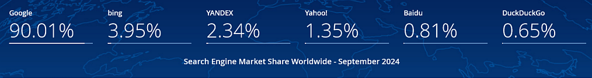

# Corso AI

Entriamo nel mondo delle AI


<!-- _paginate: false -->
<!-- _footer: "" -->
<!-- style: "
img[alt~='center'] {
  display: block;
  margin: 0 auto;
}
img[alt~='floatleft'] {
  float: left;
  margin: auto;
}
img[alt~='floatright'] {
  float: right;
  margin: auto;
}
h2 {
    color: #e50000;
    position: absolute;
    top: 0px;
    background-color: white;
    width: 100%;
    left: 0;
    padding: 0px 0px 5px 75px;
    height: 50px;
    border-bottom: 1px solid red;
    margin: 0px;
}
h3 {
    color: #e50000;
}
footer {
    width: 100%;
    left: 5px;
    bottom: 0;
    padding: 0 0 10px 10px;
}
" -->

---

## Come nascono queste slide

In risposta alla rapida diffusione di prodotti basati sull'Intelligenza Artificiale, ho elaborato una presentazione che ripercorre l'evoluzione di questa tecnologia e illustra i termini chiave utilizzati nel settore.

Nel corso della mia attività professionale, ho inoltre sperimentato diverse soluzioni AI che mi hanno permesso di ottimizzare i processi lavorativi, aumentando sia l'efficienza che la qualità dei risultati.

Ho quindi arricchito la presentazione con una sezione pratica dedicata ai vari strumenti AI, specificando per ciascuno il campo di applicazione ideale.

L'obiettivo di questo lavoro è duplice: da un lato, far conoscere i benefici concreti che l'Intelligenza Artificiale può apportare nella vita professionale, dall'altro, fornire una guida pratica per la scelta degli strumenti AI più adatti alle diverse esigenze lavorative quotidiane.

---

## Chi sono ?

Matteo Baccan è un ingegnere del software e formatore professionista con oltre 30 anni di esperienza nel settore IT.
Ha lavorato per diverse aziende e organizzazioni, occupandosi di progettazione, sviluppo, testing e gestione di applicazioni web e desktop, utilizzando vari linguaggi e tecnologie. È anche un appassionato divulgatore e insegnante di informatica, autore di numerosi articoli, libri e corsi online rivolti a tutti i livelli di competenza.
Gestisce un sito internet e un canale YouTube dove condivide video tutorial, interviste, recensioni e consigli sulla programmazione.
Attivo nelle community open source, partecipa regolarmente a eventi e concorsi di programmazione.
Si definisce un "sognatore realista" che ama sperimentare, innovare e condividere le sue conoscenze e passioni, seguendo il motto: "Non smettere mai di imparare, perché la vita non smette mai di insegnare".

---

## AI - di cosa si tratta?

L'**Intelligenza Artificiale** (AI) è una branca dell'informatica che abbraccia diverse discipline, tra cui l'apprendimento automatico, la visione artificiale, l'elaborazione del linguaggio naturale e la robotica.

Il suo scopo principale è sviluppare algoritmi che permettano ai computer di svolgere attività tradizionalmente eseguibili solo dall'intelletto umano. Si tratta di una scienza interdisciplinare che integra teoria, metodologia, analisi del linguaggio e ingegneria per creare sistemi intelligenti capaci di prendere decisioni articolate in scenari complessi.

Nel contesto aziendale, l'Intelligenza Artificiale si rivela uno strumento prezioso per ottimizzare i processi lavorativi, incrementando sia la produttività che l'efficienza operativa.

---

## Cosa contribuisce all'AI?

Esistono pi√π discipline in grado di contribuire alla creazione di una AI: informatica, biologia, psicologia, linguistica, matematica e ingegneria.

---

## Evoluzione dell'Intelligenza Artificiale

L'Intelligenza Artificiale è stata una delle aree più innovative della scienza e della tecnologia negli ultimi decenni. La storia dell'AI può essere divisa in quattro periodi principali.

---

## 1948-1965

La fase iniziale (1948-1965): è iniziata con la pubblicazione del programma di gioco di scacchi di Alan Turing nel 1948 (Turochamp).

Questo programma è stato il primo a utilizzare un algoritmo di ricerca per trovare la mossa migliore in una posizione di scacchi. Il programma di Turing è stato seguito da altri programmi di gioco di scacchi, come il programma di gioco di scacchi di Claude Shannon nel 1950 (Shannon's Chess Program) e il programma di gioco di scacchi di John McCarthy nel 1951 (McCarthy's Chess Program).

---

## 1965-1980

Il periodo della simulazione (1965-1980): è stata la prima vera fase di ricerca. I ricercatori hanno iniziato a esplorare temi come l'elaborazione del linguaggio naturale, la visione artificiale e l'intelligenza artificiale distribuita.

---

## 1980-1990

La fase dell'intelligenza distribuita (1980-1990): è stato un periodo di enormi progressi nell'apprendimento automatico e nella ricerca sulla rete neurale artificiale.

---

## 1990-oggi

La fase moderna (1990-ad oggi): è stata una grande era di innovazioni nell'AI, con una profonda comprensione dei più importanti problemi computazionali. Le reti neurali artificiali e l'apprendimento automatico hanno portato ad alcuni dei più importanti risultati nell'AI.

---

## Capacità di calcolo

Con l'aumento delle capacità di calcolo, la ricerca ha iniziato a muoversi verso la robotica, l'intelligenza artificiale generale e l'analisi dei dati. Sono stati fatti progressi significativi nei settori della visione artificiale, della produzione automatizzata e della guida autonoma.

L'AI è diventata una parte importante della vita quotidiana, con applicazioni in tutti i campi, dal riconoscimento vocale alla diagnostica medica.

---

## AI  - Da cosa è composta


<https://en.m.wikipedia.org/wiki/File:AI_relation_to_Generative_Models_subset,_venn_diagram.png>

---

## Cos'è il Machine Learning?

In principio esistevano algoritmi hard-coded e regole fisse che si sono dimostrate inadeguate per compiti come riconoscimento di immagini e trattamento del testo

La soluzione è stata quella di simulare il processo di apprendimento umano attraverso il machine learning, in questo modo gli algoritmi imparano da una vasta quantità di dati: vengono addestrati dei modelli in base a dei dati di input.

Questo processo è analogo all'apprendimento umano, dove si inizia con conoscenze basilari e si progredisce verso livelli più avanzati. Inoltre, per affrontare compiti ancora più complessi, è stata introdotta l'idea di imitare il cervello umano attraverso reti neurali.

Queste reti consentono alle macchine di apprendere in modo simile all'elaborazione dei dati da parte dell'essere umano, ampliando così le capacità dell'IA.

---

## Eliza

ELIZA è un chatbot scritto nel 1966 da Joseph Weizenbaum. Il bot consiste in un analizzatore lessicale e un insieme di regole che permettono di simulare una conversazione in inglese, gallese o tedesco.

Lo script più noto, spesso erroneamente identificato con ELIZA, è DOCTOR, che imita un terapeuta rogersiano.

ELIZA procedeva analizzando e sostituendo semplici parole chiave in frasi preconfezionate. A seconda delle parole che l'utente immetteva nel programma, l'illusione di un interlocutore umano veniva smascherata o poteva continuare per diverse battute. Talvolta risultava talmente convincente che alcune persone erano così convinte di comunicare con un essere umano, da insistere per parecchi minuti.

<https://it.wikipedia.org/wiki/ELIZA_(chatterbot)>

---

## Eliza - foto


---

## Tipologie di Machine Learning

- Unsupervised Learning
    I dati non sono etichettati e il modello deve trovare da solo i pattern e relazioni.

- Supervised Learning
    I dati sono catalogati ed etichettati: ed esempio immagini e loro rappresentazione. Il modello acquisisce competenza in base a quanto ha appreso. Questo tipo di apprendimento è utilizzato per la classificazione e la regressione (predizione dei dati).

- Reinforcement Learning
    Un agente apprende a prende decisioni in un ambiente dinamico interagendo con esso. L'agente riceve feedback sotto forma di ricompense o punizioni in base alle sua azioni. L'obiettivo è massimizzare la ricompensa totale nel lungo termine.

---

## Reti neurali

Il machine learning aveva difficoltà con problemi di semplice comprensione, fino a quando si è capito che la limitazione non risiedeva nel concetto di machine learning o nell'imitare il cervello umano.

Il problema era che le reti neurali semplici, con un numero limitato di neuroni collegati in modo basilare, non potevano replicare le capacità del cervello umano.

Questo non dovrebbe sorprendere, dato che il cervello umano contiene circa 86 miliardi di neuroni e una rete di connessioni estremamente complessa.

---

## Cos'è il Deep Learning?

Il deep learning consiste nell'utilizzo di reti neurali con una maggiore complessità, comprensive di più neuroni, livelli e interconnessioni.

Sebbene non siamo ancora in grado di replicare completamente la complessità del cervello umano, stiamo facendo progressi in questa direzione.

Il deep learning è fondamentale per numerosi sviluppi nell'informatica, come le auto a guida autonoma e il riconoscimento vocale, che sfruttano forme di intelligenza artificiale basate su questa tecnologia.

---

## Cosa sono gli algoritmi generativi?

Gli algoritmi generativi sono una classe di algoritmi di apprendimento automatico che generano dati sintetici, come immagini, suoni o testo, che sono simili a quelli reali.

Questi algoritmi utilizzano una rete neurale artificiale per apprendere i modelli di dati reali e quindi generare nuovi dati sintetici.

Riceve dei contenuti non strutturati e il modello cerca dei pattern per organizzare questi contenuti e per produrre dei nuovi dati e contenuti.

Gli algoritmi generativi sono utilizzati in diverse applicazioni, come la generazione di immagini per i videogiochi, la sintesi di voci per gli assistenti vocali e la generazione di testo per la scrittura assistita.

---

## Come funzionano gli algoritmi generativi?

- Generano contenuti in maniera probabilistica

- Non sono intelligenti e non comprendono: sono ben addestrati su come ci esprimiamo e su come scriviamo

- Non sono dei motori di ricerca: possono produrre delle allucinazioni

---

## Dati di addestramento

I dati di addestramento sono un insieme di dati utilizzati per addestrare un modello di machine learning. Questi dati sono utilizzati per insegnare al modello come eseguire un compito specifico, come la classificazione delle immagini o la traduzione automatica.

In rete esistono vari dataset di dati di addestramento, sia a pagamento che gratuiti.

---

## Da dove provengono i dati di addestramento

Alcuni dei pi√π famosi sono rappresentati da

- Common Crawl <https://commoncrawl.org/> : pi√π di 250 miliardi di pagine internet nell'arco di 16 anni

- Laion <https://laion.ai/projects/> : contiene vari dataset, come LAION5B un dataset di 5.86 miliardi di coppie di immagini/testo

- The Pile <https://pile.eleuther.ai/> : 825 GiB di dati di alta qualità, come ad esempio PubMed Central (PMC) un archivio di articoli accademici pubblicati su riviste biomediche

---

## Tipi di intelligenza artificiale

Esistono varie tipologie di intelligenza artificiale, a seconda del loro scopo e delle loro funzionalità. Alcune delle tipologie più comuni includono:

- ANI (Artificial Narrow Intelligence)

- AGI (Artificial General Intelligence)

- ASI (Artificial Super Intelligence)

---

## ANI (Artificial Narrow Intelligence)

L'intelligenza artificiale stretta è un tipo di IA in cui una tecnologia ha la capacità di superare gli esseri umani in un compito ben definito. Si concentra su un singolo sottoinsieme di abilità cognitive, come la guida autonoma o il riconoscimento facciale.

---

## AGI (Artificial General Intelligence)

L'intelligenza artificiale forte o intelligenza artificiale generale è la capacità di un agente intelligente di apprendere e capire un qualsiasi compito intellettuale che può imparare un essere umano.

È l'obiettivo principale di alcune delle ricerche nell'intelligenza artificiale e un argomento comune nella fantascienza e nella futurologia.

Alcune fonti accademiche riservano il termine "IA forte" (strong AI) a quei programmi informatici in grado di essere senzienti e di avere una coscienza.

<https://it.wikipedia.org/wiki/Intelligenza_artificiale_forte>

---

## ASI (Artificial Super Intelligence)

AI che è più intelligente dei migliori esseri umani in termini di velocità di elaborazione, abilità di apprendimento e capacità di risolvere problemi.

---

## AI Generativa

L'AI generativa è un tipo di AI che utilizza algoritmi di apprendimento automatico per creare nuovi contenuti, come immagini, video, testi e suoni.

Esempi di AI generative includono:

- Reti generative avversariali (GAN)
- Reti neurali ricorrenti (RNN)
- Reti neurali convoluzionali (CNN)

---

## Reti Generative Avversariali

Le Reti Generative Avversariali (GAN - Generative Adversarial Networks) sono un'architettura di apprendimento automatico introdotta da Ian Goodfellow nel 2014.

La loro struttura si basa su due reti neurali che competono tra loro in un "gioco" a somma zero:

1. **Il Generatore (G)**: Produce dati sintetici cercando di imitare dei dati reali. Il suo obiettivo è creare esempi così convincenti da "ingannare" il Discriminatore.

2. **Il Discriminatore (D)**: Agisce come un "giudice", cercando di distinguere tra dati reali e generati. Deve classificare correttamente i dati come autentici o falsi.

Le due reti si allenano simultaneamente:

- Il Generatore migliora progressivamente la qualità dei dati sintetici
- Il Discriminatore affina la sua capacità di rilevare le falsificazioni

---

## Reti Generative Avversariali - esempi

Alcuni esempi pratici di applicazione delle GAN:

- Generazione di immagini fotorealistiche
- Conversione di schizzi in fotografie
- Invecchiamento/ringiovanimento di volti nelle foto
- Creazione di opere d'arte
- Sintesi di video
- Generazione di dati per aumentare dataset esistenti

Il processo di allenamento è spesso complesso e può presentare instabilità, ma le GAN hanno rivoluzionato il campo della generazione di contenuti artificiali.

---

## Reti neurali ricorrenti

Le Reti Neurali Ricorrenti (RNN - Recurrent Neural Networks) sono un tipo di rete neurale artificiale progettata specificamente per elaborare sequenze di dati, dove l'ordine temporale delle informazioni è importante.

Caratteristiche principali:

1. **Memoria interna**: A differenza delle reti neurali tradizionali, le RNN mantengono uno "stato interno" che funziona come una forma di memoria, permettendo di considerare le informazioni precedenti per elaborare l'input corrente.

2. **Collegamenti ricorrenti**: I neuroni hanno connessioni che formano cicli, permettendo all'informazione di persistere da un passo temporale all'altro.

---

## Reti neurali ricorrenti - varianti

Principali varianti:

1. **LSTM** (Long Short-Term Memory):
Una LSTM (Long Short-Term Memory) è una variante avanzata delle reti neurali ricorrenti che utilizza un sistema di "gate" (cancelli) per controllare il flusso delle informazioni, permettendo alla rete di memorizzare selettivamente informazioni importanti per lunghi periodi e risolvere il problema del vanishing gradient.

2. **GRU** (Gated Recurrent Unit):
La GRU (Gated Recurrent Unit) è una versione semplificata della LSTM che combina i gate di dimenticanza e di input in un unico "gate di aggiornamento", mantenendo prestazioni simili, ma con minor complessità computazionale.

---

## Reti neurali ricorrenti - applicazioni

Applicazioni comuni:

- Elaborazione del linguaggio naturale
- Traduzione automatica
- Riconoscimento vocale
- Previsione di serie temporali
- Generazione di testo
- Analisi di sequenze biologiche (DNA, proteine)

---

## Reti neurali ricorrenti - pro e contro

Vantaggi:

- Capacità di gestire input di lunghezza variabile
- Mantenimento del contesto temporale
- Flessibilità nell'elaborazione sequenziale

Limitazioni:

- Difficoltà nell'apprendimento di dipendenze a lungo termine (parzialmente risolto con LSTM)
- Costo computazionale elevato per sequenze lunghe
- Possibili problemi di instabilità durante l'addestramento

---

## Reti neurali convoluzionali

Le Reti Neurali Convoluzionali (CNN o ConvNet) sono un tipo di rete neurale artificiale specificamente progettata per processare dati strutturati a griglia, come le immagini, che utilizza operazioni di convoluzione per estrarre automaticamente caratteristiche rilevanti attraverso filtri che analizzano porzioni locali dell'input.

La convoluzione è un'operazione matematica che applica un filtro (o kernel) a una porzione di dati di input, facendolo scorrere sistematicamente su di essa per produrre una nuova rappresentazione dove ogni valore di output è una somma pesata dei valori di input vicini. Questa operazione permette di rilevare pattern locali come bordi, texture o forme nelle immagini.

---

## Reti neurali convoluzionali - componenti

1. **Strati di convoluzione**:
   - Applicano filtri (kernel) all'input
   - Estraggono caratteristiche come bordi, texture, forme
   - Condivisione dei parametri per ridurre la complessità

2. **Strati di pooling**:
   - Riducono le dimensioni (downsampling)
   - Mantengono le caratteristiche pi√π importanti
   - Rendono la rete pi√π robusta a piccole variazioni

3. **Strati completamente connessi**:
   - Combinano le caratteristiche estratte
   - Effettuano la classificazione finale

---

## Reti neurali convoluzionali - applicazioni

Applicazioni principali:

- Riconoscimento di immagini
- Visione artificiale
- Elaborazione video
- Analisi medica (raggi X, risonanze)
- Sistemi di guida autonoma

---

## LLM

I Large Language Models (LLM) sono un tipo di AI generativa che utilizza algoritmi di apprendimento automatico per creare nuovi contenuti, come testi, immagini e suoni.

---

## Classificazione dei LLM

Gli LLM (Large Language Models) possono essere classificati in diversi modi, in base a vari criteri.

Ecco alcune delle principali categorie e criteri di classificazione:

---

## Classificazione dei LLM - architettura

Architettura del modello:

- Transformer-based (GPT (OpenAI), BERT (Google), Claude (Anthropic), LLaMA (Meta), PaLM (Google))
   Usa self-attention per processare input in parallelo ed è efficace su sequenze lunghe

- LSTM-based (Long Short-Term Memory)
   Usa reti neurali ricorrenti, processa input sequenzialmente, buono per sequenze moderate

- Hybrid architectures
   Combina elementi di diverse architetture (Transformer-XL)

---

## Classificazione dei LLM - paradigma

Paradigma di training:

- Autoregressive (es. GPT)
   Predice token successivo basandosi sui precedenti, unidirezionale, adatto per generazione
- Masked Language Models (es. BERT)
   Predice token mascherati in una sequenza, bidirezionale, per comprensione del linguaggio
- Encoder-Decoder (es. T5)
   Combina encoding dell'input e decoding dell'output, per trasformazioni di testo (es. traduzione)

---

## Classificazione dei LLM - dimensioni

Gli LLM possono essere catalogati in base al numero di parametri (che riflette la loro dimensione e capacità).
Ecco una classificazione generale:

**Small LLM** (< 1B parametri):

- BERT base (110M)
- DistilBERT (66M)
- GPT-2 small (117M)

**Medium LLM** (1B - 10B parametri):

- T5 (3B)
- GPT-J (6B)
- BLOOM-7B (7B)

---

## Classificazione dei LLM - dimensioni (cont.)

**Large LLM** (10B - 100B parametri):

- LLaMA-13B
- GPT-3 (175B)
- BLOOM (176B)
- PaLM (540B)

**Extra Large LLM** (> 100B parametri):

- GPT-4 (dimensione non rivelata, stimata > 1T)
- PaLM-2 (340B)
- Claude (dimensione non rivelata)

---

## Classificazione dei LLM - dimensioni - nota

Note importanti:

- La dimensione non garantisce sempre prestazioni migliori
- L'efficienza dell'architettura e la qualità dei dati di training sono cruciali
- Alcuni produttori non rivelano le dimensioni esatte dei loro modelli

---

## Classificazione dei LLM - dominio e lingua

Dominio di specializzazione:

- General-purpose
- Domain-specific (es. modelli per il settore medico o legale)

Lingue supportate:

- Monolingue
- Multilingue

---

## Classificazione dei LLM - capacità

Capacità di task:

- Single-task
   Modelli addestrati per svolgere un singolo compito specifico

- Multi-task
   Modelli capaci di eseguire molteplici compiti linguistici diversi

---

## Classificazione dei LLM - training

Approccio di training:

- Supervised
- Unsupervised
- Semi-supervised
- Self-supervised

Tipo di dati di training:

- Text-only
- Multimodal (testo + immagini, audio, ecc.)

---

## Classificazione dei LLM - accessibilità e efficienza

Accessibilità:

- Open-source
- Proprietari

Efficienza computazionale:

- Standard
- Ottimizzati (es. modelli distillati o pruned)

---

## AI OpenSource - definizione

La **Open Source AI Definition** stabilisce i criteri per considerare un sistema di intelligenza artificiale (IA) come open source, garantendo le seguenti libertà:

1. **Utilizzo**: Libertà di usare il sistema per qualsiasi scopo senza necessità di permessi.
2. **Studio**: Possibilità di analizzare il funzionamento del sistema e ispezionarne i componenti.
3. **Modifica**: Facoltà di modificare il sistema per qualsiasi scopo, inclusa la modifica dei suoi output.
4. **Condivisione**: Capacità di distribuire il sistema, con o senza modifiche, per qualsiasi scopo.

---

## AI OpenSource - applicazione

Queste libertà si applicano sia al sistema completo che ai suoi singoli componenti.
Per esercitarle, è necessario avere accesso alla forma preferita per apportare modifiche, che include:

- **Informazioni sui Dati**: Descrizione dettagliata dei dati utilizzati per l'addestramento, comprendente provenienza, caratteristiche, metodi di ottenimento e selezione, procedure di etichettatura e metodologie di elaborazione.
- **Codice**: Codice sorgente completo utilizzato per addestrare ed eseguire il sistema, inclusi processi di elaborazione dei dati, configurazioni di addestramento e architettura del modello.
- **Parametri**: Parametri del modello, come pesi o altre impostazioni, necessari per replicare o modificare il sistema.

---

## AI OpenSource - elementi

Questi elementi devono essere resi disponibili sotto termini approvati dall'Open Source Initiative (OSI), assicurando trasparenza e possibilità di modifica.

La definizione mira a promuovere l'autonomia, la trasparenza e la collaborazione nel campo dell'IA, allineandosi ai principi del software open source.

<https://opensource.org/ai/open-source-ai-definition>

---

## Prompt

Un prompt è un input testuale fornito a un LLM per guidare la sua risposta o generazione.

### Chain of Prompts

Una sequenza di prompt interconnessi usati per guidare un LLM attraverso un processo di ragionamento o un compito complesso. (o1-preview)

---

## Utilizzo

Le reti generative sono state utilizzate per creare nuovi contenuti in una varietà di settori, tra cui la produzione di film, la produzione di musica, la produzione di videogiochi e la produzione di arte.

---

## Come valutavamo le AI in passato?

- Test di Turing

---

## Test di Turing

Il test di Turing è stata la prima formulazione di una tecnica usata per determinare se un computer è in grado di pensare in modo intelligente come un essere umano. Il test è stato sviluppato nel 1950 da Alan Turing, un matematico britannico, ed è considerato uno dei primi esempi di intelligenza artificiale.

Il test di Turing è una conversazione tra un giudice umano e due partecipanti, un umano e un computer. Il giudice non sa quale delle due parti è l'umano e quale il computer. Se il giudice non è in grado di determinare la differenza, viene considerato che il computer è intelligente come un essere umano.

---

## Come valutiamo oggi le AI?

Esistono diversi modi per valutare le AI, a seconda del loro scopo e delle loro funzionalità. Alcuni dei metodi più comuni includono:

- Valutazione delle prestazioni
- Valutazione dell'usabilità
- Valutazione dell'etica
- Valutazione dell'interpretabilità

---

## Prestazioni e usabilità

- Valutazione delle prestazioni: questo metodo valuta le prestazioni dell'AI in base a metriche specifiche, come l'accuratezza, la velocità di elaborazione e la capacità di apprendimento. Questo metodo è spesso utilizzato per valutare le AI utilizzate in applicazioni come la classificazione delle immagini, la traduzione automatica e la diagnosi medica.

- Valutazione dell'usabilità: questo metodo valuta l'usabilità dell'AI, ovvero la facilità con cui gli utenti possono interagire con l'AI e utilizzarla per raggiungere i loro obiettivi. Questo metodo è spesso utilizzato per valutare le AI utilizzate in applicazioni come l'assistenza virtuale e l'interazione uomo-macchina.

---

## Etica e interpretabilità

- Valutazione dell'etica: questo metodo valuta l'impatto etico dell'AI, ovvero se l'AI rispetta i principi etici e i diritti umani. Questo metodo è spesso utilizzato per valutare le AI utilizzate in applicazioni come la sorveglianza, la selezione del personale e la decisione automatizzata. Da notare che le AI sono solo algoritmo, quindi "l'eticità" o meno di una AI rappresenta solo un modo col quale può essere corretto il suo algoritmo di valutazione.

- Valutazione dell'interpretabilità: questo metodo valuta la capacità dell'AI di spiegare le sue decisioni e il suo funzionamento interno. Questo metodo è spesso utilizzato per valutare le AI utilizzate in applicazioni come la diagnosi medica e la decisione automatizzata.

Ci sono anche altri metodi di valutazione delle AI, ma questi sono alcuni dei pi√π comuni.

---

## Il test di Turing può considerarsi superato?

Le attuali AI iniziano a superare i test di Turing, ma ci si è accorti che non è sufficiente superare il test di Turing per essere considerati intelligenti.

Nel dicembre 2022, ChatGPT è diventato il secondo chatbot ad aver superato il Test di Turing, secondo Max Woolf, uno scienziato dei dati di BuzzFeed.
ChatGPT ha vinto il test di Turing, mentre l'IA di Google, LaMDA, ha superato il Test di Turing nell'estate del 2022.

<https://mpost.io/chatgpt-passes-the-turing-test/>

<https://www.agendadigitale.eu/cultura-digitale/con-chatgpt-siamo-gia-nellera-post-test-di-turing-ma-nessuno-piu-grida-allo-scandalo/>

---

## Oppure no?

Secondo due ricercatori dell'Università della California a San Diego, che hanno condotto un esperimento per mettere alla prova il modello linguistico GPT-4, il modello non ha superato il test di Turing.

<https://arxiv.org/abs/2310.20216>

<https://www.hwupgrade.it/news/scienza-tecnologia/intelligenze-artificiali-alla-prova-del-test-di-turing-un-chatbot-anni-60-batte-gpt-35_122368.html>

---

## Applicazioni della AI

Le applicazioni dell'AI sono molteplici e in continuo sviluppo. Alcune delle applicazioni pi√π comuni includono:

- Gioco
- Elaborazione del linguaggio naturale
- Sistemi esperti
- Sistemi di visione
- Diagnosi
- Riconoscimento facciale e vocale
- Riconoscimento della scrittura a mano
- Robot intelligenti

---

## Applicazioni dell'AI - 1

- Gioco - La macchina può pensare a un gran numero di possibili posizioni basate sulla conoscenza.
Magnus Carlsen : Elo 2800-2900
AI: Stockfish 11 ha un ELO di 3500, mentre lo Komodo 13.1 ha un ELO di 3477.

- Elaborazione del linguaggio naturale - È possibile interagire con il computer che comprende il linguaggio naturale parlato dagli esseri umani: ChatGPT app, la prossima Siri con AI Generativa.

- Sistemi esperti - Forniscono spiegazioni e consigli agli utenti.

- Sistemi di visione ‚àí Riconoscimento di oggetti

---

## Applicazioni dell'AI - 2

- Diagnosi - I medici utilizzano il sistema esperto clinico per diagnosticare il paziente.

- Riconoscimento facciale - I software usati dalla polizia per convertire i ritratti di artisti forensi in foto

- Riconoscimento vocale - come Alexa e Siri

- Riconoscimento della scrittura a mano - Google translate

- Robot intelligenti - Robocup, robot autonomi in grado di giocare a pallone

---

## Tecnologie di linguaggio a corredo delle AI

Le tecnologie di linguaggio sono un insieme di strumenti e tecniche che consentono alle macchine di comprendere e generare linguaggio naturale.

Queste tecnologie sono utilizzate in una varietà di applicazioni, come i chatbot, i sistemi di traduzione automatica e i sistemi di analisi del testo.

---

## Natural Language Processing (NLP)

Ll termine NLP si riferisce alla disciplina che studia e sviluppa tecniche per la comprensione, la generazione e l'elaborazione del linguaggio naturale, ossia il linguaggio usato dagli esseri umani.

---

## Natural Language Understanding (NLU)

L'NLU è una componente specifica del più ampio dominio dell'NLP, focalizzata sulla comprensione del significato e delle intenzioni presenti nel linguaggio naturale.

Negli LLM, l'NLU permette al modello non solo di processare testo, ma di interpretare, riconoscere intenzioni, risolvere ambiguità e generare risposte rilevanti

---

## Natural Language Generation (NLG)

L'NLG rappresenta la capacità del modello di generare testo comprensibile e coerente, basandosi su input come testo, dati strutturati o persino contesti predefiniti.

L’NLG è essenziale per trasformare informazioni grezze in linguaggio naturale, applicabile in casi come la produzione di contenuti, risposte conversazionali e reportistica automatizzata.

---

## Aziende che investono in AI

- Meta: La società madre di Facebook ha investito molto nel loro modello **Llama 3**. Yann LeCun, Chief AI Scientist di Meta, ha confermato che l’azienda ha speso oltre 30 miliardi di dollari nell'infrastruttura GPU e nella formazione necessaria per il modello Llama 3.

- OpenAI: I creatori di ChatGPT guidati da Sam Altman, sembrano avere un vantaggio competitivo sugli altri con il loro nuovo modello o1-preview. È un modello multimodale nativo che può parlare, vedere, leggere e scrivere sia come input che come output e nella versione o1 aggiunge la capacità di "pensare".

- Microsoft: ha investito molto nell'AI: oltre 14 miliardi di dollari nell’ultimo trimestre. Microsoft è proprietaria del 49% in OpenAI e continua ad investire miliardi.

---

## Alternative che stanno crescendo

- Anthropic: Il modello Claude 3.5 Sonnet, uno stretto concorrente di GPT-4o, è stato sviluppato da ricercatori guidati da Dario Amodei, che ha lasciato OpenAI a causa di preoccupazioni sulla sicurezza dell'AI.

- Elon Musk: Ha fondato xAI, la sua azienda AI, a causa delle preoccupazioni verso l'approccio di OpenAI e Google sulla sicurezza dell'AI. Il suo modello si chiama Grok.

- Tesla AI: Dalle auto a guida autonoma al robot umanoide Optimus, Tesla sta spingendo i limiti del possibile nella robotica.

---

## Robotaxy

Sempre Elon Musk ha fondato RoboTaxy, un servizio di taxi robotico che utilizza la tecnologia di guida autonoma di Tesla per fornire un servizio di trasporto autonomo.


Total Recall 1990 (Atto di forza)

---

## Aziende da tenere d'occhio

- NVIDIA: è il principale fornitore di GPU che alimentano i sistemi di AI, sta consentendo il rapido avanzamento dell'AI in tutti i settori. La sua capitalizzazione di mercato è passata da $145 miliardi nel gennaio 2020 a $2,300 miliardi a maggio 2024, rendendola la terza azienda più grande al mondo.

- Google e DeepMind: Il modello all'avanguardia di Google, Gemini Ultra, inizia a recuperare terreno rispetto agli avversari.

---

## Servizi basati su AI

I servizi basati su AI sono applicazioni che utilizzano l'intelligenza artificiale per fornire funzionalità avanzate.

---

## Servizi di supporto ai testi

I servizi di supporto ai testi sono applicazioni che utilizzano l'intelligenza artificiale per generare, analizzare e modificare testi.

---

## ChatGPT - di cosa si tratta?

OpenAI ha lo scopo di creare un chatbot, ChatGPT, che risponde in modo fluido che risponda come se fosse una persona.

Si tratta di un software che interagisce con gli utenti attraverso un linguaggio naturale, come se fosse una persona.

GPT è l'acronimo di **Generative Pre-trained Transformer**, una nuova classe di modelli di linguaggio naturalmente sviluppati per generare testo.

---

## Evoluzione di OpenAI

### GTP-1

117 milioni di parametri per 4.5GB di dati

### BERT

340 milioni di parametri per 340GB di dati

Si tratta di modelli transformer basati su meccanismi di attenzione che usano importanza fra parole e frasi in un testo.

---

## Evoluzione di GPT

### GTP-2

1.5 miliardi di parametri per 40GB di dati

### GTP-3

175 miliardi di parametri per 570GB di dati
Traduzioni, riassunti, generazione di testo, dialogo, codice, matematica, immagini, musica, poesie, canzoni, testi teatrali.

Il cervello umano ha 170 milioni di neuroni e 150 trilioni di sinapsi.

---

## 30 Novembre 2022 : Rilasciato ChatGPT 3

Al momento della sua uscita non esisteva qualcosa di simile, ma ora è possibile trovare altri software simili, come Google Gemini, Perplexity.ai e Mistral AI.

Rispetto ad altri software è in grado di dialogare in maniera eccellente, ma non è in grado di rispondere a domande complesse.

Non è facile da replicare, dato che richiede costi molto alti: non si conosce la cifra esatta ma si vocifera fra i 50 e i 100 milioni di dollari.

Richiede mesi di calcolo su macchine molto potenti: si parla di 4 mesi su 10000 GPU, che equivalgono a secoli di elaborazione su un singolo computer.

Non si conoscono i modelli che sono stati usati per creare ChatGPT e non si conoscono le risorse (documenti, foto, software etc) sui quali è stato addestrato.

---

## Rilascio di ChatGPT 3.5

ChatGPT 3.5 è una versione migliorata di ChatGPT 3, con una maggiore capacità di generare testo e rispondere a domande.

---

## Rilascio delle API di programmazione

Le API di programmazione di ChatGPT 3.5 sono state rilasciate nel gennaio 2023, consentendo agli sviluppatori di integrare ChatGPT 3.5 nelle loro applicazioni.

---

## Uso da JavaScript

```javascript
import OpenAI from "openai";
const openai = new OpenAI();

const completion = await openai.chat.completions.create({
    model: "gpt-4o",
    messages: [
        { role: "system", content: "Sei un insegnante di italiano" },
        {
            role: "user",
            content: "Elencami i maggiori poeti italiani",
        },
    ],
});

console.log(completion.choices[0].message);
```

---

## Uso da JavaScript - elementi

All'interno della chiamata Javascript verso ChatGPT sono presenti 2 elementi fondamentali.

- model  : il modello di ChatGPT che si vuole utilizzare
- messages : un array di messaggi che rappresentano la conversazione tra l'utente e il chatbot.
  - role : il ruolo del messaggio (user o system). Dove **system** è il contesto e **user** è il messaggio inviato dall'utente.

---

## 14 marzo 2023 ChatGPT 4

ChatGPT 4 è una versione migliorata di ChatGPT 3.5.

Il numero di parametri è aumentato a 1 trilione, rendendolo il modello di linguaggio più grande mai creato.

---

## 13 maggio 2024 ChatGPT 4o

ChatGPT 4o (omni) è una versione migliorata di ChatGPT 4.

Con questo modello si è andati nella direzione di poter velocizzare le risposte e poter avere un feedback immediato.
Questo porta ad alcuni vantaggi come le traduzioni in tempo reale.

```plaintext
Non siamo al livello del TARDIS del Doctor Who o del traduttore universale di Star Trek,
ma stanno andando in quella direzione.
```

---

## ChatGPT o1 - beta

ChatGPT o1 è stato addestrato per "pensare" più a lungo prima di rispondere, emulando un processo di riflessione umano.

Questo approccio lo rende particolarmente efficace nella risoluzione di problemi complessi in ambiti come la scienza, la programmazione e la matematica

---

## Memoria

Una delle critiche fatte a questi tipi di modelli è che non hanno una memoria: non ricordano le informazioni che sono state fornite loro in precedenza e non le utilizzano per generare testo.

Per questo motivo una delle direzioni nelle quali si sta lavorando è l'introduzione della memoria.

ChatGPT ora ha una memoria a breve termine: ricordano le informazioni che sono state fornite loro in precedenza e le utilizzano per generare testo.

```plaintext
Per i fan di Star Trek siamo ancora molto lontani dal cervello positronico di Data.
```

---

## Parametri inclusi in ChatGPT


<https://explodingtopics.com/blog/gpt-parameters>

---

## Quanto è istruito ChatGPT?

Qualcuno ha provato a sottoporre i test MBE a ChatGPT e nella versione 4 i risultati sono stati sorprendenti.

Il Multistate Bar Exam (MBE) è una serie impegnativa di test progettati per valutare le conoscenze e le competenze legali di un candidato ed è un prerequisito per esercitare la professione forense negli Stati Uniti.

---

## MBE


<https://www.kdnuggets.com/2023/05/deep-dive-gpt-models.html>

---

## Istruzione in ambito legale


<https://www.kdnuggets.com/2023/05/deep-dive-gpt-models.html>

---

## ChatGPT - perché SI

- Definizioni tecniche
- Spiegazioni: è in grado di comprendere un testo o del codice e spiegarlo
- Rispetto a un motore di ricerca riduce la distanza fra domanda e risposta
- Riesce a produrre del codice in base a una richiesta
- Traduzioni: conosce moltissime lingue compresi i dialetti
- Può sintetizzare un testo
- Supporto alla creazione di slide, documenti, esercizi, testi teatrali, poesie, canzoni.

---

## ChatGPT - perché NO

- A causa dell'allenamento su dati statici: la sua conoscenza è ferma a **ottobre 2023** per gpt-4o e o1.
- Non è in grado di fare analisi di dati: capisce quanto viene chiesto, inizia a ragionare con una chain of prompt.
- Quando produce codice deve poi essere analizzato e integrato
- **Soffre di allucinazioni**
- Non ha accesso a internet se non tramite plugin nella versione a pagamento o SearchGPT
- I testi che scrive al momento sono discreti, occorre estenderli ed adattarli
- La troppa attenzione ai bias a volte tende a creare risposte errate o a non darle

---

## Scrivi il testo di una canzone di Tiziano Ferro? (gennaio 2023)

```text
Non me lo so spiegare

Qualcosa dentro me che
Non riesco a spiegare
Sono le parole che
Non riesco a trovare
Sento dentro me
Che qualcosa non va

Ma non me lo so spiegare

Sono parole che
Non riesco a dire
Sono sogni che
Non riesco a fare
Sento dentro me
Che qualcosa non va

Ma non me lo so spiegare

Eppure mi sento come in cielo
Sento una voce dentro che mi dice
```

---

## Scrivi il testo di una canzone di Tiziano Ferro? (novembre 2023)

Mi dispiace, ma non posso scrivere il testo completo di una canzone di Tiziano Ferro o di qualsiasi altra canzone protetta da copyright. Posso fornirti informazioni sulle canzoni di Tiziano Ferro o rispondere a domande su di lui. Se hai bisogno di altro tipo di informazione o di una sintesi di una canzone, sarò felice di aiutarti.

---

## Scrivi il testo di una canzone di Tiziano Ferro? (novembre 2024)

Non posso fornirti il testo di una canzone di Tiziano Ferro perché è protetto da copyright. Tuttavia, se vuoi, posso riassumere il tema di una delle sue canzoni o spiegare lo stile lirico e i temi tipici delle sue opere. Fammi sapere se ti interessa una descrizione!

---

## Cambiamo il contesto

**Agisci come uno paroliere**. Il tuo stile deve ricalcare quello di Tiziano Ferro. Scrivi una canzone di 2 strofe e ritornello. (novembre 2023)

```text
Sotto il cielo stellato, io e te
Nel buio della notte, un segreto da svelare
I nostri sogni, come luci nel blu
Un'emozione che cresce, solo tu e io

Nel silenzio della notte, l'attesa di un bacio
Le parole non servono, basta solo un abbraccio
Il mondo scompare, quando sei qui con me
In questo momento, per sempre sarai

Puoi, puoi sentire il mio cuore
Battere forte, solo per te, amore
Nella melodia dei nostri giorni
Noi due insieme, in un sogno senza fine
```

---

## Cambiamo il contesto Novembre 2024

**Agisci come uno paroliere**. Il tuo stile deve ricalcare quello di Tiziano Ferro. Scrivi una canzone di 2 strofe e ritornello: **"L'equilibrio di un respiro"**

```text
Strofa
Sai, ci sono giorni in cui mi perdo,  
negli spazi vuoti che ho lasciato,  
tra le parole che non ho detto,  
e i passi falsi di un passato stanco.  

Ho inseguito il suono di un silenzio,  
e mi sono nascosto nei ricordi,  
ma ogni volta torno al punto stesso,  
dove il cuore batte ma non risponde.

Ritornello
E mi chiedo se è giusto o sbagliato,  
l'equilibrio di un respiro trattenuto,  
mi manca l’aria ma rimango in piedi,  
mentre cado dentro questo cielo muto.  
```

---

## Cambiamo il contesto Novembre 2024 - 883

Ecco una canzone in stile 883, con quel mix di nostalgia e realismo quotidiano che caratterizza spesso i loro testi. La canzone parla di momenti di vita ordinaria e di quel senso di "incompiuto" tipico di chi si trova tra il voler restare e il voler cambiare.

---

## Ancora qua: Pezzali, Repetto, ChatGPT

### Ancora qua

```text
Strofa 1
Ancora qua, stesso bar, stessa gente,  
il solito che parla di tutto e di niente,  
e noi seduti a contare gli anni,  
i sogni a metà che abbiamo lasciato ai panni.  

C'è chi giura che un giorno va via,  
che questa città non è casa sua,  
poi lo vedi che resta inchiodato,  
ancora una volta fermo al passato.  
```

---

## Ancora qua: Pezzali, Repetto, ChatGPT - ritornello

```text
Ritornello
E noi che sogniamo sempre un po' più in là,  
ma poi restiamo ancora qua,  
con i progetti lasciati a metà,  
e un domani che forse arriverà.  

Ma intanto si ride e si beve un po’,  
si fa il tifo per chi ce la fa,  
e anche se sappiamo come va,  
restiamo qui… ancora qua.  
```

---

## Ancora qua: Pezzali, Repetto, ChatGPT - strofa 2

```text
Strofa 2
Passano i giorni, le sere, gli amici,  
qualcuno ha fatto i soldi, qualcuno ha già i figli,  
noi qui fermi come al primo round,  
a dirci "stavolta cambio", ma tanto poi quando?  

Resta il solito bar, la strada di casa,  
l’autostrada là fuori che chiama e che passa,  
e noi ancora a rincorrere un treno,  
che ogni volta è sempre più lontano.
```

---

## Cold letter (gennaio 2023)

Scrivi una cold letter sulla vendita del mio servizio di conteggio delle macchie dei panda?

```plaintext
Gentile cliente,
Siamo lieti di presentarvi il nostro servizio di conteggio delle macchie dei panda.

Il nostro servizio è unico nel suo genere ed è stato progettato appositamente per aiutarvi a monitorare
i panda in modo accurato e efficiente. Utilizziamo una tecnologia avanzata di intelligenza artificiale
che monitora costantemente i panda per contare le macchie sulla loro pelliccia. Inoltre, offriamo una
vasta gamma di funzionalità che vi permetteranno di ottenere una migliore comprensione dei vostri panda.

Con il nostro servizio, potrete:

Monitorare i panda in tempo reale
Contare le macchie dei panda in modo preciso
Ottenere statistiche dettagliate sui vostri panda
Ricevere notifiche quando ci sono cambiamenti significativi
Accedere a risultati storici sui vostri panda
Siamo convinti che il nostro servizio vi aiuterà a monitorare meglio i vostri panda, rendendo più semplice
la gestione delle loro macchie. Se avete domande o desiderate saperne di pi√π, non esitate a contattarci.

Cordiali saluti,
Il team di conteggio delle macchie dei panda
```

---

## Cold letter (novembre 2023)

Scrivi una cold letter sulla vendita del mio servizio di conteggio delle macchie dei panda?

```plaintext
Gentile [Nome del Destinatario],

Mi permetta di presentarmi: sono [Tuo Nome], [Tua Posizione] presso [Nome della Tua Azienda], una società
specializzata nell'ambito della conservazione della fauna selvatica e della biodiversità. Sono entusiasta di
scrivere per offrirle un servizio unico e di grande valore - il nostro Servizio di Conteggio delle Macchie dei
Panda.

I panda giganti sono un simbolo di conservazione della fauna selvatica a livello globale, e la loro sopravvivenza è
di vitale importanza per il nostro pianeta. Una delle caratteristiche pi√π iconiche dei panda giganti sono le
macchie nere e bianche sul loro corpo, che li rendono immediatamente riconoscibili. Queste macchie sono un segno
distintivo di ciascun panda e possono essere utilizzate per identificarli in modo univoco.

Il nostro Servizio di Conteggio delle Macchie dei Panda è stato progettato per sostenere e facilitare gli sforzi di
conservazione di queste meravigliose creature. Utilizziamo tecnologie avanzate di analisi delle immagini e
algoritmi di riconoscimento per individuare e conteggiare con precisione le macchie dei panda nelle immagini
raccolte. Questo processo consente di monitorare la popolazione di panda giganti in modo non invasivo, evitando lo
stress che può essere causato dalle metodologie tradizionali di censimento.
```

---

## Parte 2

```plaintext
I vantaggi del nostro servizio includono:

Precisione: La nostra tecnologia offre risultati altamente precisi nel conteggio delle macchie dei panda.

Non invasivo: Il nostro approccio riduce al minimo il disturbo per i panda, contribuendo alla loro benessere.

Efficienza: Risparmia tempo ed energie rispetto ai metodi tradizionali di conteggio.

Monitoraggio a lungo termine: Consentiamo un monitoraggio continuo e a lungo termine delle popolazioni di panda.

Contributo alla conservazione: Il nostro servizio fornisce dati cruciali per la conservazione dei panda giganti.

Siamo convinti che il nostro Servizio di Conteggio delle Macchie dei Panda possa essere un valore aggiunto ai
vostri sforzi di conservazione e ricerca. Vorremmo discutere ulteriormente come possiamo personalizzare questa
soluzione per soddisfare le vostre esigenze specifiche e come potremmo collaborare per proteggere e preservare
questa specie minacciata.

Se desidera ulteriori informazioni o organizzare una presentazione personalizzata, non esiti a contattarci. Siamo
ansiosi di collaborare con lei per proteggere uno degli animali pi√π iconici del nostro pianeta.

Grazie per l'attenzione, e rimaniamo a disposizione per qualsiasi chiarimento o richiesta.

Cordiali saluti,

[Tuo Nome]
[Tua Posizione]
[Nome della Tua Azienda]
[Contatti]
```

---

## Dobbiamo fidarci? (gennaio 2023)

```plaintext
È importante essere prudenti con qualsiasi software di terze parti, incluso ChatGPT.

Prima di fidarsi di un programma, è consigliabile esaminare attentamente le sue funzionalità
e le sue politiche sulla privacy.

Inoltre, è importante assicurarsi di disporre di una solida conoscenza dei
termini di servizio del programma e di avere sufficienti conoscenze tecniche
per configurarlo correttamente.
```

Ho chiesto direttamente a **ChatGPT**

---

## Dobbiamo fidarci di te? (novembre 2023)

```plaintext
Sono solo un programma computerizzato creato da OpenAI chiamato ChatGPT. Non ho intenzioni né desideri
e non sono in grado di agire in modo indipendente.
La mia funzione principale è rispondere alle domande e fornire informazioni basate su ciò
che ho appreso dal mio addestramento.

La tua fiducia dipende dall'uso che desideri fare di me.

Sono progettato per fornire informazioni e assistenza basate su dati noti fino
alla mia data di taglio nel gennaio 2022.
Tuttavia, la tua fiducia deve essere accompagnata da una valutazione critica
delle informazioni che fornisco e, quando necessario, confermare i dati con
fonti aggiornate e affidabili. Sono qui per aiutare, ma la responsabilità
di prendere decisioni informate è tua.
```

---

## Dobbiamo fidarci di te? (novembre 2024)

```plaintext
Il mio obiettivo è fornire risposte accurate, basate su conoscenze consolidate o ricerche aggiornate.
Tuttavia, come qualsiasi strumento software, non sono immune da errori o limiti di contesto.
La fiducia dovrebbe basarsi su come utilizzi le informazioni fornite:

    Validazione: Per decisioni critiche, verifica sempre i dettagli.
    Trasparenza: Puoi chiedere fonti, riferimenti o approfondimenti.
    Collaborazione: Sono qui per supportarti, non per sostituire il tuo giudizio.

Se hai dubbi su un argomento specifico, possiamo discuterne e approfondirlo. üòä
```

---

## ChatGPT sostituisce Google?

Al momento (ottobre 2024) non sostituisce Google, anche grazie alle nuove evoluzioni di Google come l'introduzione di uno spazio dedicato alle AI nella ricerca



<https://gs.statcounter.com/search-engine-market-share#monthly-202101-202409>

---

## Luglio 2024 - SearchGPT

SearchGPT è un motore di ricerca sviluppato da OpenAI che integra l'intelligenza artificiale per fornire risposte rapide e pertinenti, accompagnate da fonti chiare e affidabili.
Lanciato nel luglio 2024, mira a competere con servizi come Google, offrendo un'esperienza di ricerca pi√π interattiva e conversazionale.
Da novembre 2024 è disponibile a tutti.

---

## SearchGPT

Non hanno sviluppato un motore di ricerca, ma integrano i risultati di **BING** con fonti affidabili:

```plaintext
OpenAI usa principalmente Microsoft Bing per i risultati delle sue ricerche web integrate in ChatGPT,
grazie a una partnership strategica che permette l’accesso ai dati di Bing.
Questa collaborazione è stata una parte fondamentale delle nuove funzionalità di ricerca e consente
a ChatGPT di fornire risposte aggiornate e accurate, migliorando così l'utilità dell'AI
per domande basate su eventi e informazioni recenti.
```

Ho chiesto direttamente a SearchGPT

---

## ChatGPT e BING

Bing, il motore di ricerca di Microsoft, integra l'intelligenza artificiale attraverso una collaborazione con OpenAI.

**Risposte Conversazionali Avanzate**: L'adozione di modelli linguistici di grandi dimensioni consente a Bing di fornire risposte pi√π naturali e contestualizzate.

**Sintesi e Riassunti**: è in grado di sintetizzare informazioni da diverse fonti, offrendo riassunti completi e pertinenti, facilitando l'accesso rapido alle informazioni desiderate.

**Generazione di Contenuti Creativi**: Bing può assistere nella creazione di contenuti, come immagini generate a partire da descrizioni testuali, ampliando le possibilità creative degli utenti.

**Esperienza di Chat Integrata**: L'integrazione di Bing Chat in Microsoft Edge offre un assistente virtuale direttamente nel browser, migliorando l'esperienza di navigazione con suggerimenti e risposte immediate.

---

## Microsoft copilot - 9/10/2024

"mi dici le ultime notizie di Novara?"

```plaintext
Ecco alcune delle ultime notizie da Novara:

Due arresti eccellenti in provincia di Novara: I Carabinieri hanno arrestato due persone legate
   alla 'Ndrangheta, tra cui il figlio di un boss della cosca Cracolici e un ex carabiniere

Principio di incendio in un negozio del centro: I Vigili del Fuoco sono intervenuti in centro 
   città per un principio di incendio in un negozio, fortunatamente senza gravi danni

Novara capitale dello sport piemontese: Sabato scorso si è tenuta al Teatro Coccia la cerimonia
   di apertura dell'anno sportivo piemontese, con la presenza del presidente nazionale del CONI      
```

Fonti: RaiNews, NovaraToday e LaVoceDiNovara

---

## Perplexity

Perplexity AI è un innovativo motore di ricerca basato su intelligenza artificiale, progettato per fornire risposte dirette e pertinenti alle domande degli utenti attraverso un'interfaccia conversazionale. Fondato nel 2022 da Aravind Srinivas e supportato da investitori di rilievo come Jeff Bezos e Nvidia, Perplexity ha rapidamente guadagnato popolarità, attirando oltre 10 milioni di utenti attivi mensili.

**Aggiornamenti in Tempo Reale**: La piattaforma è progettata per operare in tempo reale, permettendo agli utenti di ottenere informazioni aggiornate su vari argomenti, dalle notizie alle tendenze del mercato

**Integrazione delle Fonti**: Perplexity aggrega informazioni da fonti affidabili come Wikipedia, articoli accademici e forum online, presentando anche le fonti utilizzate per garantire la trasparenza delle informazioni

<https://www.perplexity.ai>

---

## Perplexity - ultime notizie di Novara

```plaintext
Incidente stradale: Due pedoni sono stati investiti da un'auto in corso Vercelli. Le condizioni delle
   vittime non sono state rese note, ma l'incidente ha sollevato preoccupazioni sulla sicurezza stradale nella zona

Rete di spaccio smantellata: È stata condotta una maxi operazione contro il traffico di droga nel Novarese,
   portando all'arresto di diversi individui e alla chiusura di una rete di spaccio attiva in diverse aree

Situazione sanitaria: L'ASL e l'ospedale Maggiore di Novara stanno affrontando carenze di personale, utilizzando
   lavoratori "a chiamata" per garantire i servizi essenziali

Cultura e eventi: Si segnala la riapertura della biblioteca a Romagnano, grazie all'impegno dei volontari,
   dopo sette anni di chiusura. Inoltre, il progetto "Coperte Solidali" sta colorando la città per sensibilizzare
   contro la violenza sulle donne

Sport: La squadra di volley femminile Igor Novara ha ottenuto un'importante vittoria contro Firenze,
   consolidando la sua posizione nei campionati

Problemi infrastrutturali: A Galliate, il sindaco ha risposto a critiche riguardo alla maggioranza consiliare,
   mentre a Oleggio ci sono tensioni legate alla sicurezza del teatro civico
```

---

## Claude.ai

Claude AI è un modello di intelligenza artificiale sviluppato da Anthropic, progettato per facilitare conversazioni naturali e svolgere una varietà di compiti complessi, come la scrittura di codice, la sintesi di testi e la risposta a domande. Claude si distingue per la sua capacità di gestire input testuali lunghi, fino a 100.000 token, e per il suo approccio etico e responsabile allo sviluppo dell'IA.

**Artifacts**: Una delle innovazioni più interessanti è la funzione Artifacts, che consente agli utenti di visualizzare e modificare in tempo reale i risultati generati da Claude. Questa funzionalità è utile per sviluppatori e designer, permettendo di creare prototipi interattivi e visualizzazioni direttamente all'interno dell'interfaccia

<https://claude.ai/>

---

## Alternative minori

### SudoWrite - l'aiuto ai copywriter

"SudoWrite is the best AI tool for creative writers"

<https://www.sudowrite.com>

Il suo compito è quello di: riscrivere, ampliare, continuare dei testi scritti dagli utenti.
Utile al lavoro di copywriter: permette di espandere le proprie idee e superare i momenti di blocco.

Basato su ChatGPT e Claude

---

## Era una notte buia e tempestosa

```plaintext
Era una notte buia e tempestosa e i nostri eroi si trovavano isolati in una
tranquilla villetta ai piedi di un promontorio inesplorato.

La mattina successiva Pippo avrebbe scalato per la prima volta il promontorio,
ma qualcosa non lo fece dormire la notte.
```

---

## Era una notte buia e tempestosa - riscritta ed ampliata

```plaintext
Era una notte buia e tempestosa, ed i nostri eroi si trovavano in un grazioso cottage alla base di un
promontorio inesplorato. Pippo avrebbe scalato il promontorio la mattina seguente, ma non riusciva a prendere
sonno. La tempesta ululava fuori come un lupo alla ricerca della preda e il vento soffiava sempre pi√π forte
finché qualcosa penetrò nella finestra e cadde con un tonfo a terra.

"Pippo!" gridò Maria. "Credo che ci stiano derubando!"

Il vento urlava attraverso il cottage, aprendo porte, frantumando finestre, disperdendo fogli per terra. Uno
dei fogli galleggiò verso Pippo, soffiando nei suoi occhi. Lo spinse via e mentre lo faceva un volto apparve
dietro di esso.

"Saluti", disse il volto in un'antica lingua che nessuno di loro riconobbe. Si guardarono l'un l'altro per
qualche istante finché Pippo non tese la mano per stringere quella dell'altro.
```

---

## Heypi.com

Il funzionamento è simile a ChatGTP, ma oltre a scrivere è in grado di parlare.

Si puo' chattare con Heypi, ma non è in grado di scrivere codice o di dare informazioni in modo approfondito come ChatGPT

<https://heypi.com/talk>

**NB:** La funzionalità del parlato è stata aggiunta da ChatGPT nella sua app ed è stata recentemente aggiornata per poter includere accenti e modi di dire locali.

---

## Gamma

Si tratta di una AI specializzata nella generazione di presentazioni.

Parte da un testo e genera delle slide comprensive sia del testo, adeguatamente diviso, che delle immagini che lo rappresentino.

<https://gamma.app>

---

## Napkin

Napkin trasforma il tuo testo in immagini, in modo da condividere idee in modo rapido ed efficace.

<https://www.napkin.ai/>

---

## Napkin visual 1


---

## Napkin visual 2


---

## Napkin visual 3


---

## Alternative a Gamma e Napkin

### SlidesAI.io

Esempio: SlidesAI.io/Esempio.pdf

### Beautiful.ai

<https://www.beautiful.ai/>

---

## NotebookLM

NotebookLM è un assistente per la ricerca e la scrittura basato sull'AI che funziona al meglio con le fonti che carichi

<https://notebooklm.google.com/>

---

## Alternative a NotebookLM

## ChatPDF

ChatPDF prende in input un documento PDF, lo analizza e permette successivamente di fare domande sul testo analizzato

<https://www.chatpdf.com/>

### LightPDF

<https://lightpdf.com/chatdoc>

### RAG

Con i modelli open source di RAG è possibile fare domande su un testo e ottenere risposte anche con ambienti locali, installando il software sul proprio computer.

---

## Da video ad appunti - 1

### Jotbot

Questo servizio è in grado di creare appunti da un video youtube:

<https://app.myjotbot.com/>

### Coconote.app

Simile a JotBot: basta aggiungere **<https://summary.new/>** davanti a qualsiasi video youtube:

<https://summary.new/https://www.youtube.com/watch?v=W_F33Jn-rkA>

---

## Da video ad appunti - 2

### NoteGPT

Se invece la fonte fosse un video vimeo, potete usare NoteGTP

<https://notegpt.io>

### Turbo Scribe

Il vantaggio di turboscribe è quello di poter fare upload anche di video di grandi dimensioni

<https://turboscribe.ai>

---

## Da video ad appunti - 3

### Circleback

Vi siete mai trovati in un meeting dove dovevate prendere appunti e fare una minuta?

Con questa AI potete aggiungere un utente in modalita' ascoltatore.  Questo utente prendera' gli appunti per voi a per voi fara' una minuta a fine riunione

<https://circleback.ai>

---

## Da video ad appunti - 4

### Otter

Anche Otter permette di trascrivere un meeting e offre 300 minuti gratuiti al mese

<https://otter.ai/pricing>

---

## Esecuzioni in parallelo

### ChatPlayground

Prospettive multiple dell'intelligenza artificiale in un'unica interfaccia

<https://www.chatplayground.ai/>

---

## Servizi di supporto alla creazione di video

Questo tipo di AI sono in piena evoluzione, al momento il prodotto più avanzato sembra essere Sora, anche se ad ora (Marzo 2024) non è ancora disponibile al pubblico.

---

## OpenAI Sora

Si tratta di un modello da testo a video. Sora può generare video della durata massima di un minuto mantenendo la qualità visiva e l'aderenza alla richiesta dell'utente.

```plaintext
A movie trailer featuring the adventures of the 30 year old space man wearing a red wool
knitted motorcycle helmet, blue sky, salt desert, cinematic style, shot on 35mm film, vivid colors.
```

Questo prompt ha generato questo video in Full HD

DEMO: img/Sora-mitten-astronaut.mp4

<https://openai.com/sora>

---

## Synthesia

Crea un video, partendo da un testo in pochi minuti.

Synthesia è la piattaforma di creazione di video tramite AI. I video sono creabili in 120 lingue diverse, con avatar diversi.

<https://www.synthesia.io/>

---

## Synthesia e il nostro corso

DEMO: Synthesia STUDIO Your AI video.mp4

---

## HeyGen

Permette di tradurre in pi√π lingue un video e di creare il proprio Avatar virtuale.

Nella versione gratuita permette di create

- 3 video al mese
- Fino a 3 minuti
- Fino a 720p
- 1 Avatar

DEMO: HeyGen\Matteo Baccan.mp4

---

## Alternative

- Runway
- Luma
- Kling

---

## Fra fantascienza e realtà

Chi ha seguito la serie TV: Upload?

Upload è una serie televisiva statunitense di fantascienza drammatica creata da Greg Daniels per Amazon Prime Video. La serie segue il protagonista Nathan Brown che, dopo aver avuto un incidente, viene caricato in un paradiso digitale. Una volta lì, gli viene dato l'accesso a una vita virtuale con l'aiuto di un'intelligenza artificiale chiamata Nora

E Avatar 2?

Il colonnello Miles Quaritch viene clonato in un corpo Na'vi e dotato degli stessi ricordi del suo sé originale, che aveva caricato su un hard drive prima di morire.

---

## DeepBrain

Qualcuno ha pensato che l'idea era interessante e ha creato un servizio basato su AI. che cattura la vostra immagine, le espressioni del vostro volto, la vostra voce e dopo qualche ora di chiacchierata anche i vostri ricordi.

A cosa server? A creare un vostro io virtuale col quale i vostri famigliari potranno parlare dopo la vostra morte.

Quanto costa: i costi oscillano fra 12 e 20 mila dollari.

<https://www.deepbrainai.io>

---

## Kōnosuke Matsushita

È stato il fondatore dell'azienda Matsushita Electric Devices Manufactoring Works, diventata poi la multinazionale Panasonic.

L'azienda giapponese Panasonic ha riportato in vita il "Dio del management" sotto forma di avatar AI, pronto a rispondere a tutte le tue domande aziendali. Panasonic ha affermato di aver creato l’avatar AI “basato sulla grande quantità di discorsi e dati audio registrati dagli scritti, dai discorsi e dai dialoghi di Matsushita”.

Lo scopo è quello di __“esplorare e illuminare la sua filosofia e trasmetterla alla generazione successiva”__, ha affermato mercoledì la società di elettronica in un comunicato stampa. Rispondendo a una domanda dimostrativa su se vivere una buona vita significasse vivere a lungo, AI Matsushita ha detto: __“Il segreto per una buona vita è ricordare lo spirito della giovinezza, essere vivaci e pieni di speranza”__.

<https://fortune.com/2024/11/29/konosuke-matsushita-japan-god-of-management-ai/>

---

## Non solo Matsushita

### Buddha AI

Nel 2022, i ricercatori giapponesi hanno lanciato un Buddha AI, programmato con circa 1.000 insegnamenti tratti da testi buddisti per rispondere a tutti i tipi di domande profonde e significative.

<https://askbuddha.ai/>

### Ges√π AI - "Deus in machina"

Secondo quanto riportato dai media, una chiesa svizzera ha installato quest'anno una versione AI simile di Ges√π in grado di rispondere alle domande dei curiosi in 100 lingue.

Se vi trovate a Lucerna passate alla "Chapel of St. Peter"

<https://www.ilpost.it/flashes/gesu-intelligenza-artificiale-chiesa-ai/>

---

## Neural Frames

Grazie alle AI è possibile convertire del testo in un video.

DEMO: img/NeuralFrames.mp4

<https://www.neuralframes.com/>

---

## Neural Frames2

DEMO: img/NeuralFrames2.mp4

---

## Servizi di supporto alla creazione di immagini

Una delle applicazioni più interessanti dell'AI è la capacità di trasformare le immagini.

Le tecniche di AI possono essere utilizzate per aumentare le prestazioni delle immagini, ridurre il rumore, migliorare la nitidezza e l'accuratezza e persino modificare la struttura dell'immagine. Una delle applicazioni più comuni dell'AI nell'elaborazione delle immagini è il riconoscimento delle immagini, che consente di identificare determinati oggetti all'interno di un'immagine.

Altre applicazioni in questo campo sono

- la generazione di immagini
- la classificazione delle immagini
- la segmentazione delle immagini

---

## DALL-E 3 - AI Generativa

DALL-E 3 può creare immagini e opere d'arte originali e realistiche a partire da una descrizione testuale. Può combinare concetti, attributi e stili.

---

## DALL-E - “disegna giorgia meloni in stile simpson”


Usando dall-e 3 : questa richiesta è stata bloccata. Il nostro sistema ha segnalato automaticamente questa richiesta perché potrebbe essere in conflitto con la nostra content policy. Ulteriori violazioni della policy possono portare alla sospensione automatica dell'accesso.
Dall-e 2 invece generava l'immagine.

---

## DALL-E - “High quality photo of a panda astronaut”


---

## Midjourney

Midjourney è un laboratorio di ricerca indipendente che produce un programma di intelligenza artificiale con lo stesso nome che crea immagini da descrizioni testuali, simile a DALL-E e Stable Diffusion di OpenAI.

Si ipotizza che la tecnologia sottostante sia basata sulla Stable Diffusion.

---

## Midjourney - come funziona?

Midjourney nasce come un bot Discord sul loro Discord ufficiale, inviando messaggi diretti al bot o invitando il bot a un server di terze parti.

Per generare immagini, gli utenti utilizzano il comando

```text
/imagine
```

e digitano un prompt; il bot restituisce quindi un set di quattro immagini.

Gli utenti possono quindi scegliere quali immagini desiderano eseguire l'upscaling.

Successivamente è nato il sito web in grado di fornire le stesse funzioanlità del bot Discord.

<https://www.midjourney.com>

---

## Midjourney -Super realistic Italian Boy - upscale


---

## Midjourney - Foto di interni

```text
Realistic image of a luxurious bedroom with a soft bed, gray comforter and white white pillows
```


---

## Midjourney -Laughing dinasours


---

## Midjourney -Disegni

```text
Un uomo di mezza età, intenso, con luci da cinema, visione a mezzo busto,  inquadra la telecamera e un volto molto dettagliato unreal engine --q 2
```


---

## Midjourney - Cheat Sheet

Per migliorare la qualità dei vostri lavori, c'è chi ha iniziato a raccogliere dei prompt

<https://arjenharris.notion.site/arjenharris/Midjourney-Cheat-Sheet-271922c6869549898ead33eaf79517fa>

---

## Leonardo AI

Leonardo è un modello di intelligenza artificiale che può generare immagini realistiche a partire da una descrizione testuale.

Leonardo è stato addestrato su un ampio set di dati di immagini e testi, e può generare immagini in una varietà di stili e storie.

---

## Ideogram AI

Ideogram permette la generazione di immagini realistiche: il migliore per la gestione dei testi

<https://ideogram.ai/t/explore>

---

## Leonardo AI - esempio

```text
A young woman in a bikini, on a Cuban beach. High resolution photography, high quality, high detail, hyper realistic, studio photo, studio
lighting, beauty dish, soft shadow details, intricate details, cinematic, volumetric lights, natural features in the style of studio photography.
```


---

## Freepik Pikaso - Real-time AI art generator

Trasforma in tempo reale i propri disegni in immagini con gradi variabili di qualità


<https://www.freepik.com/ai/pikaso-ai-drawing>

---

## Flux

Flux permette di creare

- Immagini da testo
- Video da testo
- Video da foto

<https://flux-ai.io>

---

## Flux - esempio

Disegna una foto di Clint Eastwood con la maglia del Milan


---

## Fal.ai

Si tratta di un sito contenitore di modelli generativi di intelligenza artificiale, per la creazione di immagini e video

Al momento dispone di oltre 70 modelli utilizzabili con un credito a scalare. Al momento dell'iscrizione viene regalato 1 dollaro di credito.

<https://fal.ai/dashboard>

---

## TikTok filtro AI Manga - AI Trasformativa

Il filtro di TikTok di "Ai Manga" è un filtro creativo, basato sull'intelligenza artificiale, progettato per aiutare gli utenti a creare contenuti coinvolgenti.

Questo filtro consentono agli utenti di trasformare le loro foto in stili manga, anime o persino fumetti.

---

## Huggy Wuggy - Originale


---

## Huggy Wuggy - by mia figlia


---

## Huggy Wuggy - by AI Manga


---

## Proviamo il filtro con un'immagine migliore


---

## Astronauta AI Manga


---

## DreamStudio

Dream Studio è un'interfaccia facile da usare per la creazione di immagini usando l'ultima versione del modello di generazione di immagini Stable Diffusion. Stable Diffusion è un modello veloce ed efficiente per creare immagini da testo che comprende le relazioni tra parole e immagini. Può creare immagini di alta qualità di qualsiasi cosa si possa immaginare in pochi secondi - basta digitare un prompt di testo e premere Dream.

<https://dreamstudio.ai>

---

## Kandinsky - gennaio 2023

Disegna l'immagine un gatto in stile Kandinsky


---

## Kandinsky - gennaio 2024


---

## Van Gogh - gennaio 2023

Disegna l'immagine un gatto in stile Van Gogh


---

## Andy Warhol - gennaio 2023

Disegna l'immagine un gatto in stile Andy Warhol


---

## Edvard Munch - gennaio 2023

Disegna l'immagine un gatto in stile Edvard Munch


---

## Valentino Rossi - gennaio 2023

Realizza **Valentino Rossi** che mangia un gelato


---

## Valentino Rossi - gennaio 2024


---

## LensGo.ai

Quando occorre invece andare sull'iperrealismo, si può utilizzare LensGo.


---

## LensGo - pixar

Oppure con uno stile Pixar


---

## Packify

Quanti designer devono creare giornalmente il package di un prodotto?

<https://www.packify.ai/> serve a questo


---

## This *** does not exist

Sono una serie di siti web in grado di generare persone, gatti, cavalli e strutture chimiche che non esistono, basandosi su una AI alimentata da StyleGAN, una rete neurale di Nvidia sviluppata in 2018.

GAN è acronimo di Generative Adversarial Network.

Una rete GAN consiste di 2 reti neurali concorrenti, una genera qualcosa e la seconda cerca di trovare se i risultati sono reali o generati dalla prima.

L'allenamento termina quando la prima rete neurale inizia a ingannare costantemente la seconda.

---


<https://thispersondoesnotexist.com/>

---

## Alternative a This person does not exist

Oltre a volti di persone è possibile generare:

<https://thiscatdoesnotexist.com/> : Gatti
<https://thishorsedoesnotexist.com/> : Cavalli
<https://thischemicaldoesnotexist.com/> : Strutture chimiche

---

## Caso studio sulle immagini generative

Prendiamo una immagine da Instagram e proviamo a replicarla con una AI


---

## Facciamoci descrivere l'immagine da Claude.ai

```text
L'immagine è un annuncio pubblicitario per Enpal, un'azienda che installa pannelli fotovoltaici.
L'annuncio mostra una famiglia sorridente di quattro persone, rappresentate in uno stile animato
cartone animato, davanti a una strada residenziale di case con tetti in tegole e pannelli solari installati.

Il messaggio principale invita a "Guadagnare con i vicini" installando pannelli fotovoltaici Enpal,
promettendo uno sconto fino al 20% sulla bolletta. In basso a sinistra, c'è un'immagine di una
persona che installa pannelli solari.

La pubblicità sembra rivolta a potenziali clienti residenziali, promuovendo l'installazione di pannelli
solari come un modo per risparmiare sulle bollette energetiche e creare una "comunità energetica"
di vicini che utilizzano l'energia solare.
```

---

## Facciamo generare l'immagine a Leonardo.ai

```text
una famiglia sorridente in uno scenario residenziale con case e pannelli solari sui tetti, incoraggiando a
"guadagnare con i vicini" installando i loro sistemi fotovoltaici e unendosi alla loro comunità energetica,
tutto in stile Disney Pixar
```


---

## Banner Edison

L'esperienza può essere reiterata all'infinito

DEMO:

- corso-ai-banner-edison-instagram.jpg
- corso-ai-banner-edison-instagram-leonardo.jpg

---

## Servizi di supporto alla creazione di audio

Anche la creazione e manipolazione di file audio ha avuto un notevole sviluppo grazie all'AI.

Al momento l'aspetto più interessante di quello che si sta provando a fare è la creazione di canzoni partendo da prompt testuali o la clonazione di voci.

---

## FakeYou

La tecnologia deep fake di FakeYou permette di far dire ai tuoi personaggi preferiti qualsiasi frase.

Oltre a questo è possibile caricare un audio e farlo pronunciare ad una serie di personaggi: l'aspetto interessante è la sincronizzazione fra parole e movimenti delle labbra.

<https://fakeyou.com/>

---

## FakeYou - esempio

Papa Francesco apprezza il corso di AI

DEMO: img/PapaFrancescoAI.wav

---

## Suno.ai

Al momento l'AI migliore per quanto riguarda la creazione di canzoni.

Partendo da un testo e da uno stile è in grado di creare nuove canzoni che possono coprire qualsiasi stile conosciuto.

DEMO: img/Suno-Il Fuoco Dentro di Me.mp4

---

## MusicLM

MusicLM, un modello che genera musica di alta fedeltà da descrizioni testuali come "una melodia rasserenante suonata al violino accompagnata da un riff distorto di chitarra".
MusicLM considera il processo di generazione di musica condizionata come un compito di modellazione sequenza-sequenza gerarchico e genera musica a 24 kHz che rimane coerente per diversi minuti.
MusicLM può essere condizionato sia al testo che alla melodia in quanto può trasformare le melodie fischiate e cantate secondo lo stile descritto in una didascalia.

**Al momento** il progetto non è ancora pubblico, se non per i risultati ottenuti.

<https://google-research.github.io/seanet/musiclm/examples/>

---

## Soundraw.io

Si tratta di una intelligenza artificiale in grado di creare delle musiche partendo dal genere, ritmo e durata. Ogni pezzo creato può essere successivamente personalizzato.

I brani prodotti sono senza copyright e possono essere liberamente utilizzati.

<https://soundraw.io/>

---

## Musicfy

Musicfy è in grado di creare della musica partendo da un testo o da una melodia cantata o fischiettata.

<https://musicfy.lol/>

Una musica rock con un introduzione di chitarre elettriche

DEMO: img/Musicfy.wav

---

## Vocal Remover

Vocal Remover: tramite una AI è possibile separare la musica dalla parte cantata.
Si poteva fare anche prima, ma ora si puo' fare online, con una AI.

<https://vocalremover.org/it/>

---

## WebDesign e AI

Esistono alcuni strumenti che possono rendere obsoleto il lavoro del WebDesign, almeno in alcuni contesti.

---

## Durable

Durable è un site builder basato su AI. Può costruire un sito completo in 30 secondi utilizzando gli spunti generati da una AI.

Verifica la provenienza della richiesta, il settore di appartenenza e genera un sito vetrina in pochi secondi inventando completamente i contenuti.

<https://durable.co>

---

## Uizard.io

Uno strumento che permette di creare un sito web, partendo da un'immagine.

Rappresenta un valido aiuto per chi vuole disegnare l'interfaccia ed utilizzare successivamente uno strumento in grado di trasformala in codice.

<https://uizard.io/>

---

## Robotica

L'ultima frontiera di integrazione è rappresentata da Figure 01 <https://www.figure.ai/> e OpenAI.

OpenAI Speech-to-Speech Reasoning

Hanno integrato un sistema di robotica con un sistema di intelligenza artificiale in grado di rispondere a domande e di eseguire compiti complessi.

<https://www.youtube.com/watch?v=Sq1QZB5baNw>

---

## Dove studiare per approfondire l'argomento

Esistono molte fonti sulle quali approfondire il mondo delle AI.
Di seguito ne riporto alcune per poter approfondire quanto accennato in queste slide.

---

## Libri dove approfondire - 1

Questa lista deriva da un post di [Matteo Flora](https://matteoflora.com/) come spunto nello studio delle AI

- Per imparare le basi dell'AI: "Artificial Intelligence: A Modern Approach" di Stuart Russell e Peter Norvig. Copre tutti gli aspetti dell'intelligenza artificiale, dalle tecniche di base alle applicazioni pi√π avanzate. Il libro discute in modo dettagliato le tecniche di apprendimento automatico, l'elaborazione del linguaggio naturale, l'ottimizzazione dei sistemi di ricerca, la visione artificiale, la robotica, l'intelligenza artificiale distribuita e le reti neurali.

- "GPT-3: Building Innovative NLP Products Using Large Language Models".
Questo libro offre una panoramica dei modelli di linguaggio di grandi dimensioni, come l'utilizzo di GPT-3, nonché esempi pratici di come tali modelli possano essere usati per lo sviluppo di prodotti di Natural Language Processing (NLP).

---

## Libri dove approfondire - 2

- Per capire come l'IA sta cambiando il mondo attuale "The Fourth Industrial Revolution" di Klaus Schwab.
Esplora come la tecnologia stia trasformando il mondo in cui viviamo. In particolare, Schwab si concentra su come la tecnologia sta cambiando la natura del lavoro, la società, la politica ed economica.

- "The Future of Work: Robots, AI, and Automation" di Darrell M. West è un libro che esplora l'IA e la robotica
In questo libro vengono esaminate le questioni tecnologiche e le implicazioni sociali legate a lavori come l'intelligenza artificiale (AI), la robotica, l'automazione e l'Internet of Things (IoT).

---

## Libri dove approfondire - 3

- "The Age of Spiritual Machines" di Ray Kurzweil è un libro che esplora come l'IA potrebbe influire sull'umanità in un futuro prossimo.
Un libro di riferimento per gli studenti, i ricercatori e gli sviluppatori di intelligenza artificiale. Copre tutti gli aspetti dell'intelligenza artificiale, dalle fondamenta teoriche ai sistemi di intelligenza artificiale pi√π avanzati.

- "The Singularity is Near", di Ray Kurzweil.
Kurzweil affronta la possibilità di un "singularity" tecnologico, in cui la tecnologia supera l'intelligenza umana, diventando la forza dominante nella società.

---

## Libri dove approfondire - 4

- "The Future of Humanity" di Michio Kaku è un libro che esplora come la scienza e la tecnologia stanno influenzando il futuro dell'umanità.
Una guida dettagliata su come l'intelligenza artificiale, la biologia sintetica, l'ingegneria genetica e altre tecnologie futuristiche potrebbero cambiare il nostro futuro

- "Superintelligence: Paths, Dangers, and Strategies" il libro scritto da Nick Bostrom - il "filosofo dell'Apocalisse" - nel 2014 che esplora i potenziali pericoli e benefici dell'intelligenza artificiale superintelligente.

---

## Fonti usate per la creazione di queste slide

<https://github.com/matteobaccan/awesome-ai> : La mia lista ragionata di AI
<https://github.com/ai-collection/ai-collection> : una lista molto completa di AI
<https://chat.openai.com> : ChatGPT
<https://it.wikipedia.org> : definizioni e argomenti
<https://www.tutorialspoint.com/artificial_intelligence/> : Tutorial AI
<https://flowgpt.com/> : Esempi di prompt per ChatGPT
<https://www.youtube.com/watch?v=sVvGZDoEEeQ> : 1100. Che cosa sono GPT, GPT-3 e ChatGPT e cosa possono fare? Introduzione semplice in italiano!
"Esempi di AI in azienda" di Alessio Pomaro
"Come funziona ChatGPT" <https://www.youtube.com/watch?v=D9hiuVmtyAU> di Cesare Furlanello

---

## Fonti usate per la creazione di queste slide 2

<https://aaronsim.notion.site/b4f5dd304d9a4683a70167b6cc4b94f1?v=6cc0bd8ce4f04f26ad088e44c910b167> : elenco di prodotti basati su AI
<https://letsview.com/ai-tools> : Directory di prodotti AI
<https://whataicando.com/> : Directory di prodotti AI
<https://arstechnica.com/science/2023/07/a-jargon-free-explanation-of-how-ai-large-language-models-work/> : come funzionano i large language model

Ogni immagine inserita in queste slide riporta la fonte

---

## Disclaimer

L'autore ha generato questo testo in parte con GPT, il modello di generazione del linguaggio su larga scala di OpenAI.

Dopo aver generato la bozza del testo, l'autore ha modificato e rivisto il contenuto e si assume la responsabilità di questa pubblicazione.

L'immagine di sfondo è stata generata con <https://app.haikei.app>
