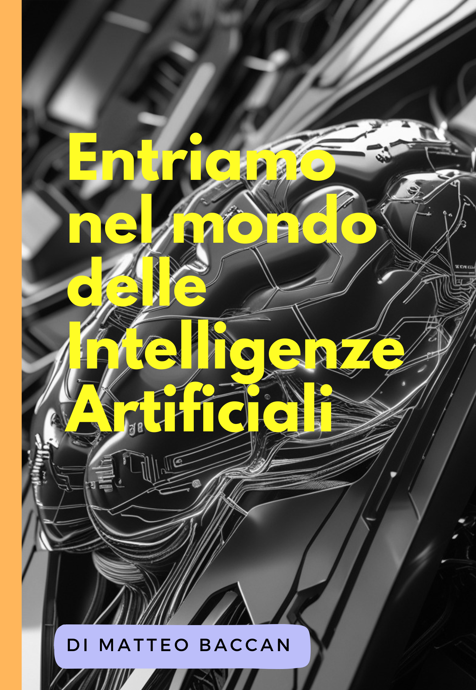

# Entriamo nel mondo delle Intelligenze Artificiali

## Capitolo 1: Introduzione all'Intelligenza Artificiale

### 1.1 Come nasce questo libro

In risposta alla rapida diffusione di prodotti basati sull'Intelligenza Artificiale, ho elaborato una presentazione che ripercorre l'evoluzione di questa tecnologia e illustra i termini chiave utilizzati nel settore. Nel corso della mia attività professionale, ho sperimentato diverse soluzioni AI che mi hanno permesso di ottimizzare i processi lavorativi, aumentando sia l'efficienza che la qualità dei risultati. Ho quindi arricchito la presentazione con una sezione pratica dedicata ai vari strumenti AI, specificando per ciascuno il campo di applicazione ideale.

L'obiettivo di questo lavoro è duplice: da un lato, far conoscere i benefici concreti che l'Intelligenza Artificiale può apportare nella vita professionale, dall'altro, fornire una guida pratica per la scelta degli strumenti AI più adatti alle diverse esigenze lavorative quotidiane.

Da questa presentazione è nato il libro che state leggendo, arricchito con nuovi contenuti e approfondimenti, per offrire una panoramica completa sull'Intelligenza Artificiale e sulle sue applicazioni pratiche.

Per approfondire ulteriormente l'argomento, vi invito a visitare il progetto GitHub associato a questo libro, dove troverete risorse aggiuntive ed approfondimenti su vari aspetti dell'Intelligenza Artificiale.

<https://github.com/matteobaccan/CorsoAI>

### 1.2 Chi sono?

Matteo Baccan è un ingegnere del software e formatore professionista con oltre 30 anni di esperienza nel settore IT. Ha lavorato per diverse aziende e organizzazioni, occupandosi di progettazione, sviluppo, testing e gestione di applicazioni web e desktop, utilizzando vari linguaggi e tecnologie. È anche un appassionato divulgatore e insegnante di informatica, autore di numerosi articoli, libri e corsi online rivolti a tutti i livelli di competenza.

Gestisce un sito internet e un canale YouTube dove condivide video tutorial, interviste, recensioni e consigli sulla programmazione. Attivo nelle community open source, partecipa regolarmente a eventi e concorsi di programmazione. Si definisce un "sognatore realista" che ama sperimentare, innovare e condividere le sue conoscenze e passioni, seguendo il motto: "Non smettere mai di imparare, perché la vita non smette mai di insegnare".

# Capitolo 2: Cos'è l'Intelligenza Artificiale?

## 2.1 AI - Di cosa si tratta?

L'**Intelligenza Artificiale** (AI) è una branca dell'informatica che si occupa di creare sistemi e algoritmi in grado di svolgere compiti che tradizionalmente richiedono l'intelligenza umana. Questi compiti includono il ragionamento, l'apprendimento, la pianificazione, la percezione, il riconoscimento vocale e visivo, la comprensione del linguaggio naturale e la risoluzione di problemi complessi.

L'AI non è un concetto nuovo: le sue radici risalgono agli anni '50, quando Alan Turing propose il famoso **Test di Turing** come criterio per determinare se una macchina può essere considerata "intelligente". Tuttavia, solo negli ultimi decenni, grazie ai progressi nella potenza di calcolo, alla disponibilità di grandi quantità di dati e allo sviluppo di algoritmi avanzati, l'AI ha iniziato a raggiungere risultati significativi e a diventare parte integrante della nostra vita quotidiana.

### 2.1.1 Definizione di Intelligenza Artificiale

L'AI può essere definita come la capacità di una macchina di imitare le funzioni cognitive umane, come l'apprendimento e la risoluzione di problemi. Questo include la capacità di analizzare dati, riconoscere pattern, prendere decisioni e adattarsi a nuove situazioni senza essere esplicitamente programmata per ogni singolo compito.

### 2.1.2 Differenza tra AI, Machine Learning e Deep Learning

- **AI (Intelligenza Artificiale)**: È il campo più ampio che comprende tutte le tecnologie e i metodi per creare macchine intelligenti.
- **Machine Learning (Apprendimento Automatico)**: È una sottobranca dell'AI che si concentra sullo sviluppo di algoritmi che permettono alle macchine di apprendere dai dati senza essere esplicitamente programmate.
- **Deep Learning (Apprendimento Profondo)**: È una sottobranca del Machine Learning che utilizza reti neurali artificiali con molti strati (da qui il termine "deep") per risolvere problemi complessi, come il riconoscimento di immagini o il trattamento del linguaggio naturale.

### 2.1.3 Tipi di Intelligenza Artificiale

L'AI può essere classificata in tre categorie principali, in base alle sue capacità e al livello di autonomia:

1. **ANI (Artificial Narrow Intelligence)**: È l'AI specializzata in un compito specifico, come il riconoscimento facciale o la traduzione automatica. È la forma di AI più comune oggi.

2. **AGI (Artificial General Intelligence)**: È un'AI che possiede un'intelligenza generale simile a quella umana, in grado di svolgere qualsiasi compito intellettuale che un essere umano può fare. Questo tipo di AI non è ancora stato realizzato.

3. **ASI (Artificial Super Intelligence)**: È un'AI che supera l'intelligenza umana in tutti i campi, compresa la creatività, la risoluzione di problemi e il ragionamento. Questo è un concetto teorico e non è ancora stato raggiunto.

## 2.2 Cosa contribuisce all'AI?

L'Intelligenza Artificiale è un campo interdisciplinare che attinge da diverse discipline per sviluppare sistemi intelligenti. Ecco alcune delle principali aree che contribuiscono all'AI:

### 2.2.1 Informatica

L'informatica fornisce le basi teoriche e pratiche per lo sviluppo di algoritmi, strutture dati e sistemi computazionali che sono alla base dell'AI. Senza l'informatica, non sarebbe possibile creare software e hardware in grado di eseguire compiti complessi.

### 2.2.2 Matematica

La matematica è essenziale per l'AI, in particolare per lo sviluppo di algoritmi di apprendimento automatico. Concetti come l'algebra lineare, il calcolo differenziale, la teoria della probabilità e la statistica sono fondamentali per comprendere e migliorare i modelli di AI.

### 2.2.3 Neuroscienze

Le neuroscienze studiano il funzionamento del cervello umano e forniscono ispirazione per lo sviluppo di reti neurali artificiali, che imitano il modo in cui i neuroni biologici elaborano le informazioni.

### 2.2.4 Psicologia

La psicologia contribuisce all'AI attraverso lo studio del comportamento umano e dei processi cognitivi. Questo aiuta a sviluppare sistemi di AI che possono interagire con gli esseri umani in modo più naturale e intuitivo.

### 2.2.5 Linguistica

La linguistica è fondamentale per lo sviluppo di sistemi di elaborazione del linguaggio naturale (NLP), che permettono alle macchine di comprendere, interpretare e generare il linguaggio umano.

### 2.2.6 Ingegneria

L'ingegneria, in particolare l'ingegneria del software e l'ingegneria elettronica, è essenziale per la progettazione e l'implementazione di sistemi di AI, sia a livello di software che di hardware.

## 2.3 Applicazioni dell'AI nella vita quotidiana

L'AI è ormai parte integrante della nostra vita quotidiana, anche se spesso non ce ne rendiamo conto. Ecco alcune delle applicazioni più comuni:

### 2.3.1 Assistenti Virtuali

Assistenti virtuali come **Siri**, **Alexa** e **Google Assistant** utilizzano l'AI per comprendere e rispondere alle richieste degli utenti, come impostare promemoria, cercare informazioni o controllare dispositivi smart home.

### 2.3.2 Riconoscimento Facciale

Il riconoscimento facciale è utilizzato in molte applicazioni, dallo sblocco degli smartphone alla sorveglianza pubblica. Sistemi come **Face ID** di Apple utilizzano algoritmi di AI per identificare i volti con precisione.

### 2.3.3 Raccomandazioni Personalizzate

Piattaforme come **Netflix**, **Spotify** e **Amazon** utilizzano l'AI per analizzare i comportamenti degli utenti e fornire raccomandazioni personalizzate, come film, musica o prodotti.

### 2.3.4 Guida Autonoma

Le auto a guida autonoma, come quelle sviluppate da **Tesla**, utilizzano l'AI per percepire l'ambiente circostante, prendere decisioni e navigare in modo sicuro senza l'intervento umano.

### 2.3.5 Diagnostica Medica

L'AI è utilizzata in campo medico per analizzare immagini mediche, come radiografie e risonanze magnetiche, e aiutare i medici a diagnosticare malattie con maggiore precisione.

### 2.3.6 Traduzione Automatica

Servizi come **Google Translate** utilizzano l'AI per tradurre testo e parlato in tempo reale, rendendo più facile la comunicazione tra persone che parlano lingue diverse.

## 2.4 Etica e Sfide dell'AI

L'AI offre enormi opportunità, ma solleva anche importanti questioni etiche e sfide che devono essere affrontate:

### 2.4.1 Privacy e Sicurezza

L'AI richiede grandi quantità di dati per funzionare, il che solleva preoccupazioni sulla privacy e sulla sicurezza delle informazioni personali. È essenziale garantire che i dati siano utilizzati in modo responsabile e protetti da accessi non autorizzati.

### 2.4.2 Bias e Discriminazione

Gli algoritmi di AI possono essere influenzati da bias presenti nei dati di addestramento, portando a decisioni discriminatorie o ingiuste. È importante sviluppare modelli di AI che siano equi e inclusivi.

### 2.4.3 Impatto sul Lavoro

L'automazione guidata dall'AI potrebbe portare alla perdita di posti di lavoro in alcuni settori, mentre ne creerà di nuovi in altri. È necessario preparare la forza lavoro per questa transizione attraverso la formazione e l'istruzione.

### 2.4.4 Controllo e Trasparenza

Man mano che l'AI diventa più potente, è essenziale garantire che i sistemi di AI siano controllabili e trasparenti. Gli utenti devono comprendere come funzionano questi sistemi e avere il potere di intervenire se necessario.

## 2.5 Il Futuro dell'AI

Il futuro dell'AI è pieno di promesse, ma anche di incertezze. Ecco alcune delle tendenze e delle sfide che potrebbero plasmare il futuro di questa tecnologia:

### 2.5.1 AI Generale (AGI)

Uno degli obiettivi a lungo termine dell'AI è lo sviluppo di un'**Intelligenza Artificiale Generale** (AGI), in grado di svolgere qualsiasi compito intellettuale che un essere umano può fare. Questo richiederà progressi significativi nella comprensione del funzionamento del cervello umano e nello sviluppo di algoritmi più avanzati.

### 2.5.2 Collaborazione Uomo-Macchina

In futuro, l'AI non sostituirà gli esseri umani, ma collaborerà con loro per migliorare le capacità umane. Ad esempio, i medici potrebbero utilizzare l'AI per analizzare i dati dei pazienti e prendere decisioni più informate.

### 2.5.3 Etica e Regolamentazione

Man mano che l'AI diventa più pervasiva, sarà necessario sviluppare norme e regolamenti per garantire che questa tecnologia sia utilizzata in modo etico e responsabile. Questo includerà la definizione di linee guida per la privacy, la sicurezza e l'equità.

### 2.5.4 Sostenibilità

L'AI può essere utilizzata per affrontare alcune delle sfide più urgenti del nostro tempo, come il cambiamento climatico e la scarsità di risorse. Ad esempio, l'AI può ottimizzare l'uso dell'energia, migliorare l'agricoltura e ridurre gli sprechi.

## 2.6 Conclusione

L'Intelligenza Artificiale è una tecnologia trasformativa che sta cambiando il modo in cui viviamo, lavoriamo e interagiamo con il mondo. Mentre offre enormi opportunità, solleva anche importanti questioni etiche e sfide che devono essere affrontate. Comprendere cos'è l'AI, come funziona e quali sono le sue implicazioni è essenziale per navigare in questo nuovo panorama tecnologico e sfruttare al meglio il suo potenziale.

# Capitolo 3: Evoluzione dell'Intelligenza Artificiale

## 3.1 Introduzione

L'Intelligenza Artificiale (AI) è stata una delle aree più innovative della scienza e della tecnologia negli ultimi decenni. La storia dell'AI può essere divisa in quattro periodi principali, ciascuno caratterizzato da progressi significativi, sfide e cambiamenti nel modo in cui l'AI viene concepita e sviluppata. Questo capitolo esplora l'evoluzione dell'AI, dalle sue origini teoriche agli sviluppi più recenti, e come questa tecnologia abbia trasformato il mondo.

## 3.2 La fase iniziale (1948-1965)

### 3.2.1 Le origini teoriche

Le radici dell'AI possono essere rintracciate negli anni '40 e '50, quando i primi pionieri iniziarono a esplorare l'idea di creare macchine intelligenti. Uno dei momenti chiave fu la pubblicazione del programma di gioco di scacchi di **Alan Turing** nel 1948, noto come **Turochamp**. Questo programma è stato il primo a utilizzare un algoritmo di ricerca per trovare la mossa migliore in una posizione di scacchi, dimostrando che le macchine potevano essere programmate per eseguire compiti complessi.

### 3.2.2 Il Test di Turing

Nel 1950, Alan Turing propose il famoso **Test di Turing**, un criterio per determinare se una macchina può essere considerata "intelligente". Secondo Turing, se una macchina può ingannare un essere umano facendogli credere di essere un altro essere umano durante una conversazione, allora può essere considerata intelligente. Questo test ha gettato le basi per lo sviluppo dell'AI e rimane un punto di riferimento importante nel campo.

### 3.2.3 I primi programmi di scacchi

Dopo il lavoro di Turing, altri ricercatori iniziarono a sviluppare programmi di scacchi. Nel 1950, **Claude Shannon** creò il **Shannon's Chess Program**, uno dei primi programmi di scacchi basati su algoritmi di ricerca. Nel 1951, **John McCarthy** sviluppò il **McCarthy's Chess Program**, che utilizzava tecniche più avanzate per valutare le mosse.

### 3.2.4 La nascita dell'AI come disciplina

Nel 1956, si tenne la **Conferenza di Dartmouth**, organizzata da John McCarthy, Marvin Minsky, Nathaniel Rochester e Claude Shannon. Questo evento è considerato il momento in cui l'AI è stata formalmente riconosciuta come una disciplina scientifica. Durante la conferenza, i partecipanti discussero la possibilità di creare macchine in grado di simulare l'intelligenza umana, gettando le basi per la ricerca futura.

## 3.3 Il periodo della simulazione (1965-1980)

### 3.3.1 L'era dei sistemi esperti

Durante questo periodo, i ricercatori iniziarono a sviluppare **sistemi esperti**, programmi progettati per risolvere problemi specifici utilizzando regole logiche e conoscenze specialistiche. Uno dei primi sistemi esperti fu **DENDRAL**, sviluppato alla Stanford University negli anni '60, che utilizzava l'AI per analizzare dati chimici e identificare strutture molecolari.

### 3.3.2 Elaborazione del linguaggio naturale

Negli anni '70, l'elaborazione del linguaggio naturale (NLP) divenne un'area di ricerca importante. Uno dei primi esempi di NLP fu **ELIZA**, un chatbot sviluppato da **Joseph Weizenbaum** nel 1966. ELIZA simulava una conversazione con un terapeuta rogersiano, utilizzando semplici regole per analizzare e rispondere alle frasi dell'utente. Nonostante la sua semplicità, ELIZA dimostrò che le macchine potevano interagire con gli esseri umani in modo apparentemente intelligente.

### 3.3.3 Visione artificiale

La visione artificiale, ovvero la capacità delle macchine di interpretare immagini e video, iniziò a svilupparsi in questo periodo. I primi sistemi di visione artificiale erano in grado di riconoscere forme semplici e oggetti, aprendo la strada a applicazioni più avanzate come il riconoscimento facciale e la guida autonoma.

### 3.3.4 L'inverno dell'AI

Nonostante i progressi, gli anni '70 furono anche caratterizzati da un periodo noto come **l'inverno dell'AI**, in cui l'entusiasmo iniziale si scontrò con le limitazioni tecnologiche e la mancanza di risultati concreti. I finanziamenti per la ricerca diminuirono e molti progetti furono abbandonati. Tuttavia, questo periodo portò anche a una maggiore consapevolezza delle sfide e delle complessità dell'AI.

## 3.4 La fase dell'intelligenza distribuita (1980-1990)

### 3.4.1 L'avvento delle reti neurali

Negli anni '80, le **reti neurali artificiali** iniziarono a guadagnare popolarità come approccio all'AI. Le reti neurali imitano il funzionamento del cervello umano, utilizzando strati di neuroni artificiali per elaborare informazioni e apprendere dai dati. Questo approccio portò a progressi significativi in aree come il riconoscimento di pattern e la classificazione di immagini.

### 3.4.2 Apprendimento automatico

L'apprendimento automatico (Machine Learning) divenne un'area di ricerca centrale durante questo periodo. Gli algoritmi di apprendimento automatico, come le **reti neurali ricorrenti** (RNN) e le **reti neurali convoluzionali** (CNN), permisero alle macchine di apprendere da grandi quantità di dati e migliorare le loro prestazioni nel tempo.

### 3.4.3 Sistemi di ragionamento probabilistico

Negli anni '80, i ricercatori iniziarono a sviluppare sistemi di ragionamento probabilistico, che utilizzavano la teoria della probabilità per prendere decisioni in condizioni di incertezza. Questo approccio fu particolarmente utile in applicazioni come la diagnostica medica e la pianificazione.

### 3.4.4 L'ascesa dell'AI commerciale

Durante questo periodo, l'AI iniziò a essere utilizzata in applicazioni commerciali, come i sistemi di raccomandazione, i filtri antispam e i sistemi di trading finanziario. Questo segnò l'inizio dell'integrazione dell'AI nella vita quotidiana e nell'economia globale.

## 3.5 La fase moderna (1990-oggi)

### 3.5.1 L'era del Big Data

Con l'avvento di Internet e la crescente disponibilità di dati, l'AI entrò in una nuova era. I modelli di apprendimento automatico potevano ora essere addestrati su enormi dataset, migliorando significativamente le loro prestazioni. Questo portò a progressi in aree come il riconoscimento vocale, la traduzione automatica e il riconoscimento di immagini.

### 3.5.2 Deep Learning

Il **deep learning**, una sottobranca del Machine Learning che utilizza reti neurali con molti strati, divenne dominante negli anni 2010. Modelli come le **reti neurali convoluzionali** (CNN) e le **reti neurali ricorrenti** (RNN) permisero di raggiungere risultati straordinari in compiti complessi, come il riconoscimento di immagini e la generazione di testo.

### 3.5.3 AI Generativa

L'AI generativa, che utilizza algoritmi per creare nuovi contenuti come immagini, musica e testo, ha visto una rapida crescita negli ultimi anni. Modelli come **GPT-3** e **DALL-E** hanno dimostrato la capacità di generare contenuti di alta qualità, aprendo nuove possibilità per l'arte, la creatività e l'intrattenimento.

### 3.5.4 Guida autonoma e robotica

La guida autonoma e la robotica sono diventate aree di ricerca importanti, con aziende come **Tesla** e **Waymo** che sviluppano auto a guida autonoma. I robot dotati di AI sono utilizzati in settori come la produzione, la logistica e l'assistenza sanitaria.

### 3.5.5 AI nella medicina

L'AI è stata ampiamente adottata in campo medico, con applicazioni che vanno dalla diagnostica basata su immagini alla scoperta di nuovi farmaci. Modelli di AI sono utilizzati per analizzare dati medici e fornire raccomandazioni ai medici, migliorando l'accuratezza e l'efficienza delle cure.

### 3.5.6 Etica e regolamentazione

Man mano che l'AI diventa più potente e pervasiva, le questioni etiche e di regolamentazione sono diventate sempre più importanti. Temi come la privacy, il bias algoritmico e l'impatto sul lavoro sono al centro del dibattito pubblico, con governi e organizzazioni che lavorano per sviluppare norme e linee guida per l'uso responsabile dell'AI.

## 3.6 Conclusione

L'evoluzione dell'Intelligenza Artificiale è stata un viaggio affascinante, caratterizzato da progressi straordinari e sfide significative. Dalle prime teorie di Alan Turing agli avanzati modelli di deep learning di oggi, l'AI ha trasformato il modo in cui viviamo, lavoriamo e interagiamo con il mondo. Mentre guardiamo al futuro, è essenziale continuare a esplorare le potenzialità dell'AI, affrontando al contempo le questioni etiche e sociali che essa solleva.

# Capitolo 4: Machine Learning e Deep Learning

## 4.1 Introduzione

Il **Machine Learning** (ML) e il **Deep Learning** (DL) sono due delle aree più importanti e rivoluzionarie dell'Intelligenza Artificiale (AI). Queste tecnologie permettono alle macchine di apprendere dai dati, migliorare le loro prestazioni nel tempo e svolgere compiti complessi che tradizionalmente richiedevano l'intelligenza umana. Questo capitolo esplora i concetti fondamentali del Machine Learning e del Deep Learning, le loro differenze, le tecniche principali e le applicazioni pratiche.

## 4.2 Cos'è il Machine Learning?

### 4.2.1 Definizione di Machine Learning

Il **Machine Learning** è una sottobranca dell'AI che si concentra sullo sviluppo di algoritmi e modelli che permettono alle macchine di apprendere dai dati senza essere esplicitamente programmate. Invece di seguire regole fisse, i modelli di Machine Learning utilizzano dati di addestramento per identificare pattern e fare previsioni o decisioni.

### 4.2.2 Perché il Machine Learning è importante?

Il Machine Learning è fondamentale perché permette di affrontare problemi complessi che non possono essere risolti con algoritmi tradizionali. Ad esempio, riconoscere un volto in un'immagine o tradurre un testo da una lingua all'altra sono compiti che richiedono la capacità di apprendere da grandi quantità di dati e di generalizzare da essi.

### 4.2.3 Come funziona il Machine Learning?

Il processo di Machine Learning può essere suddiviso in tre fasi principali:

1. **Addestramento**: Il modello viene addestrato su un dataset di input, imparando a riconoscere pattern e relazioni.

2. **Validazione**: Il modello viene testato su un dataset separato per valutare le sue prestazioni e regolare i parametri.

3. **Inferenza**: Il modello addestrato viene utilizzato per fare previsioni o decisioni su nuovi dati.

## 4.3 Tipologie di Machine Learning

### 4.3.1 Apprendimento Supervisionato (Supervised Learning)

Nell'**apprendimento supervisionato**, il modello viene addestrato su un dataset etichettato, dove ogni esempio di input è associato a un output desiderato. L'obiettivo è imparare una funzione che mappa gli input agli output corretti. Esempi comuni includono la classificazione di immagini e la previsione di valori numerici (regressione).

#### Esempi di algoritmi di apprendimento supervisionato

- **Regressione Lineare**: Utilizzato per prevedere valori continui, come il prezzo di una casa.
- **Alberi di Decisione**: Utilizzati per la classificazione e la regressione, basati su una serie di decisioni binarie.
- **Support Vector Machines (SVM)**: Utilizzati per la classificazione, trovando il confine ottimale tra diverse classi.

### 4.3.2 Apprendimento Non Supervisionato (Unsupervised Learning)

Nell'**apprendimento non supervisionato**, il modello viene addestrato su un dataset non etichettato, dove non ci sono output desiderati. L'obiettivo è identificare pattern o strutture nascoste nei dati. Esempi comuni includono il clustering e la riduzione della dimensionalità.

#### Esempi di algoritmi di apprendimento non supervisionato

- **K-Means Clustering**: Utilizzato per raggruppare dati in cluster basati sulla somiglianza.
- **Principal Component Analysis (PCA)**: Utilizzato per ridurre la dimensionalità dei dati, mantenendo le informazioni più importanti.
- **Autoencoder**: Una rete neurale utilizzata per comprimere e ricostruire dati, spesso utilizzata per la riduzione del rumore.

### 4.3.3 Apprendimento per Rinforzo (Reinforcement Learning)

Nell'**apprendimento per rinforzo**, un agente impara a prendere decisioni interagendo con un ambiente dinamico. L'agente riceve feedback sotto forma di ricompense o punizioni in base alle sue azioni, e l'obiettivo è massimizzare la ricompensa totale nel lungo termine. Questo approccio è particolarmente utile in contesti come i giochi e la robotica.

#### Esempi di algoritmi di apprendimento per rinforzo

- **Q-Learning**: Un algoritmo che impara una politica ottimale per prendere decisioni in un ambiente.
- **Deep Q-Networks (DQN)**: Una combinazione di Q-Learning e reti neurali profonde, utilizzata per risolvere problemi complessi.

## 4.4 Cos'è il Deep Learning?

### 4.4.1 Definizione di Deep Learning

Il **Deep Learning** è una sottobranca del Machine Learning che utilizza **reti neurali artificiali** con molti strati (da qui il termine "deep") per risolvere problemi complessi. Queste reti neurali sono ispirate al funzionamento del cervello umano e sono in grado di apprendere rappresentazioni gerarchiche dei dati.

### 4.4.2 Perché il Deep Learning è importante?

Il Deep Learning ha rivoluzionato molti campi dell'AI grazie alla sua capacità di gestire grandi quantità di dati e di apprendere feature complesse senza la necessità di un'ingegneria manuale delle feature. Questo lo rende particolarmente efficace in compiti come il riconoscimento di immagini, il trattamento del linguaggio naturale e la generazione di contenuti.

### 4.4.3 Come funziona il Deep Learning?

Le reti neurali profonde sono composte da più strati di neuroni artificiali, ognuno dei quali trasforma i dati in modo non lineare. Durante l'addestramento, i pesi della rete vengono regolati per minimizzare l'errore tra le previsioni del modello e i risultati desiderati. Questo processo è noto come **backpropagation**.

#### Componenti principali di una rete neurale

- **Input Layer**: Lo strato che riceve i dati di input.
- **Hidden Layers**: Gli strati intermedi che trasformano i dati.
- **Output Layer**: Lo strato che produce il risultato finale.

## 4.5 Tipologie di Reti Neurali

### 4.5.1 Reti Neurali Convoluzionali (CNN)

Le **Reti Neurali Convoluzionali** (CNN) sono progettate per elaborare dati strutturati a griglia, come le immagini. Utilizzano operazioni di convoluzione per estrarre feature locali, come bordi e texture, e pooling per ridurre le dimensioni dei dati.

#### Applicazioni delle CNN

- Riconoscimento di immagini
- Visione artificiale
- Sistemi di guida autonoma

### 4.5.2 Reti Neurali Ricorrenti (RNN)

Le **Reti Neurali Ricorrenti** (RNN) sono progettate per elaborare sequenze di dati, come il testo o le serie temporali. Mantengono uno "stato interno" che funziona come una forma di memoria, permettendo di considerare le informazioni precedenti per elaborare l'input corrente.

#### Applicazioni delle RNN

- Elaborazione del linguaggio naturale
- Traduzione automatica
- Generazione di testo

### 4.5.3 Reti Generative Avversariali (GAN)

Le **Reti Generative Avversariali** (GAN) sono composte da due reti neurali: un generatore e un discriminatore. Il generatore crea dati sintetici, mentre il discriminatore cerca di distinguere tra dati reali e generati. Le due reti si allenano simultaneamente, migliorando progressivamente la qualità dei dati generati.

#### Applicazioni delle GAN

- Generazione di immagini fotorealistiche
- Creazione di opere d'arte
- Sintesi di video

## 4.6 Applicazioni Pratiche del Machine Learning e Deep Learning

### 4.6.1 Riconoscimento di Immagini

Il riconoscimento di immagini è una delle applicazioni più comuni del Deep Learning. Modelli come le CNN sono utilizzati per identificare oggetti, volti e scene in immagini e video.

### 4.6.2 Elaborazione del Linguaggio Naturale (NLP)

L'NLP è un campo dell'AI che si occupa dell'interazione tra macchine e linguaggio umano. Modelli come le RNN e i Transformer sono utilizzati per compiti come la traduzione automatica, la generazione di testo e l'analisi del sentiment.

### 4.6.3 Guida Autonoma

Le auto a guida autonoma utilizzano il Machine Learning e il Deep Learning per percepire l'ambiente circostante, prendere decisioni e navigare in modo sicuro. Modelli come le CNN sono utilizzati per il riconoscimento di oggetti e la pianificazione del percorso.

### 4.6.4 Diagnostica Medica

L'AI è utilizzata in campo medico per analizzare immagini mediche, come radiografie e risonanze magnetiche, e aiutare i medici a diagnosticare malattie con maggiore precisione. Modelli di Deep Learning sono utilizzati per identificare anomalie e fornire raccomandazioni.

### 4.6.5 Generazione di Contenuti

L'AI generativa, come le GAN, è utilizzata per creare nuovi contenuti, come immagini, musica e testo. Modelli come GPT-3 e DALL-E hanno dimostrato la capacità di generare contenuti di alta qualità, aprendo nuove possibilità per l'arte e l'intrattenimento.

## 4.7 Sfide e Limiti del Machine Learning e Deep Learning

### 4.7.1 Sovradattamento (Overfitting)

Il **sovradattamento** si verifica quando un modello impara troppo bene i dati di addestramento, perdendo la capacità di generalizzare a nuovi dati. Questo può essere mitigato utilizzando tecniche come la regolarizzazione e la cross-validation.

### 4.7.2 Bias nei Dati

I modelli di Machine Learning possono essere influenzati da bias presenti nei dati di addestramento, portando a decisioni discriminatorie o ingiuste. È importante garantire che i dati siano rappresentativi e privi di pregiudizi.

### 4.7.3 Complessità Computazionale

Il Deep Learning richiede grandi quantità di dati e risorse computazionali per l'addestramento. Questo può rendere difficile l'implementazione di modelli complessi in contesti con risorse limitate.

### 4.7.4 Interpretabilità

I modelli di Deep Learning sono spesso considerati "scatole nere" perché è difficile comprendere come prendono decisioni. Questo solleva preoccupazioni sulla trasparenza e l'affidabilità, specialmente in contesti critici come la medicina e la finanza.

## 4.8 Conclusione

Il Machine Learning e il Deep Learning sono tecnologie potenti che stanno trasformando il modo in cui affrontiamo problemi complessi e prendiamo decisioni. Dalla visione artificiale all'elaborazione del linguaggio naturale, queste tecnologie hanno applicazioni pratiche in quasi ogni settore. Tuttavia, è essenziale affrontare le sfide e i limiti associati a queste tecnologie, garantendo che siano utilizzate in modo etico e responsabile. Mentre continuiamo a esplorare le potenzialità del Machine Learning e del Deep Learning, è importante bilanciare l'innovazione con la consapevolezza delle implicazioni sociali e etiche.

# Capitolo 5: Algoritmi Generativi e Reti Neurali

## 5.1 Introduzione

Gli **algoritmi generativi** e le **reti neurali** sono tra le tecnologie più avanzate e rivoluzionarie nel campo dell'Intelligenza Artificiale (AI). Questi strumenti permettono alle macchine di creare nuovi contenuti, come immagini, suoni e testo, che sono indistinguibili da quelli prodotti dagli esseri umani. Questo capitolo esplora i concetti fondamentali degli algoritmi generativi, le architetture delle reti neurali più comuni e le loro applicazioni pratiche.

## 5.2 Cosa sono gli Algoritmi Generativi?

### 5.2.1 Definizione di Algoritmi Generativi

Gli **algoritmi generativi** sono una classe di algoritmi di apprendimento automatico che generano dati sintetici, come immagini, suoni o testo, che sono simili a quelli reali. Questi algoritmi utilizzano una rete neurale artificiale per apprendere i modelli di dati reali e quindi generare nuovi dati sintetici.

### 5.2.2 Perché gli Algoritmi Generativi sono importanti?

Gli algoritmi generativi sono importanti perché permettono di creare contenuti nuovi e originali senza la necessità di un intervento umano diretto. Questo apre nuove possibilità in campi come l'arte, la musica, il design e l'intrattenimento. Inoltre, gli algoritmi generativi possono essere utilizzati per aumentare i dataset esistenti, migliorando le prestazioni dei modelli di Machine Learning.

### 5.2.3 Come funzionano gli Algoritmi Generativi?

Gli algoritmi generativi funzionano apprendendo i pattern e le strutture presenti nei dati di addestramento. Una volta addestrati, questi algoritmi possono generare nuovi dati che seguono le stesse distribuzioni e caratteristiche dei dati originali. Questo processo è spesso basato su tecniche come le **Reti Generative Avversariali (GAN)** e le **Reti Neurali Ricorrenti (RNN)**.

## 5.3 Reti Generative Avversariali (GAN)

### 5.3.1 Cos'è una GAN?

Una **Rete Generativa Avversaria (GAN)** è un'architettura di apprendimento automatico introdotta da **Ian Goodfellow** nel 2014. Le GAN sono composte da due reti neurali che competono tra loro in un "gioco" a somma zero:

1. **Il Generatore (G)**: Produce dati sintetici cercando di imitare dei dati reali. Il suo obiettivo è creare esempi così convincenti da "ingannare" il Discriminatore.

2. **Il Discriminatore (D)**: Agisce come un "giudice", cercando di distinguere tra dati reali e generati. Deve classificare correttamente i dati come autentici o falsi.

### 5.3.2 Come funziona una GAN?

Le due reti si allenano simultaneamente:

- Il Generatore migliora progressivamente la qualità dei dati sintetici.
- Il Discriminatore affina la sua capacità di rilevare le falsificazioni.

Questo processo continua fino a quando il Generatore produce dati che il Discriminatore non è più in grado di distinguere da quelli reali.

### 5.3.3 Applicazioni delle GAN

Le GAN hanno una vasta gamma di applicazioni, tra cui:

- **Generazione di immagini fotorealistiche**: Le GAN possono creare immagini di volti, paesaggi e oggetti che sembrano reali.
- **Conversione di schizzi in fotografie**: Le GAN possono trasformare disegni o schizzi in immagini fotorealistiche.
- **Invecchiamento/ringiovanimento di volti**: Le GAN possono modificare l'età apparente di una persona in una foto.
- **Creazione di opere d'arte**: Le GAN possono generare opere d'arte originali in vari stili.
- **Sintesi di video**: Le GAN possono creare video realistici partendo da descrizioni testuali.

### 5.3.4 Sfide delle GAN

Nonostante il loro potenziale, le GAN presentano alcune sfide:

- **Instabilità durante l'addestramento**: Le GAN possono essere difficili da addestrare a causa della competizione tra il Generatore e il Discriminatore.
- **Modal Collapse**: Il Generatore può iniziare a produrre sempre lo stesso output, limitando la varietà dei dati generati.
- **Qualità dei dati generati**: Anche se le GAN possono produrre dati realistici, a volte possono generare artefatti o imperfezioni.

## 5.4 Reti Neurali Ricorrenti (RNN)

### 5.4.1 Cos'è una RNN?

Una **Rete Neurale Ricorrente (RNN)** è un tipo di rete neurale artificiale progettata specificamente per elaborare sequenze di dati, come il testo o le serie temporali. Le RNN mantengono uno "stato interno" che funziona come una forma di memoria, permettendo di considerare le informazioni precedenti per elaborare l'input corrente.

### 5.4.2 Come funziona una RNN?

Le RNN elaborano i dati sequenziali passo dopo passo, mantenendo uno stato interno che cattura le informazioni rilevanti dai passaggi precedenti. Questo permette alle RNN di gestire input di lunghezza variabile e di mantenere il contesto temporale.

### 5.4.3 Varianti delle RNN

1. **LSTM (Long Short-Term Memory)**: Una LSTM è una variante avanzata delle RNN che utilizza un sistema di "gate" (cancelli) per controllare il flusso delle informazioni, permettendo alla rete di memorizzare selettivamente informazioni importanti per lunghi periodi e risolvere il problema del **vanishing gradient**.
2. **GRU (Gated Recurrent Unit)**: La GRU è una versione semplificata della LSTM che combina i gate di dimenticanza e di input in un unico "gate di aggiornamento", mantenendo prestazioni simili, ma con minor complessità computazionale.

### 5.4.4 Applicazioni delle RNN

Le RNN sono utilizzate in una vasta gamma di applicazioni, tra cui:

- **Elaborazione del linguaggio naturale (NLP)**: Le RNN sono utilizzate per compiti come la traduzione automatica, la generazione di testo e l'analisi del sentiment.
- **Riconoscimento vocale**: Le RNN possono essere utilizzate per convertire il parlato in testo.
- **Previsione di serie temporali**: Le RNN sono utilizzate per prevedere valori futuri basati su dati storici, come i prezzi delle azioni o le previsioni meteorologiche.
- **Generazione di testo**: Le RNN possono generare testo coerente e contestualmente rilevante, come poesie, articoli o codici di programmazione.

## 5.5 Reti Neurali Convoluzionali (CNN)

### 5.5.1 Cos'è una CNN?

Una **Rete Neurale Convoluzionale (CNN)** è un tipo di rete neurale artificiale progettata specificamente per elaborare dati strutturati a griglia, come le immagini. Le CNN utilizzano operazioni di convoluzione per estrarre feature locali, come bordi e texture, e pooling per ridurre le dimensioni dei dati.

### 5.5.2 Come funziona una CNN?

Le CNN sono composte da più strati di neuroni artificiali, ognuno dei quali trasforma i dati in modo non lineare. Gli strati di convoluzione applicano filtri (kernel) all'input per estrarre feature locali, mentre gli strati di pooling riducono le dimensioni dei dati, mantenendo le feature più importanti.

### 5.5.3 Applicazioni delle CNN

Le CNN sono utilizzate in una vasta gamma di applicazioni, tra cui:

- **Riconoscimento di immagini**: Le CNN sono utilizzate per identificare oggetti, volti e scene in immagini e video.
- **Visione artificiale**: Le CNN sono utilizzate in sistemi di guida autonoma, sorveglianza e analisi medica.
- **Elaborazione video**: Le CNN possono analizzare video per rilevare movimenti, oggetti o eventi specifici.
- **Analisi medica**: Le CNN sono utilizzate per analizzare immagini mediche, come radiografie e risonanze magnetiche, e aiutare i medici a diagnosticare malattie.

## 5.6 Algoritmi Generativi in Azione

### 5.6.1 Generazione di Immagini

Gli algoritmi generativi, come le GAN, sono utilizzati per creare immagini fotorealistiche, opere d'arte e design. Ad esempio, **DALL-E** è un modello generativo sviluppato da OpenAI che può creare immagini originali basate su descrizioni testuali.

### 5.6.2 Generazione di Musica

Gli algoritmi generativi possono essere utilizzati per creare musica originale in vari stili. Modelli come **MuseNet** di OpenAI possono generare composizioni musicali complesse basate su input testuali o melodici.

### 5.6.3 Generazione di Testo

Le RNN e i modelli Transformer, come **GPT-3**, sono utilizzati per generare testo coerente e contestualmente rilevante. Questi modelli possono essere utilizzati per scrivere articoli, poesie, codici di programmazione e molto altro.

### 5.6.4 Sintesi di Voce

Gli algoritmi generativi possono essere utilizzati per sintetizzare voci realistiche basate su input testuali. Questo è particolarmente utile per applicazioni come gli assistenti vocali e la creazione di contenuti audio.

## 5.7 Sfide e Limiti degli Algoritmi Generativi

### 5.7.1 Qualità dei Dati Generati

Anche se gli algoritmi generativi possono produrre dati realistici, a volte possono generare artefatti o imperfezioni. È importante valutare la qualità dei dati generati e garantire che siano utili per l'applicazione desiderata.

### 5.7.2 Bias nei Dati di Addestramento

Gli algoritmi generativi possono essere influenzati da bias presenti nei dati di addestramento, portando a risultati distorti o discriminatori. È importante garantire che i dati di addestramento siano rappresentativi e privi di pregiudizi.

### 5.7.3 Complessità Computazionale

Gli algoritmi generativi, in particolare le GAN, richiedono grandi quantità di dati e risorse computazionali per l'addestramento. Questo può rendere difficile l'implementazione di modelli complessi in contesti con risorse limitate.

### 5.7.4 Etica e Responsabilità

La capacità degli algoritmi generativi di creare contenuti realistici solleva importanti questioni etiche, come la possibilità di creare deepfake o contenuti falsi. È essenziale utilizzare queste tecnologie in modo responsabile e garantire che siano impiegate per scopi positivi.

## 5.8 Conclusione

Gli algoritmi generativi e le reti neurali sono tecnologie potenti che stanno trasformando il modo in cui creiamo e interagiamo con i contenuti. Dalla generazione di immagini e musica alla sintesi di voce e testo, queste tecnologie hanno applicazioni pratiche in quasi ogni settore. Tuttavia, è essenziale affrontare le sfide e i limiti associati a queste tecnologie, garantendo che siano utilizzate in modo etico e responsabile. Mentre continuiamo a esplorare le potenzialità degli algoritmi generativi, è importante bilanciare l'innovazione con la consapevolezza delle implicazioni sociali e etiche.

# Capitolo 6: Applicazioni dell'AI

## 6.1 Introduzione

L'Intelligenza Artificiale (AI) ha rivoluzionato numerosi settori, portando innovazioni che erano impensabili solo pochi decenni fa. Dalla medicina alla finanza, dall'intrattenimento alla produzione industriale, l'AI è diventata uno strumento indispensabile per migliorare l'efficienza, la precisione e la creatività. Questo capitolo esplora alcune delle applicazioni più significative dell'AI, mostrando come questa tecnologia stia trasformando il mondo in cui viviamo.

## 6.2 Gioco

### 6.2.1 AI nei Giochi da Tavolo e di Strategia

L'AI ha dimostrato di essere estremamente efficace nei giochi da tavolo e di strategia, dove la capacità di calcolare mosse e previsioni è fondamentale. Uno degli esempi più famosi è **AlphaGo**, sviluppato da DeepMind, che nel 2016 ha sconfitto il campione mondiale di Go, Lee Sedol. Il Go è un gioco estremamente complesso, con più possibili configurazioni di quante siano le particelle nell'universo, e la vittoria di AlphaGo ha segnato un traguardo storico per l'AI.

### 6.2.2 AI nei Videogiochi

Nei videogiochi, l'AI è utilizzata per creare personaggi non giocanti (NPC) che si comportano in modo realistico e adattivo. Gli algoritmi di AI permettono agli NPC di reagire alle azioni del giocatore, imparare dalle loro strategie e offrire una sfida sempre nuova. Inoltre, l'AI è utilizzata per generare contenuti procedurali, come mondi aperti e missioni, rendendo i giochi più dinamici e personalizzati.

### 6.2.3 AI e Scacchi

Gli scacchi sono stati uno dei primi campi in cui l'AI ha dimostrato la sua superiorità. Programmi come **Stockfish** e **Komodo** hanno raggiunto livelli di gioco che superano di gran lunga quelli dei migliori giocatori umani. Questi programmi utilizzano algoritmi di ricerca avanzati e reti neurali per valutare milioni di mosse al secondo e scegliere la migliore strategia.

## 6.3 Elaborazione del Linguaggio Naturale (NLP)

### 6.3.1 Traduzione Automatica

L'AI ha rivoluzionato la traduzione automatica, rendendo possibile la comunicazione tra persone che parlano lingue diverse in tempo reale. Servizi come **Google Translate** utilizzano modelli di NLP basati su reti neurali per tradurre testo e parlato con una precisione sempre maggiore. Questi modelli sono addestrati su enormi quantità di dati multilingue e sono in grado di gestire sfumature linguistiche e contesti complessi.

### 6.3.2 Assistenti Virtuali

Assistenti virtuali come **Siri**, **Alexa** e **Google Assistant** utilizzano l'AI per comprendere e rispondere alle richieste degli utenti. Questi sistemi combinano NLP, riconoscimento vocale e apprendimento automatico per offrire un'interazione naturale e intuitiva. Gli assistenti virtuali possono svolgere una vasta gamma di compiti, come impostare promemoria, cercare informazioni, controllare dispositivi smart home e molto altro.

### 6.3.3 Generazione di Testo

L'AI è utilizzata per generare testo coerente e contestualmente rilevante, come articoli, poesie, codici di programmazione e molto altro. Modelli come **GPT-3** di OpenAI sono in grado di produrre testi di alta qualità basati su input testuali, aprendo nuove possibilità per la creazione di contenuti e l'automazione di processi di scrittura.

## 6.4 Sistemi Esperti

### 6.4.1 Diagnostica Medica

I sistemi esperti basati su AI sono utilizzati in campo medico per analizzare dati clinici e fornire diagnosi accurate. Ad esempio, modelli di AI possono analizzare immagini mediche, come radiografie e risonanze magnetiche, per identificare anomalie e suggerire trattamenti. Questi sistemi aiutano i medici a prendere decisioni informate e migliorare l'efficienza delle cure.

### 6.4.2 Supporto Decisionale

In settori come la finanza e la logistica, i sistemi esperti basati su AI sono utilizzati per analizzare dati complessi e fornire raccomandazioni strategiche. Ad esempio, i sistemi di trading algoritmico utilizzano l'AI per analizzare i mercati finanziari e prendere decisioni di investimento in tempo reale. Allo stesso modo, i sistemi di gestione della supply chain utilizzano l'AI per ottimizzare i processi logistici e ridurre i costi.

## 6.5 Sistemi di Visione Artificiale

### 6.5.1 Riconoscimento di Immagini

L'AI è utilizzata per riconoscere oggetti, volti e scene in immagini e video. Applicazioni come il riconoscimento facciale sono utilizzate in contesti di sicurezza, sorveglianza e autenticazione. Ad esempio, **Face ID** di Apple utilizza algoritmi di visione artificiale per sbloccare gli smartphone in modo sicuro e conveniente.

### 6.5.2 Guida Autonoma

Le auto a guida autonoma utilizzano l'AI per percepire l'ambiente circostante, prendere decisioni e navigare in modo sicuro senza l'intervento umano. Modelli di visione artificiale, come le **Reti Neurali Convoluzionali (CNN)**, sono utilizzati per identificare oggetti, segnali stradali e pedoni, mentre algoritmi di pianificazione determinano il percorso ottimale.

### 6.5.3 Analisi Medica

L'AI è utilizzata per analizzare immagini mediche, come radiografie, risonanze magnetiche e tomografie, per identificare malattie e anomalie. Modelli di visione artificiale possono rilevare tumori, fratture e altre condizioni con una precisione che rivaleggia con quella dei radiologi umani. Questo aiuta i medici a diagnosticare malattie in modo più rapido e accurato.

## 6.6 Riconoscimento Facciale e Vocale

### 6.6.1 Riconoscimento Facciale

Il riconoscimento facciale è utilizzato in molte applicazioni, dallo sblocco degli smartphone alla sorveglianza pubblica. Sistemi come **Face ID** di Apple e **DeepFace** di Facebook utilizzano algoritmi di AI per identificare i volti con precisione. Questa tecnologia è anche utilizzata in contesti di sicurezza, come il controllo degli accessi e l'identificazione di sospetti.

### 6.6.2 Riconoscimento Vocale

Il riconoscimento vocale è utilizzato per convertire il parlato in testo, permettendo un'interazione naturale con i dispositivi elettronici. Applicazioni come **Siri**, **Alexa** e **Google Assistant** utilizzano algoritmi di riconoscimento vocale per comprendere e rispondere alle richieste degli utenti. Questa tecnologia è anche utilizzata in contesti professionali, come la trascrizione di riunioni e la dettatura di documenti.

## 6.7 Riconoscimento della Scrittura a Mano

### 6.7.1 Digitalizzazione di Documenti

L'AI è utilizzata per riconoscere e digitalizzare la scrittura a mano, rendendo più facile l'archiviazione e la ricerca di documenti. Applicazioni come **Google Translate** possono riconoscere e tradurre testo scritto a mano in tempo reale, migliorando l'accessibilità e la comunicazione.

### 6.7.2 Autenticazione

Il riconoscimento della scrittura a mano è utilizzato per l'autenticazione biometrica, permettendo di verificare l'identità di una persona in base alla sua calligrafia. Questa tecnologia è utilizzata in contesti di sicurezza, come la firma digitale e il controllo degli accessi.

## 6.8 Robot Intelligenti

### 6.8.1 Robotica Industriale

I robot intelligenti sono utilizzati in contesti industriali per automatizzare processi di produzione, come l'assemblaggio, la saldatura e la verniciatura. Questi robot utilizzano l'AI per percepire l'ambiente circostante, adattarsi a cambiamenti e ottimizzare le operazioni. Questo migliora l'efficienza, riduce i costi e aumenta la qualità dei prodotti.

### 6.8.2 Robotica di Servizio

I robot di servizio sono utilizzati in contesti domestici, commerciali e sanitari per svolgere compiti come la pulizia, l'assistenza agli anziani e la consegna di merci. Questi robot utilizzano l'AI per interagire con gli esseri umani, navigare in ambienti complessi e adattarsi a nuove situazioni.

### 6.8.3 Robotica Militare

I robot militari sono utilizzati per missioni di esplorazione, sorveglianza e combattimento. Questi robot utilizzano l'AI per percepire l'ambiente circostante, prendere decisioni autonome e collaborare con altri robot e soldati. Questo migliora l'efficienza e la sicurezza delle operazioni militari.

## 6.9 Applicazioni Emergenti dell'AI

### 6.9.1 AI nella Creatività

L'AI è utilizzata per creare opere d'arte, musica e design. Modelli generativi come **DALL-E** e **MuseNet** possono produrre contenuti originali e di alta qualità, aprendo nuove possibilità per l'arte e l'intrattenimento.

### 6.9.2 AI nella Finanza

L'AI è utilizzata per analizzare i mercati finanziari, prevedere tendenze e gestire portafogli di investimento. Algoritmi di trading algoritmico utilizzano l'AI per prendere decisioni di investimento in tempo reale, migliorando la redditività e riducendo i rischi.

### 6.9.3 AI nella Salute Mentale

L'AI è utilizzata per sviluppare applicazioni di supporto alla salute mentale, come chatbot terapeutici e strumenti di monitoraggio dell'umore. Queste applicazioni utilizzano l'AI per offrire supporto emotivo, identificare segnali di stress e suggerire strategie di coping.

## 6.10 Conclusione

L'AI ha un impatto trasformativo su numerosi settori, portando innovazioni che migliorano la qualità della vita, l'efficienza dei processi e la creatività. Dalla medicina alla finanza, dall'intrattenimento alla produzione industriale, l'AI è diventata uno strumento indispensabile per affrontare sfide complesse e creare nuove opportunità. Mentre continuiamo a esplorare le potenzialità dell'AI, è essenziale bilanciare l'innovazione con la consapevolezza delle implicazioni etiche e sociali, garantendo che questa tecnologia sia utilizzata in modo responsabile e benefico per tutti.

# Capitolo 7: Valutazione delle AI

## 7.1 Introduzione

La valutazione delle Intelligenze Artificiali (AI) è un processo cruciale per garantire che i sistemi di AI siano efficaci, affidabili e sicuri. Con l'aumento dell'adozione dell'AI in settori critici come la medicina, la finanza e la sicurezza, è essenziale disporre di metodi robusti per valutare le prestazioni, l'usabilità, l'etica e l'interpretabilità dei modelli di AI. Questo capitolo esplora i principali approcci e strumenti utilizzati per valutare le AI, nonché le sfide e le considerazioni etiche associate a questo processo.

## 7.2 Test di Turing

### 7.2.1 Cos'è il Test di Turing?

Il **Test di Turing** è stato proposto dal matematico britannico **Alan Turing** nel 1950 come criterio per determinare se una macchina può essere considerata "intelligente". Il test prevede una conversazione tra un giudice umano e due partecipanti, uno umano e uno macchina. Se il giudice non è in grado di distinguere tra i due, la macchina viene considerata intelligente.

### 7.2.2 Applicazioni del Test di Turing

Il Test di Turing è stato utilizzato come punto di riferimento per valutare la capacità delle macchine di imitare il comportamento umano. Tuttavia, con l'evoluzione dell'AI, il test è stato criticato per la sua semplicità e per il fatto che non misura la vera intelligenza, ma solo la capacità di ingannare un essere umano.

### 7.2.3 Limiti del Test di Turing

- **Superficialità**: Il test si concentra sull'imitazione del comportamento umano, ma non valuta la comprensione o la consapevolezza.
- **Soggettività**: Il risultato del test dipende dalla percezione del giudice, che può essere influenzata da pregiudizi o aspettative.
- **Mancanza di misurazione della creatività**: Il test non valuta la capacità della macchina di creare nuove idee o soluzioni.

## 7.3 Come valutiamo oggi le AI?

### 7.3.1 Valutazione delle Prestazioni

La valutazione delle prestazioni è uno dei metodi più comuni per valutare l'AI. Questo approccio si concentra su metriche quantitative, come l'accuratezza, la precisione, il richiamo e l'F1-score, per misurare l'efficacia di un modello in un compito specifico.

#### Metriche comuni

- **Accuratezza**: La percentuale di previsioni corrette rispetto al totale delle previsioni.
- **Precisione**: La percentuale di previsioni positive corrette rispetto al totale delle previsioni positive.
- **Richiamo**: La percentuale di casi positivi correttamente identificati rispetto al totale dei casi positivi.
- **F1-score**: La media armonica di precisione e richiamo, utile per bilanciare i due metrici.

### 7.3.2 Valutazione dell'Usabilità

La valutazione dell'usabilità si concentra sulla facilità con cui gli utenti possono interagire con un sistema di AI. Questo include la progettazione dell'interfaccia utente, la chiarezza delle risposte e la capacità del sistema di adattarsi alle esigenze degli utenti.

#### Metodi di valutazione

- **Test di usabilità**: Gli utenti interagiscono con il sistema mentre gli osservatori registrano problemi e difficoltà.
- **Questionari e sondaggi**: Gli utenti forniscono feedback sulla loro esperienza con il sistema.
- **Analisi delle sessioni**: I dati di interazione vengono analizzati per identificare pattern e aree di miglioramento.

### 7.3.3 Valutazione dell'Etica

La valutazione dell'etica si concentra sull'impatto sociale e morale dell'AI. Questo include la valutazione del bias algoritmico, della privacy, della sicurezza e dell'impatto sul lavoro.

#### Considerazioni etiche

- **Bias algoritmico**: I modelli di AI possono perpetuare o amplificare pregiudizi presenti nei dati di addestramento, portando a decisioni discriminatorie.
- **Privacy**: L'AI spesso richiede grandi quantità di dati personali, sollevando preoccupazioni sulla protezione della privacy.
- **Sicurezza**: I sistemi di AI possono essere vulnerabili ad attacchi informatici, come l'avvelenamento dei dati o gli attacchi adversarial.
- **Impatto sul lavoro**: L'automazione guidata dall'AI potrebbe portare alla perdita di posti di lavoro in alcuni settori, mentre ne creerà di nuovi in altri.

### 7.3.4 Valutazione dell'Interpretabilità

La valutazione dell'interpretabilità si concentra sulla capacità di un sistema di AI di spiegare le sue decisioni e il suo funzionamento interno. Questo è particolarmente importante in contesti critici, come la medicina e la finanza, dove è essenziale comprendere come vengono prese le decisioni.

#### Metodi di interpretabilità

- **Modelli interpretabili**: Utilizzo di modelli semplici e trasparenti, come gli alberi di decisione, che sono più facili da interpretare.
- **Tecniche di spiegazione**: Utilizzo di tecniche come **LIME** (Local Interpretable Model-agnostic Explanations) e **SHAP** (SHapley Additive exPlanations) per spiegare le previsioni di modelli complessi.
- **Visualizzazione**: Utilizzo di grafici e diagrammi per rappresentare il funzionamento interno del modello e le sue decisioni.

## 7.4 Nuovi Test e Benchmark

### 7.4.1 FrontierMath

**FrontierMath** è un benchmark sviluppato per testare le capacità di ragionamento matematico dei modelli di AI. Questo benchmark include problemi matematici complessi e originali, progettati per essere particolarmente impegnativi anche per esperti umani. FrontierMath utilizza sistemi di verifica automatizzati per valutare le prestazioni dei modelli in modo efficiente e riproducibile.

#### Caratteristiche di FrontierMath

- **Difficoltà**: I problemi sono progettati per essere estremamente difficili, richiedendo ore o giorni di lavoro per essere risolti.
- **Originalità**: Tutti i problemi sono nuovi e non pubblicati, eliminando il rischio di contaminazione dei dati.
- **Valutazione Automatizzata**: Utilizza sistemi di verifica automatizzati per valutare le prestazioni dei modelli in modo efficiente.

### 7.4.2 ARC Benchmark

L'**ARC Benchmark** (AI2 Reasoning Challenge) è stato sviluppato per testare le capacità di ragionamento dei modelli di linguaggio di grandi dimensioni (LLM). Questo benchmark include domande complesse a scelta multipla, progettate per valutare la comprensione profonda del linguaggio e il ragionamento.

#### Caratteristiche dell'ARC Benchmark

- **Domande Complesse**: Include 7.787 domande a scelta multipla, suddivise in "Easy Set" e "Challenge Set".
- **Integrazione delle Informazioni**: Valuta come i modelli integrano informazioni sparse per rispondere a domande complesse.
- **Scoring**: Ogni risposta corretta guadagna un punto, con punteggi distribuiti equamente in caso di pareggio.

## 7.5 Sfide nella Valutazione delle AI

### 7.5.1 Bias nei Dati di Addestramento

I modelli di AI possono essere influenzati da bias presenti nei dati di addestramento, portando a decisioni discriminatorie o ingiuste. È essenziale garantire che i dati siano rappresentativi e privi di pregiudizi.

### 7.5.2 Complessità Computazionale

La valutazione di modelli di AI complessi, come le reti neurali profonde, richiede grandi quantità di risorse computazionali e tempo. Questo può rendere difficile la valutazione su larga scala o in contesti con risorse limitate.

### 7.5.3 Interpretabilità

I modelli di AI, in particolare quelli basati su deep learning, sono spesso considerati "scatole nere" perché è difficile comprendere come prendono decisioni. Questo solleva preoccupazioni sulla trasparenza e l'affidabilità, specialmente in contesti critici.

### 7.5.4 Etica e Responsabilità

La valutazione delle AI deve considerare le implicazioni etiche e sociali dell'uso di questa tecnologia. È essenziale garantire che i sistemi di AI siano utilizzati in modo responsabile e che le decisioni siano giustificabili e trasparenti.

## 7.6 Conclusione

La valutazione delle AI è un processo complesso e multidisciplinare che richiede l'integrazione di metodi quantitativi, qualitativi ed etici. Con l'aumento dell'adozione dell'AI in settori critici, è essenziale disporre di strumenti e approcci robusti per garantire che i sistemi di AI siano efficaci, affidabili e sicuri. Mentre continuiamo a sviluppare e implementare nuove tecnologie di AI, è importante bilanciare l'innovazione con la consapevolezza delle implicazioni etiche e sociali, garantendo che questa tecnologia sia utilizzata in modo responsabile e benefico per tutti.

# Capitolo 8: Aziende e Tecnologie AI

## 8.1 Introduzione

L'Intelligenza Artificiale (AI) è diventata un campo di investimento cruciale per molte aziende tecnologiche e non solo. Le grandi aziende stanno investendo miliardi di dollari nello sviluppo di modelli di AI avanzati, infrastrutture e applicazioni pratiche. Questo capitolo esplora le principali aziende che stanno guidando l'innovazione nel campo dell'AI, le tecnologie che stanno sviluppando e le implicazioni di questi investimenti per il futuro dell'AI.

## 8.2 Aziende Leader nel Campo dell'AI

### 8.2.1 Meta (ex Facebook)

Meta, la società madre di Facebook, ha investito pesantemente nello sviluppo di modelli di AI avanzati, in particolare nel campo del **metaverso** e dell'elaborazione del linguaggio naturale. Uno dei loro progetti più noti è **Llama 3**, un modello di linguaggio di grandi dimensioni che mira a migliorare l'interazione uomo-macchina nel metaverso.

#### Investimenti di Meta

- **Infrastruttura GPU**: Meta ha speso oltre 30 miliardi di dollari nell'infrastruttura GPU necessaria per addestrare modelli di AI su larga scala.
- **Ricerca e Sviluppo**: Meta collabora con istituzioni accademiche e di ricerca per sviluppare nuove tecnologie di AI, come il riconoscimento facciale e la generazione di contenuti.

### 8.2.2 OpenAI

OpenAI è una delle aziende più influenti nel campo dell'AI, nota per lo sviluppo di modelli di linguaggio avanzati come **GPT-3** e **GPT-4**. OpenAI è guidata da **Sam Altman** e ha l'obiettivo di creare un'AI generale (AGI) che sia sicura e benefica per l'umanità.

#### Modelli di OpenAI

- **GPT-3**: Un modello di linguaggio con 175 miliardi di parametri, in grado di generare testo coerente e contestualmente rilevante.
- **GPT-4**: Una versione avanzata di GPT-3, con capacità migliorate di comprensione e generazione del linguaggio.
- **DALL-E**: Un modello generativo che crea immagini originali basate su descrizioni testuali.

### 8.2.3 Microsoft

Microsoft è uno dei principali investitori nel campo dell'AI, con un focus sull'integrazione dell'AI nei suoi prodotti e servizi. Microsoft ha investito oltre 14 miliardi di dollari nell'ultimo trimestre e possiede il 49% di OpenAI.

#### Tecnologie di Microsoft

- **Azure AI**: Una piattaforma cloud che offre strumenti e servizi di AI per sviluppatori e aziende.
- **Copilot**: Un assistente AI integrato in prodotti come Microsoft Office, che aiuta gli utenti a scrivere documenti, creare presentazioni e analizzare dati.
- **Bing AI**: Un motore di ricerca potenziato dall'AI che offre risposte conversazionali e sintesi di informazioni.

### 8.2.4 Google e DeepMind

Google e la sua filiale **DeepMind** sono leader nello sviluppo di tecnologie di AI, con un focus su modelli di linguaggio, visione artificiale e apprendimento per rinforzo. DeepMind è nota per lo sviluppo di **AlphaGo**, il primo programma a sconfiggere un campione mondiale di Go.

#### Tecnologie di Google

- **Gemini Ultra**: Un modello di linguaggio avanzato che compete con GPT-4 in termini di capacità e prestazioni.
- **TensorFlow**: Una piattaforma open-source per lo sviluppo e l'addestramento di modelli di AI.
- **Google Assistant**: Un assistente virtuale basato su AI che utilizza NLP per interagire con gli utenti.

## 8.3 Alternative in Crescita

### 8.3.1 Anthropic

Anthropic è un'azienda fondata da ex ricercatori di OpenAI, con un focus sullo sviluppo di modelli di AI sicuri e affidabili. Il loro modello **Claude 3.5 Sonnet** è considerato un concorrente diretto di GPT-4, con una particolare attenzione alla sicurezza e all'etica.

#### Caratteristiche di Claude 3.5 Sonnet

- **Sicurezza**: Progettato per minimizzare i rischi associati all'AI, come la diffusione di informazioni false o dannose.
- **Efficienza**: Ottimizzato per ridurre i costi computazionali e migliorare le prestazioni.

### 8.3.2 Elon Musk e xAI

Elon Musk, il fondatore di Tesla e SpaceX, ha lanciato **xAI**, una nuova azienda focalizzata sullo sviluppo di modelli di AI sicuri e trasparenti. Musk ha espresso preoccupazioni riguardo alla sicurezza dell'AI e mira a creare modelli che siano allineati con i valori umani.

#### Tecnologie di xAI

- **Grok**: Un modello di linguaggio sviluppato da xAI, progettato per essere trasparente e sicuro.
- **Integrazione con Tesla**: xAI collabora con Tesla per sviluppare tecnologie di AI per auto a guida autonoma e robotica.

### 8.3.3 Tesla AI

Tesla è leader nello sviluppo di tecnologie di AI per auto a guida autonoma e robotica. Il loro sistema **Autopilot** utilizza reti neurali convoluzionali (CNN) per percepire l'ambiente circostante e prendere decisioni in tempo reale.

#### Tecnologie di Tesla

- **Autopilot**: Un sistema di guida autonoma che utilizza AI per navigare in strade complesse.
- **Optimus**: Un robot umanoide sviluppato da Tesla, progettato per svolgere compiti domestici e industriali.

## 8.4 Aziende da Tenere d'Occhio

### 8.4.1 NVIDIA

NVIDIA è il principale fornitore di GPU (unità di elaborazione grafica) che alimentano i sistemi di AI. La loro tecnologia è utilizzata per addestrare modelli di AI su larga scala e per eseguire inferenze in tempo reale.

#### Tecnologie di NVIDIA

- **CUDA**: Una piattaforma di programmazione parallela che accelera l'addestramento di modelli di AI.
- **DGX Systems**: Sistemi di calcolo ad alte prestazioni progettati per l'addestramento di modelli di AI.

### 8.4.2 IBM

IBM è un pioniere nel campo dell'AI, con un focus su modelli di linguaggio e sistemi esperti. Il loro sistema **Watson** è noto per la sua capacità di analizzare grandi quantità di dati e fornire raccomandazioni basate su AI.

#### Tecnologie di IBM

- **Watson**: Un sistema di AI che utilizza NLP e machine learning per analizzare dati e fornire raccomandazioni.
- **IBM Cloud**: Una piattaforma cloud che offre strumenti e servizi di AI per sviluppatori e aziende.

### 8.4.3 Amazon

Amazon utilizza l'AI in molti dei suoi prodotti e servizi, dal riconoscimento vocale alla gestione della supply chain. Il loro assistente virtuale **Alexa** è uno degli esempi più noti di AI applicata alla vita quotidiana.

#### Tecnologie di Amazon

- **Alexa**: Un assistente virtuale basato su AI che utilizza NLP per interagire con gli utenti.
- **AWS AI**: Una piattaforma cloud che offre strumenti e servizi di AI per sviluppatori e aziende.

## 8.5 Tecnologie Emergenti

### 8.5.1 AI Generativa

L'AI generativa è una delle aree più innovative nel campo dell'AI, con applicazioni che vanno dalla creazione di immagini e musica alla generazione di testo. Modelli come **DALL-E** e **GPT-3** hanno dimostrato la capacità di creare contenuti originali e di alta qualità.

#### Applicazioni dell'AI Generativa

- **Arte e Design**: Creazione di opere d'arte e design originali basati su descrizioni testuali.
- **Musica**: Generazione di composizioni musicali in vari stili.
- **Testo**: Creazione di articoli, poesie e codici di programmazione.

### 8.5.2 AI Multimodale

L'AI multimodale è in grado di elaborare e integrare diversi tipi di dati, come testo, immagini e audio. Questo permette di creare sistemi di AI più versatili e potenti, in grado di svolgere compiti complessi.

#### Applicazioni dell'AI Multimodale

- **Assistenti Virtuali**: Integrazione di testo, voce e immagini per un'interazione più naturale.
- **Diagnostica Medica**: Analisi di immagini mediche e dati clinici per fornire diagnosi accurate.
- **Guida Autonoma**: Integrazione di dati visivi, sonori e di sensori per navigare in ambienti complessi.

## 8.6 Implicazioni degli Investimenti in AI

### 8.6.1 Impatto Economico

Gli investimenti in AI stanno trasformando l'economia globale, creando nuove opportunità di business e migliorando l'efficienza dei processi. Tuttavia, l'automazione guidata dall'AI potrebbe portare alla perdita di posti di lavoro in alcuni settori, mentre ne creerà di nuovi in altri.

### 8.6.2 Etica e Sicurezza

Con l'aumento dell'adozione dell'AI, è essenziale affrontare le questioni etiche e di sicurezza associate a questa tecnologia. Questo include la protezione della privacy, la prevenzione del bias algoritmico e la garanzia che i sistemi di AI siano utilizzati in modo responsabile.

### 8.6.3 Collaborazione Uomo-Macchina

In futuro, l'AI non sostituirà gli esseri umani, ma collaborerà con loro per migliorare le capacità umane. Questo richiederà lo sviluppo di sistemi di AI che siano trasparenti, affidabili e facili da usare.

## 8.7 Conclusione

Le aziende leader nel campo dell'AI stanno investendo miliardi di dollari nello sviluppo di tecnologie avanzate che stanno trasformando il modo in cui viviamo, lavoriamo e interagiamo con il mondo. Dalla creazione di modelli di linguaggio avanzati allo sviluppo di auto a guida autonoma, l'AI sta aprendo nuove possibilità e sfide. Mentre continuiamo a esplorare le potenzialità dell'AI, è essenziale bilanciare l'innovazione con la consapevolezza delle implicazioni etiche e sociali, garantendo che questa tecnologia sia utilizzata in modo responsabile e benefico per tutti.

# Capitolo 9: Strumenti e Servizi AI

## 9.1 Introduzione

L'Intelligenza Artificiale (AI) è diventata accessibile a un pubblico sempre più ampio grazie alla disponibilità di strumenti e servizi che semplificano lo sviluppo, l'implementazione e l'utilizzo di modelli di AI. Questi strumenti spaziano da piattaforme di sviluppo open-source a servizi cloud che offrono funzionalità di AI pronte all'uso. Questo capitolo esplora alcuni degli strumenti e servizi AI più popolari e come possono essere utilizzati per risolvere problemi reali.

## 9.2 Piattaforme di Sviluppo AI

### 9.2.1 TensorFlow

**TensorFlow** è una piattaforma open-source sviluppata da Google per la creazione e l'addestramento di modelli di AI. TensorFlow è ampiamente utilizzato per lo sviluppo di reti neurali e offre una vasta gamma di strumenti per la gestione dei dati, l'addestramento dei modelli e la distribuzione delle applicazioni.

#### Caratteristiche di TensorFlow

- **Flessibilità**: Supporta una vasta gamma di modelli di AI, dalle reti neurali semplici ai modelli complessi di deep learning.
- **Scalabilità**: Può essere eseguito su CPU, GPU e TPU, permettendo di scalare l'addestramento su grandi dataset.
- **Ecosistema**: Include strumenti come **TensorFlow Lite** per l'implementazione su dispositivi mobili e **TensorFlow.js** per l'uso in applicazioni web.

### 9.2.2 PyTorch

**PyTorch** è una piattaforma open-source sviluppata da Facebook che è diventata molto popolare tra i ricercatori e gli sviluppatori di AI. PyTorch è noto per la sua facilità d'uso e la sua flessibilità, che lo rendono ideale per la prototipazione rapida e la ricerca.

#### Caratteristiche di PyTorch

- **Dynamic Computational Graph**: A differenza di TensorFlow, PyTorch utilizza un grafo computazionale dinamico, che permette di modificare il modello durante l'esecuzione.
- **Integrazione con Python**: PyTorch è strettamente integrato con Python, rendendolo facile da usare per chi ha familiarità con questo linguaggio.
- **Comunità Attiva**: PyTorch ha una grande comunità di sviluppatori e ricercatori che contribuiscono allo sviluppo della piattaforma.

### 9.2.3 Keras

**Keras** è un'API di alto livello per lo sviluppo di modelli di deep learning, che può essere eseguita su TensorFlow, Theano o CNTK. Keras è progettato per essere semplice e intuitivo, rendendolo ideale per chi è nuovo al campo dell'AI.

#### Caratteristiche di Keras

- **Semplicità**: Keras offre un'interfaccia semplice e intuitiva per la creazione di modelli di deep learning.
- **Modularità**: I modelli in Keras sono costruiti utilizzando componenti modulari, che possono essere facilmente combinati per creare architetture complesse.
- **Estensibilità**: Keras può essere esteso con nuove funzionalità e componenti, rendendolo adatto a una vasta gamma di applicazioni.

## 9.3 Servizi Cloud AI

### 9.3.1 Google Cloud AI

**Google Cloud AI** offre una vasta gamma di servizi di AI, tra cui strumenti per l'elaborazione del linguaggio naturale, la visione artificiale e l'analisi dei dati. Google Cloud AI è integrato con altre piattaforme Google, come **BigQuery** e **Google Analytics**.

#### Servizi principali

- **AutoML**: Uno strumento che permette di addestrare modelli di machine learning senza bisogno di competenze tecniche avanzate.
- **Cloud Vision API**: Un'API per l'analisi di immagini, che include funzionalità come il riconoscimento di oggetti, volti e testo.
- **Cloud Natural Language API**: Un'API per l'analisi del testo, che include funzionalità come l'analisi del sentiment e l'estrazione di entità.

### 9.3.2 Microsoft Azure AI

**Microsoft Azure AI** è una piattaforma cloud che offre strumenti e servizi di AI per sviluppatori e aziende. Azure AI è integrato con altri servizi Microsoft, come **Azure Machine Learning** e **Azure Cognitive Services**.

#### Servizi principali di Microsoft

- **Azure Machine Learning**: Una piattaforma per lo sviluppo, l'addestramento e la distribuzione di modelli di machine learning.
- **Cognitive Services**: Una raccolta di API per l'elaborazione del linguaggio naturale, la visione artificiale e il riconoscimento vocale.
- **Bot Framework**: Uno strumento per la creazione di chatbot intelligenti che possono interagire con gli utenti in modo naturale.

### 9.3.3 Amazon Web Services (AWS) AI

**Amazon Web Services (AWS) AI** offre una vasta gamma di servizi di AI, tra cui strumenti per l'elaborazione del linguaggio naturale, la visione artificiale e l'analisi dei dati. AWS AI è integrato con altri servizi AWS, come **S3** e **Lambda**.

#### Servizi principali di Amazon

- **Amazon SageMaker**: Una piattaforma per lo sviluppo, l'addestramento e la distribuzione di modelli di machine learning.
- **Rekognition**: Un servizio per l'analisi di immagini, che include funzionalità come il riconoscimento di oggetti, volti e testo.
- **Polly**: Un servizio per la sintesi vocale, che permette di convertire testo in parlato in tempo reale.

## 9.4 Strumenti per l'Elaborazione del Linguaggio Naturale (NLP)

### 9.4.1 Hugging Face

**Hugging Face** è una piattaforma open-source che offre una vasta gamma di strumenti per l'elaborazione del linguaggio naturale, tra cui modelli pre-addestrati, dataset e API. Hugging Face è noto per la sua libreria **Transformers**, che include modelli come **BERT**, **GPT-3** e **T5**.

#### Caratteristiche di Hugging Face

- **Modelli Pre-addestrati**: Hugging Face offre una vasta gamma di modelli pre-addestrati che possono essere utilizzati per compiti come la traduzione automatica, la generazione di testo e l'analisi del sentiment.
- **Dataset**: Hugging Face offre accesso a dataset di alta qualità per l'addestramento di modelli di NLP.
- **API**: Hugging Face offre API per l'integrazione di modelli di NLP in applicazioni web e mobili.

### 9.4.2 spaCy

**spaCy** è una libreria open-source per l'elaborazione del linguaggio naturale, progettata per essere veloce e efficiente. spaCy è ampiamente utilizzata per compiti come l'analisi del testo, l'estrazione di entità e la classificazione del testo.

#### Caratteristiche di spaCy

- **Velocità**: spaCy è ottimizzata per l'elaborazione rapida di grandi quantità di testo.
- **Facilità d'uso**: spaCy offre un'interfaccia semplice e intuitiva per l'elaborazione del linguaggio naturale.
- **Estensibilità**: spaCy può essere estesa con nuove funzionalità e componenti, rendendola adatta a una vasta gamma di applicazioni.

## 9.5 Strumenti per la Visione Artificiale

### 9.5.1 OpenCV

**OpenCV** è una libreria open-source per la visione artificiale, che offre una vasta gamma di strumenti per l'analisi di immagini e video. OpenCV è ampiamente utilizzata per compiti come il riconoscimento di oggetti, il tracking e la segmentazione.

#### Caratteristiche di OpenCV

- **Versatilità**: OpenCV supporta una vasta gamma di algoritmi di visione artificiale, dal riconoscimento di oggetti alla ricostruzione 3D.
- **Integrazione**: OpenCV può essere integrata con altre librerie di AI, come TensorFlow e PyTorch.
- **Comunità Attiva**: OpenCV ha una grande comunità di sviluppatori che contribuiscono allo sviluppo della libreria.

### 9.5.2 YOLO (You Only Look Once)

**YOLO** è un algoritmo di visione artificiale progettato per il riconoscimento di oggetti in tempo reale. YOLO è noto per la sua velocità e precisione, che lo rendono ideale per applicazioni come la guida autonoma e la sorveglianza.

#### Caratteristiche di YOLO

- **Velocità**: YOLO è in grado di elaborare immagini in tempo reale, rendendolo adatto per applicazioni che richiedono una risposta rapida.
- **Precisione**: YOLO offre un alto livello di precisione nel riconoscimento di oggetti, anche in condizioni complesse.
- **Facilità d'uso**: YOLO è disponibile come libreria open-source, con una documentazione completa e esempi di codice.

## 9.6 Strumenti per l'Apprendimento per Rinforzo

### 9.6.1 OpenAI Gym

**OpenAI Gym** è una piattaforma open-source per lo sviluppo e il test di algoritmi di apprendimento per rinforzo. OpenAI Gym offre una vasta gamma di ambienti simulati, che possono essere utilizzati per addestrare e valutare modelli di AI.

#### Caratteristiche di OpenAI Gym

- **Ambienti Simulati**: OpenAI Gym offre una vasta gamma di ambienti simulati, dai giochi classici ai problemi di controllo complessi.
- **Facilità d'uso**: OpenAI Gym offre un'interfaccia semplice e intuitiva per lo sviluppo di algoritmi di apprendimento per rinforzo.
- **Estensibilità**: OpenAI Gym può essere esteso con nuovi ambienti e algoritmi, rendendolo adatto a una vasta gamma di applicazioni.

### 9.6.2 Stable-Baselines3

**Stable-Baselines3** è una libreria open-source per l'apprendimento per rinforzo, che offre una vasta gamma di algoritmi pre-implementati. Stable-Baselines3 è progettata per essere semplice da usare e altamente personalizzabile.

#### Caratteristiche di Stable-Baselines3

- **Algoritmi Pre-implementati**: Stable-Baselines3 offre una vasta gamma di algoritmi di apprendimento per rinforzo, come **PPO**, **A2C** e **DQN**.
- **Facilità d'uso**: Stable-Baselines3 offre un'interfaccia semplice e intuitiva per lo sviluppo di algoritmi di apprendimento per rinforzo.
- **Estensibilità**: Stable-Baselines3 può essere estesa con nuovi algoritmi e ambienti, rendendola adatta a una vasta gamma di applicazioni.

## 9.7 Conclusione

Gli strumenti e i servizi AI stanno democratizzando l'accesso alla tecnologia, permettendo a sviluppatori, ricercatori e aziende di creare e implementare modelli di AI in modo più semplice ed efficiente. Dalle piattaforme di sviluppo open-source ai servizi cloud pronti all'uso, queste tecnologie stanno aprendo nuove possibilità e trasformando il modo in cui affrontiamo problemi complessi. Mentre continuiamo a esplorare le potenzialità dell'AI, è essenziale bilanciare l'innovazione con la consapevolezza delle implicazioni etiche e sociali, garantendo che questa tecnologia sia utilizzata in modo responsabile e benefico per tutti.

# Capitolo 10: Creazione di Contenuti con le AI

## 10.1 Introduzione

La creazione di contenuti è uno dei campi in cui l'Intelligenza Artificiale (AI) sta dimostrando un impatto significativo. Grazie agli algoritmi generativi, l'AI è in grado di produrre testi, immagini, musica e video che sono indistinguibili da quelli creati dagli esseri umani. Questo capitolo esplora le tecnologie e gli strumenti che permettono la creazione di contenuti con AI, le loro applicazioni pratiche e le implicazioni per il futuro della creatività.

## 10.2 AI Generativa: Cosa è e Come Funziona

### 10.2.1 Definizione di AI Generativa

L'**AI generativa** è una classe di algoritmi di apprendimento automatico che generano nuovi dati, come immagini, suoni o testo, che sono simili a quelli reali. Questi algoritmi utilizzano una rete neurale artificiale per apprendere i modelli di dati reali e quindi generare nuovi dati sintetici.

### 10.2.2 Come Funziona l'AI Generativa?

Gli algoritmi generativi funzionano apprendendo i pattern e le strutture presenti nei dati di addestramento. Una volta addestrati, questi algoritmi possono generare nuovi dati che seguono le stesse distribuzioni e caratteristiche dei dati originali. Questo processo è spesso basato su tecniche come le **Reti Generative Avversariali (GAN)** e le **Reti Neurali Ricorrenti (RNN)**.

### 10.2.3 Applicazioni dell'AI Generativa

L'AI generativa ha una vasta gamma di applicazioni, tra cui:

- **Generazione di immagini**: Creazione di immagini fotorealistiche, opere d'arte e design.
- **Generazione di musica**: Composizione di brani musicali in vari stili.
- **Generazione di testo**: Scrittura di articoli, poesie, codici di programmazione e molto altro.
- **Sintesi di video**: Creazione di video basati su descrizioni testuali o sequenze di immagini.

## 10.3 Generazione di Immagini con AI

### 10.3.1 DALL-E

**DALL-E** è un modello generativo sviluppato da OpenAI che può creare immagini originali basate su descrizioni testuali. DALL-E è in grado di combinare concetti, attributi e stili per produrre immagini che sono sia creative che realistiche.

#### Esempi di DALL-E

- **"Un'anatra con occhiali da sole su una spiaggia tropicale"**: DALL-E può generare un'immagine di un'anatra con occhiali da sole su una spiaggia tropicale, con dettagli realistici.
- **"Un salotto in stile futuristico con mobili minimalisti"**: DALL-E può creare un'immagine di un salotto futuristico con mobili minimalisti, seguendo la descrizione testuale.

### 10.3.2 Midjourney

**Midjourney** è un laboratorio di ricerca indipendente che produce un programma di intelligenza artificiale che crea immagini da descrizioni testuali. Midjourney è noto per la sua capacità di generare immagini artistiche e fotorealistiche.

#### Esempi di Midjourney

- **"Un paesaggio surreale con montagne fluttuanti e un cielo viola"**: Midjourney può generare un'immagine di un paesaggio surreale con montagne fluttuanti e un cielo viola, con dettagli artistici.
- **"Un ritratto di un uomo di mezza età con un'espressione intensa"**: Midjourney può creare un ritratto fotorealistico di un uomo di mezza età con un'espressione intensa.

### 10.3.3 Leonardo AI

**Leonardo AI** è un modello di intelligenza artificiale che può generare immagini realistiche a partire da una descrizione testuale. Leonardo è stato addestrato su un ampio set di dati di immagini e testi, e può generare immagini in una varietà di stili e storie.

#### Esempi di Leonardo AI

- **"Una giovane donna in bikini su una spiaggia cubana"**: Leonardo AI può generare un'immagine fotorealistica di una giovane donna in bikini su una spiaggia cubana, con dettagli realistici.
- **"Un interno lussuoso con un letto morbido e cuscini bianchi"**: Leonardo AI può creare un'immagine di un interno lussuoso con un letto morbido e cuscini bianchi, seguendo la descrizione testuale.

## 10.4 Generazione di Musica con AI

### 10.4.1 MuseNet

**MuseNet** è un modello generativo sviluppato da OpenAI che può creare composizioni musicali complesse basate su input testuali o melodici. MuseNet è in grado di generare musica in vari stili, dal classico al jazz al pop.

#### Esempi di MuseNet

- **"Una sinfonia in stile classico con un tema epico"**: MuseNet può generare una sinfonia in stile classico con un tema epico, con strumenti come violini, trombe e timpani.
- **"Un brano jazz con un assolo di sassofono"**: MuseNet può creare un brano jazz con un assolo di sassofono, seguendo la descrizione testuale.

### 10.4.2 Jukedeck

**Jukedeck** è una piattaforma che utilizza l'AI per generare musica originale basata su input dell'utente, come il genere, il tempo e la durata. Jukedeck è utilizzato per creare musica per video, giochi e altre applicazioni multimediali.

#### Esempi di Jukedeck

- **"Un brano elettronico con un tempo veloce"**: Jukedeck può generare un brano elettronico con un tempo veloce, ideale per video dinamici.
- **"Una melodia rilassante con chitarra acustica"**: Jukedeck può creare una melodia rilassante con chitarra acustica, perfetta per video di meditazione.

### 10.4.3 Amper Music

**Amper Music** è un'altra piattaforma che utilizza l'AI per generare musica originale. Amper Music permette agli utenti di personalizzare la musica in base al genere, al tempo e all'umore, rendendola adatta a una vasta gamma di applicazioni.

#### Esempi di Amper Music

- **"Un brano rock con un ritmo energico"**: Amper Music può generare un brano rock con un ritmo energico, ideale per video sportivi.
- **"Una melodia ambient con suoni della natura"**: Amper Music può creare una melodia ambient con suoni della natura, perfetta per video di viaggi.

## 10.5 Generazione di Testo con AI

### 10.5.1 GPT-3

**GPT-3** è un modello di linguaggio sviluppato da OpenAI che può generare testo coerente e contestualmente rilevante. GPT-3 è utilizzato per compiti come la scrittura di articoli, la generazione di codice e la creazione di contenuti creativi.

#### Esempi di GPT-3

- **"Scrivi una poesia sull'amore"**: GPT-3 può generare una poesia sull'amore, con versi romantici e metafore evocative.
- **"Genera un codice Python per ordinare una lista di numeri"**: GPT-3 può creare un codice Python per ordinare una lista di numeri, con commenti esplicativi.

### 10.5.2 ChatGPT

**ChatGPT** è un modello di linguaggio basato su GPT-3, progettato per interagire con gli utenti in modo conversazionale. ChatGPT è utilizzato per creare chatbot, assistenti virtuali e strumenti di supporto alla scrittura.

#### Esempi di ChatGPT

- **"Aiutami a scrivere una lettera di presentazione"**: ChatGPT può generare una lettera di presentazione professionale, basata sulle informazioni fornite dall'utente.
- **"Spiegami la teoria della relatività in termini semplici"**: ChatGPT può spiegare la teoria della relatività in modo semplice e comprensibile, con esempi pratici.

### 10.5.3 Jasper AI

**Jasper AI** è una piattaforma che utilizza l'AI per generare contenuti testuali, come articoli, post di blog e descrizioni di prodotti. Jasper AI è utilizzato da marketer e creatori di contenuti per automatizzare la scrittura e migliorare la produttività.

#### Esempi di Jasper AI

- **"Scrivi un post di blog sui benefici dello yoga"**: Jasper AI può generare un post di blog sui benefici dello yoga, con informazioni dettagliate e consigli pratici.
- **"Crea una descrizione di prodotto per un paio di scarpe da corsa"**: Jasper AI può creare una descrizione di prodotto per un paio di scarpe da corsa, evidenziando le caratteristiche e i benefici.

## 10.6 Sintesi di Video con AI

### 10.6.1 Synthesia

**Synthesia** è una piattaforma che utilizza l'AI per creare video basati su descrizioni testuali. Synthesia permette agli utenti di creare video con avatar virtuali che parlano in diverse lingue, rendendola ideale per la creazione di contenuti multimediali.

#### Esempi di Synthesia

- **"Crea un video di presentazione per un nuovo prodotto"**: Synthesia può generare un video di presentazione con un avatar virtuale che descrive le caratteristiche del prodotto.
- **"Genera un video tutorial su come usare un software"**: Synthesia può creare un video tutorial con un avatar virtuale che spiega come usare un software, passo dopo passo.

### 10.6.2 Runway ML

**Runway ML** è una piattaforma che offre strumenti per la creazione di video con AI. Runway ML permette agli utenti di generare video basati su descrizioni testuali, immagini o sequenze di video esistenti.

#### Esempi di Runway ML

- **"Crea un video artistico basato su una descrizione testuale"**: Runway ML può generare un video artistico basato su una descrizione testuale, con effetti visivi creativi.
- **"Genera un video promozionale per un evento"**: Runway ML può creare un video promozionale per un evento, con animazioni e grafiche dinamiche.

### 10.6.3 Luma AI

**Luma AI** è una piattaforma che utilizza l'AI per creare video basati su immagini o sequenze di video esistenti. Luma AI è utilizzato per la creazione di contenuti multimediali, come video promozionali e tutorial.

#### Esempi di Luma AI

- **"Crea un video di un prodotto basato su immagini"**: Luma AI può generare un video di un prodotto basato su immagini, con animazioni e transizioni fluide.
- **"Genera un video di un paesaggio basato su una sequenza di immagini"**: Luma AI può creare un video di un paesaggio basato su una sequenza di immagini, con effetti visivi realistici.

## 10.7 Implicazioni della Creazione di Contenuti con AI

### 10.7.1 Creatività e Originalità

L'AI generativa sta aprendo nuove possibilità per la creatività, permettendo agli artisti e ai creatori di contenuti di esplorare nuove idee e stili. Tuttavia, è importante considerare come l'AI influenzi l'originalità e l'autenticità dei contenuti creati.

### 10.7.2 Etica e Proprietà Intellettuale

La creazione di contenuti con AI solleva importanti questioni etiche, come la proprietà intellettuale e il diritto d'autore. È essenziale stabilire linee guida chiare per l'uso responsabile dell'AI nella creazione di contenuti.

### 10.7.3 Impatto sul Lavoro

L'AI generativa potrebbe avere un impatto significativo sul lavoro dei creatori di contenuti, come scrittori, artisti e musicisti. È importante considerare come l'AI possa essere utilizzata per supportare e potenziare il lavoro umano, piuttosto che sostituirlo.

## 10.8 Conclusione

La creazione di contenuti con AI sta trasformando il modo in cui produciamo e consumiamo arte, musica, testo e video. Grazie agli algoritmi generativi, l'AI è in grado di produrre contenuti originali e di alta qualità, aprendo nuove possibilità per la creatività e l'innovazione. Tuttavia, è essenziale bilanciare l'innovazione con la consapevolezza delle implicazioni etiche e sociali, garantendo che questa tecnologia sia utilizzata in modo responsabile e benefico per tutti.

# Capitolo 11: Conclusioni e Risorse

## 11.1 Introduzione

L'Intelligenza Artificiale (AI) è una delle tecnologie più trasformative del nostro tempo, con un impatto significativo su quasi ogni aspetto della nostra vita. Dalla medicina alla finanza, dall'intrattenimento alla produzione industriale, l'AI sta aprendo nuove possibilità e sfide. Questo capitolo conclude il nostro viaggio nel mondo dell'AI, riassumendo i punti chiave e fornendo risorse per approfondire ulteriormente l'argomento.

## 11.2 Riassunto dei Punti Chiave

### 11.2.1 Cos'è l'AI?

L'AI è una branca dell'informatica che si occupa di creare sistemi e algoritmi in grado di svolgere compiti che tradizionalmente richiedono l'intelligenza umana. Questo include il ragionamento, l'apprendimento, la pianificazione, la percezione e la risoluzione di problemi complessi.

### 11.2.2 Machine Learning e Deep Learning

Il **Machine Learning** è una sottobranca dell'AI che si concentra sullo sviluppo di algoritmi che permettono alle macchine di apprendere dai dati senza essere esplicitamente programmate. Il **Deep Learning** è una sottobranca del Machine Learning che utilizza reti neurali con molti strati per risolvere problemi complessi.

### 11.2.3 Algoritmi Generativi

Gli **algoritmi generativi** sono una classe di algoritmi di apprendimento automatico che generano nuovi dati, come immagini, suoni o testo, che sono simili a quelli reali. Le **Reti Generative Avversariali (GAN)** e le **Reti Neurali Ricorrenti (RNN)** sono esempi comuni di algoritmi generativi.

### 11.2.4 Applicazioni dell'AI

L'AI ha una vasta gamma di applicazioni, tra cui il riconoscimento di immagini, l'elaborazione del linguaggio naturale, la guida autonoma, la diagnostica medica e la creazione di contenuti. Queste applicazioni stanno trasformando il modo in cui viviamo, lavoriamo e interagiamo con il mondo.

### 11.2.5 Valutazione delle AI

La valutazione delle AI è un processo cruciale per garantire che i sistemi di AI siano efficaci, affidabili e sicuri. Questo include la valutazione delle prestazioni, l'usabilità, l'etica e l'interpretabilità dei modelli di AI.

### 11.2.6 Aziende e Tecnologie AI

Le aziende leader nel campo dell'AI, come **Meta**, **OpenAI**, **Microsoft** e **Google**, stanno investendo miliardi di dollari nello sviluppo di tecnologie avanzate. Queste aziende stanno guidando l'innovazione nel campo dell'AI, aprendo nuove possibilità e sfide.

### 11.2.7 Strumenti e Servizi AI

Gli strumenti e i servizi AI, come **TensorFlow**, **PyTorch**, **Google Cloud AI** e **Azure AI**, stanno democratizzando l'accesso alla tecnologia, permettendo a sviluppatori, ricercatori e aziende di creare e implementare modelli di AI in modo più semplice ed efficiente.

### 11.2.8 Creazione di Contenuti con AI

L'AI generativa sta trasformando il modo in cui produciamo e consumiamo arte, musica, testo e video. Grazie agli algoritmi generativi, l'AI è in grado di produrre contenuti originali e di alta qualità, aprendo nuove possibilità per la creatività e l'innovazione.

## 11.3 Dove Studiare per Approfondire l'Argomento

### 11.3.1 Corsi Online

- **Coursera**: Offre corsi di AI e Machine Learning tenuti da università e istituzioni di prestigio, come Stanford e MIT.
- **edX**: Offre corsi di AI e Machine Learning tenuti da università come Harvard e Berkeley.
- **Udacity**: Offre corsi di AI e Machine Learning con un focus pratico, inclusi progetti reali.

### 11.3.2 Libri Consigliati

- **"Artificial Intelligence: A Modern Approach"** di Stuart Russell e Peter Norvig: Un testo fondamentale che copre tutti gli aspetti dell'AI, dalle tecniche di base alle applicazioni avanzate.
- **"Deep Learning"** di Ian Goodfellow, Yoshua Bengio e Aaron Courville: Un testo approfondito che copre i concetti e le tecniche del deep learning.
- **"Hands-On Machine Learning with Scikit-Learn, Keras, and TensorFlow"** di Aurélien Géron: Un libro pratico che guida il lettore attraverso l'implementazione di modelli di Machine Learning e Deep Learning.

### 11.3.3 Risorse Online

- **Kaggle**: Una piattaforma per competizioni di data science e Machine Learning, con dataset e tutorial.
- **arXiv**: Un archivio di articoli scientifici su AI, Machine Learning e altri campi correlati.
- **GitHub**: Una piattaforma per la condivisione di codice e progetti open-source, con repository di modelli di AI e strumenti di sviluppo.

## 11.4 Fonti Usate per la Creazione di queste Slide

### 11.4.1 Risorse Online

- **GitHub**: <https://github.com/matteobaccan/awesome-ai> - Una lista ragionata di risorse AI.
- **ChatGPT**: <https://chat.openai.com> - Utilizzato per generare contenuti e rispondere a domande.
- **Wikipedia**: <https://it.wikipedia.org> - Per definizioni e argomenti generali.
- **Tutorialspoint**: <https://www.tutorialspoint.com/artificial_intelligence/> - Tutorial e guide su AI.

### 11.4.2 Video e Corsi

- **YouTube**: <https://www.youtube.com/watch?v=sVvGZDoEEeQ> - Video introduttivo su GPT, GPT-3 e ChatGPT.
- **Cesare Furlanello**: <https://www.youtube.com/watch?v=D9hiuVmtyAU> - Video su come funziona ChatGPT.

### 11.4.3 Articoli e Blog

- **FlowGPT**: <https://flowgpt.com/> - Esempi di prompt per ChatGPT.
- **Aaronsim Notion**: <https://aaronsim.notion.site/b4f5dd304d9a4683a70167b6cc4b94f1> - Elenco di prodotti basati su AI.
- **Ars Technica**: <https://arstechnica.com/science/2023/07/a-jargon-free-explanation-of-how-ai-large-language-models-work/> - Spiegazione semplice dei modelli di linguaggio di grandi dimensioni.

## 11.5 Conclusione

L'Intelligenza Artificiale è una tecnologia potente e trasformativa che sta cambiando il modo in cui viviamo, lavoriamo e interagiamo con il mondo. Dalla creazione di contenuti alla diagnosi medica, dalla guida autonoma alla finanza, l'AI sta aprendo nuove possibilità e sfide. Mentre continuiamo a esplorare le potenzialità dell'AI, è essenziale bilanciare l'innovazione con la consapevolezza delle implicazioni etiche e sociali, garantendo che questa tecnologia sia utilizzata in modo responsabile e benefico per tutti.

Grazie per aver seguito questo corso sull'AI. Speriamo che queste informazioni ti siano state utili e che ti abbiano ispirato a esplorare ulteriormente il mondo dell'Intelligenza Artificiale. Non smettere mai di imparare, perché la vita non smette mai di insegnare.

## 11.6 Disclaimer

L'autore ha generato questo testo in parte con GPT, il modello di generazione del linguaggio su larga scala di OpenAI.
Il libro è stato poi affinato con DeepSeek. Dopo aver generato la bozza del testo, l'autore ha modificato e rivisto il contenuto prima della pubblicazione.
