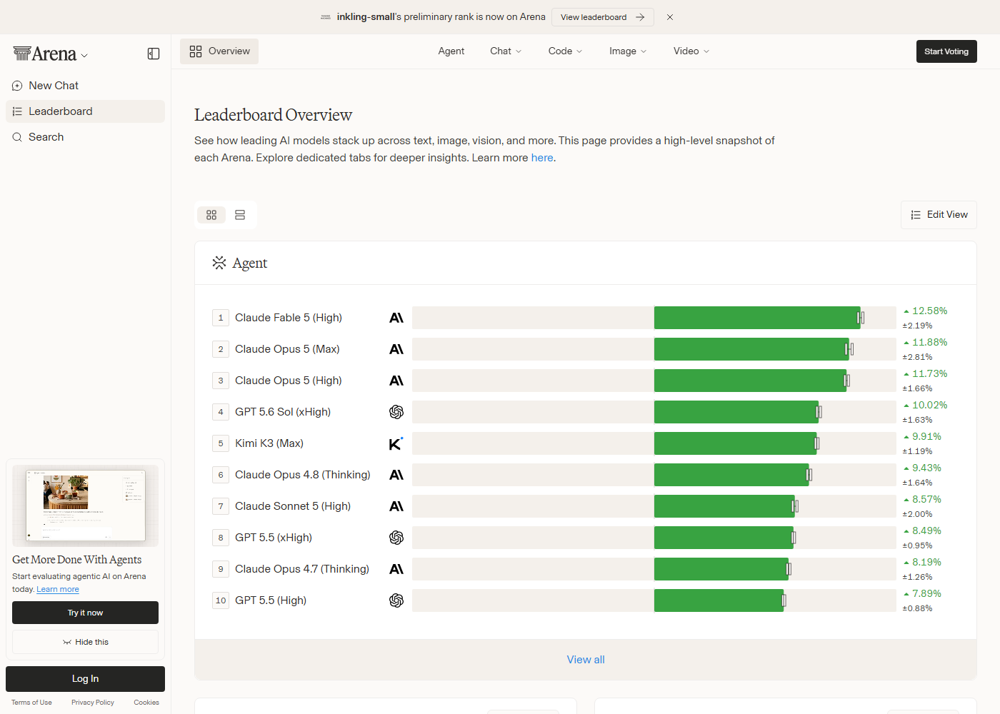
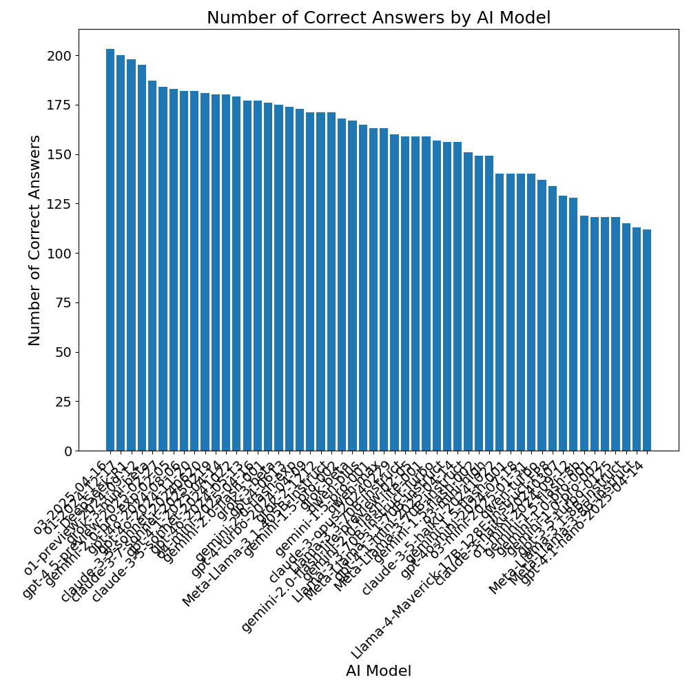
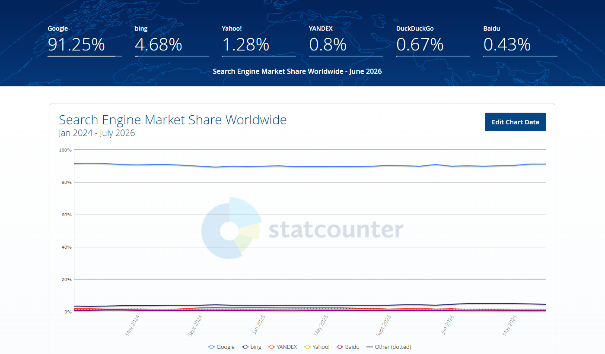
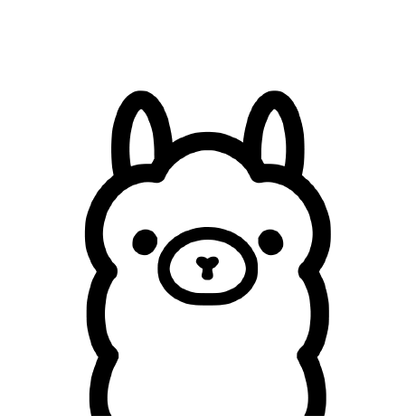
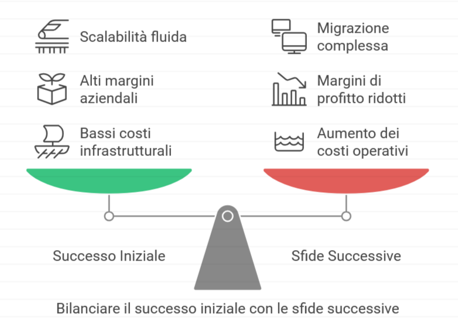
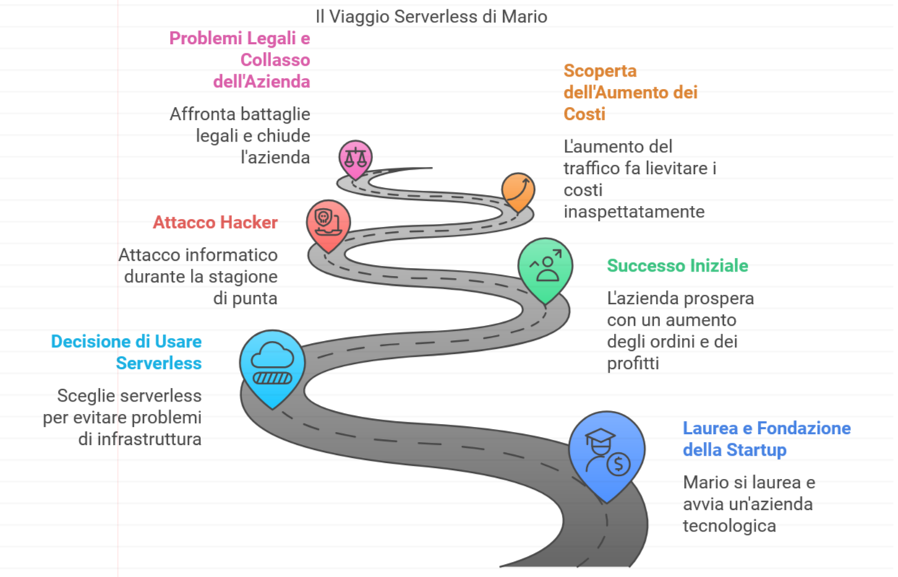
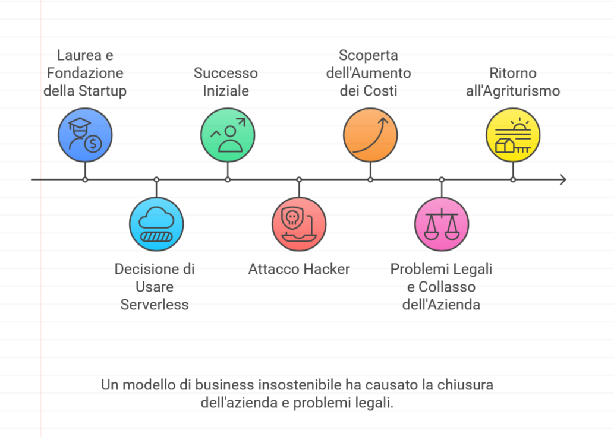
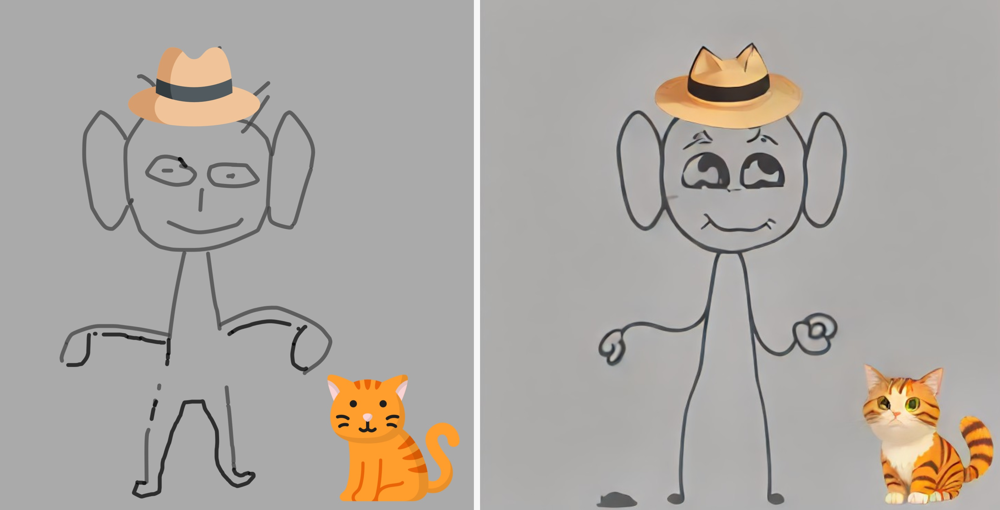
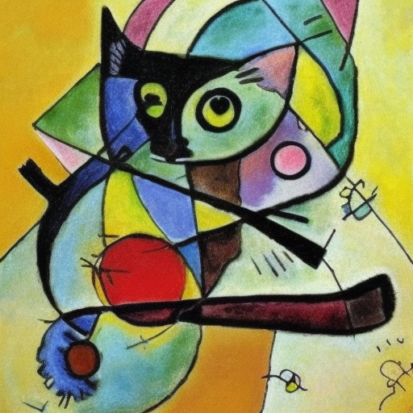
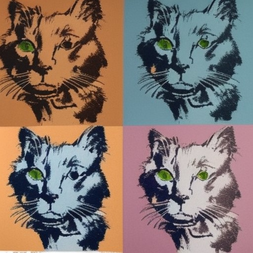

# Corso AI — Pratica

## Guida all'utilizzo dell'AI


<!-- _paginate: false -->
<!-- _footer: "" -->
<!-- style: "
@import url('https://fonts.googleapis.com/css2?family=Atkinson+Hyperlegible:ital,wght@0,400;0,700;1,400;1,700&family=Share+Tech+Mono&display=swap');

img[alt~='center'] {
  display: block;
  margin: 0 auto;
}
img[alt~='floatleft'] {
  float: left;
  margin: auto;
}
img[alt~='floatright'] {
  float: right;
  margin: auto;
}

section {
  --primary: #14233d;
  --secondary: #3fa9ac;
  --dark: #171717;
  --muted: #5c6f84;
  --line: rgba(20, 35, 61, 0.16);
  --light: #f5f6f4;
  --cyan-bright: #4fc3c7;
  --phosphor: #33ff33;
  --warroom: #060f1c;
  font-family: 'Atkinson Hyperlegible', 'Segoe UI', Arial, sans-serif;
  font-size: 22px;
  color: var(--dark);
  background-color: var(--light);
  line-height: 1.34;
  padding: 40px 60px 60px 60px;
  display: flex;
  flex-direction: column;
  justify-content: flex-start;
}

h2 {
  color: var(--primary);
  font-family: 'Share Tech Mono', 'Consolas', monospace;
  font-size: 1.3em;
  line-height: 1.15;
  margin-top: 0;
  margin-bottom: 0.5em;
  font-weight: 400;
  letter-spacing: 0.01em;
  text-transform: uppercase;
  background: linear-gradient(90deg, var(--primary) 0%, var(--cyan-bright) 100%);
  background-size: 320px 3px;
  background-repeat: no-repeat;
  background-position: bottom left;
  padding-bottom: 0.32em;
}
h2 strong {
  color: var(--secondary);
}
h3 {
  color: var(--secondary);
  font-family: 'Share Tech Mono', 'Consolas', monospace;
  font-size: 0.95em;
  font-weight: 400;
  letter-spacing: 0.01em;
  margin-bottom: 0.3em;
}

ul, ol {
  margin-top: 0.3em;
}
li {
  margin-bottom: 0.34em;
  color: var(--dark);
  line-height: 1.34;
}
li::marker {
  color: var(--secondary);
  font-weight: 900;
}
strong {
  color: var(--primary);
  font-weight: 900;
}
a {
  color: var(--secondary);
  text-decoration: none;
  border-bottom: 1px solid rgba(63, 169, 172, 0.45);
}
a:hover {
  border-bottom-color: var(--secondary);
}
em {
  color: var(--muted);
  font-style: italic;
}

blockquote {
  background: rgba(27, 54, 93, 0.05);
  border-left: 8px solid var(--secondary);
  border-radius: 0;
  margin: 1em 0;
  padding: 0.82em 24px;
  font-style: italic;
  color: var(--dark);
  font-size: 0.95em;
  font-weight: 650;
}

pre {
  background: var(--warroom);
  border: 1px solid rgba(51, 255, 51, 0.3);
  border-radius: 4px;
  padding: 16px 20px;
  margin: 0.65em 0;
}
pre code, pre code * {
  color: var(--phosphor) !important;
  font-family: 'Cascadia Code', 'Fira Code', 'Consolas', monospace !important;
  text-shadow: 0 0 5px rgba(51, 255, 51, 0.35);
  font-size: 0.88em;
  line-height: 1.5;
}
code {
  font-family: 'Cascadia Code', 'Fira Code', 'Consolas', monospace;
  color: var(--primary);
  background-color: rgba(20, 35, 61, 0.08);
  padding: 2px 6px;
  border-radius: 4px;
  font-size: 0.9em;
}

section table {
  border-collapse: collapse;
  table-layout: fixed;
  display: table !important;
  width: 1160px !important;
  max-width: none !important;
  margin-top: 0.6em;
  font-size: 0.88em;
  background-color: rgba(255,255,255,0.98);
  border-radius: 4px;
  overflow: hidden;
  border: 1px solid var(--line);
}
th {
  background: var(--primary);
  color: #fff;
  padding: 12px 14px;
  font-weight: 900;
}
td {
  border-bottom: 1px solid rgba(27, 54, 93, 0.08);
  padding: 12px 14px;
  color: var(--dark);
}
tr:nth-child(even) {
  background-color: rgba(27, 54, 93, 0.03);
}

img {
  border-radius: 2px;
}

footer {
  color: var(--muted);
  font-size: 13px;
  font-weight: 800;
  left: 54px;
  bottom: 19px;
}
section::after {
  color: var(--muted);
  font-size: 13px;
  font-weight: 900;
}

section.lead {
  background-color: var(--primary) !important;
  background-image: linear-gradient(135deg, #1b365d 0%, #0d1b30 100%) !important;
  color: #fff;
  justify-content: center;
  text-align: left;
  padding: 90px 90px;
}
section.lead h1 {
  color: #fff;
  font-family: 'Share Tech Mono', 'Consolas', monospace;
  font-size: 2.1em;
  font-weight: 900;
  text-transform: uppercase;
  line-height: 1.05;
  margin: 0;
  max-width: 870px;
}
section.lead h2 {
  color: var(--secondary);
  font-size: 1.15em;
  font-weight: 650;
  line-height: 1.24;
  background: none;
  text-transform: none;
  padding: 0;
  margin-top: 0.3em;
  max-width: 760px;
}
section.lead strong {
  color: #fff;
}
section.lead footer {
  display: block;
  color: #fff;
}
" -->

---

## Come nascono queste slide

In risposta alla rapida diffusione di prodotti basati sull'Intelligenza Artificiale, ho elaborato una presentazione che ripercorre l'evoluzione di questa tecnologia e illustra i termini chiave utilizzati nel settore.

Nel corso della mia attività professionale, ho inoltre sperimentato diverse soluzioni AI che mi hanno permesso di ottimizzare i processi lavorativi, aumentando sia l'efficienza che la qualità dei risultati.

Ho quindi arricchito la presentazione con una sezione pratica dedicata ai vari strumenti AI, specificando per ciascuno il campo di applicazione ideale.

L'obiettivo di questo lavoro è duplice: da un lato, far conoscere i benefici concreti che l'Intelligenza Artificiale può apportare nella vita professionale, dall'altro, fornire una guida pratica per la scelta degli strumenti AI più adatti alle diverse esigenze lavorative quotidiane.

---

## Chi sono ?

Matteo Baccan è un ingegnere del software e formatore professionista con oltre 30 anni di esperienza nel settore IT.
Ha lavorato per diverse aziende e organizzazioni, occupandosi di progettazione, sviluppo, testing e gestione di applicazioni web e desktop, utilizzando vari linguaggi e tecnologie. È anche un appassionato divulgatore e insegnante di informatica, autore di numerosi articoli, libri e corsi online rivolti a tutti i livelli di competenza.
Gestisce un sito internet e un canale YouTube dove condivide video tutorial, interviste, recensioni e consigli sulla programmazione.
Attivo nelle community open source, partecipa regolarmente a eventi e concorsi di programmazione.
Si definisce un "sognatore realista" che ama sperimentare, innovare e condividere le sue conoscenze e passioni, seguendo il motto: "Non smettere mai di imparare, perché la vita non smette mai di insegnare".

---

## Cosa è l'Intelligenza Artificiale?

L'**Intelligenza Artificiale** (AI) è una branca dell'informatica che abbraccia diverse discipline, tra cui l'apprendimento automatico, la visione artificiale, l'elaborazione del linguaggio naturale e la robotica.

Il suo scopo principale è sviluppare algoritmi che permettano ai computer di svolgere attività tradizionalmente eseguibili solo dall'intelletto umano. Si tratta di una scienza interdisciplinare che integra teoria, metodologia, analisi del linguaggio e ingegneria per creare sistemi intelligenti capaci di prendere decisioni articolate in scenari complessi.

Nel contesto aziendale, l'Intelligenza Artificiale si rivela uno strumento prezioso per ottimizzare i processi lavorativi, incrementando sia la produttività che l'efficienza operativa.

---

## Prompt

Immagina di assumere oggi stesso un nuovo collaboratore bravissimo: ha letto praticamente tutto lo scibile umano, ma non conosce te, la tua azienda, né cosa hai davvero in mente.

Se gli dici solo "fammi un report", improvviserà. Se gli spieghi obiettivo, formato atteso, vincoli e contesto, il risultato sarà tutta un'altra cosa.

Con un LLM funziona allo stesso modo: il **prompt** è l'istruzione — il "brief" — con cui lo guidiamo verso la risposta che ci serve davvero.

---

## Anatomia di un prompt o1

Greg Brockman, cofondatore e presidente di OpenAI, ha condiviso su X un esempio di prompt ben fatto:

<https://x.com/gdb/status/1878489681702310392>

- Obiettivo
- Formato della risposta
- Avvertenze
- Contesto

---

## Prompt: **Obiettivo**

Voglio una lista delle migliori escursioni di media lunghezza raggiungibili entro due ore da San Francisco.

Ogni escursione dovrebbe offrire un'avventura interessante e unica, ed essere meno conosciuta.

---

## Prompt: **Formato della Risposta**

Per ogni escursione, indica il nome del sentiero come lo troverei su AllTrails, poi fornisci l'indirizzo di partenza dell'escursione, l'indirizzo di arrivo, la distanza, il tempo di guida, la durata dell'escursione e cosa la rende un'avventura interessante e unica.

Elenca le migliori 3.

---

## Prompt: **Avvertenze**

Fai attenzione a verificare che il nome del sentiero sia corretto, che esista effettivamente e che il tempo sia corretto.

---

## Prompt: **Contesto**

Per contesto: io e la mia ragazza facciamo un sacco di escursioni! Abbiamo fatto praticamente tutte le escursioni locali di SF, che siano nel presidio o nel golden gate park. Vogliamo decisamente uscire dalla città -- abbiamo fatto il monte tam recentemente, tutto il percorso dall'inizio delle scale fino a stinson -- è stato davvero lungo e siamo decisamente in vena di qualcosa di diverso questo weekend! Le viste sull'oceano sarebbero ancora belle. Amiamo il buon cibo. Una cosa che mi è piaciuta dell'escursione sul monte tam è che finisce con una celebrazione (Arrivare in città per la colazione!). I vecchi silos missilistici e altre strutture vicino a Discovery point sono interessanti ma ho fatto quell'escursione probabilmente 20 volte a questo punto. Non ci vedremo per alcune settimane (lei deve stare a LA per lavoro) quindi l'unicità qui conta davvero.

---

## JSON Prompting

Il JSON Prompting è una tecnica che sfrutta la struttura JSON (JavaScript Object Notation) per inviare richieste più precise e strutturate ai Large Language Models (LLM) e per ricevere risposte formattate in modo prevedibile.

**Una tecnica di un'epoca precisa (2023-2024)**: nata quando si cercava un modo per "istruire meglio" il modello irrigidendo il formato della richiesta. Con l'evoluzione dei modelli si è capito che a contare davvero non è la struttura del dato in ingresso, ma la sua **completezza** (lo vediamo a fine sezione) — vale comunque la pena conoscerla, perché resta utile per un motivo diverso: strutturare l'output.

**Perché è utile?**

- **Precisione**: Definire chiaramente i campi richiesti riduce l'ambiguità.
- **Prevedibilità**: Le risposte JSON sono facili da parsare e integrare in applicazioni.
- **Complessità gestita**: Permette di inviare richieste complesse con dati strutturati.
- **Controllo del formato**: Assicura che l'output del modello sia esattamente nel formato desiderato.

---

## Vantaggi del JSON Prompting

L'adozione del JSON prompting offre numerosi vantaggi rispetto all'uso del solo linguaggio naturale:

Maggiore Precisione e Controllo: Elimina le ambiguità del linguaggio naturale. Specificando parametri come "tono", "lunghezza" e "formato di output", si guida l'IA a generare esattamente il risultato desiderato.

Coerenza dell'Output: Assicura che l'IA risponda sempre nel formato desiderato. Questo è fondamentale quando l'output dell'IA deve essere elaborato da altri software.

Efficienza nell'Integrazione: L'output in formato JSON è facilmente interpretabile da qualsiasi linguaggio di programmazione.

Riduzione degli Errori: La struttura rigida del JSON riduce la probabilità di errori di interpretazione da parte del modello, diminuendo le cosiddette "allucinazioni".

---

## Linguaggio Naturale

### Prompt naturale

"Scrivi un tweet per promuovere un nuovo smartphone chiamato 'CyberPro X' che ha una fotocamera da 108MP e una batteria a lunga durata. Usa un tono entusiasta e includi degli hashtag."

### Risposta naturale

"🚀 Scopri il nuovo CyberPro X! Con una fotocamera da 108MP e una batteria che non ti abbandona mai, è lo smartphone che hai sempre sognato! #CyberProX #NuovoSmartphone #Tecnologia"

---

## Formato JSON

### Prompt JSON

```json
{ "task": "scrivi_tweet_promozionale", 
   "prodotto": {
      "nome": "CyberPro X", 
      "caratteristiche_principali": [ "fotocamera 108MP", "batteria a lunga durata"] 
      },
   "piattaforma": "Twitter",
   "tono": "entusiasta", 
   "istruzioni_aggiuntive": { "includi_hashtag": true, "lunghezza_massima": 280 } } 
```

### Risposta JSON

```json
{ "testo_tweet": "Preparati a scattare foto incredibili con la fotocamera da 108MP del 
   nuovo CyberPro X! 📸 E con la sua batteria a lunga durata, non dovrai più
   preoccuparti di rimanere a secco! 🔋 #CyberProX #Innovazione #Smartphone", 
   "hashtag": [ "CyberProX", "Innovazione", "Smartphone" ] } 
```

---

## JSON Prompting - Come funziona

Si fornisce al LLM un prompt che include un esempio o una descrizione della struttura JSON desiderata sia per l'input (opzionale) che per l'output.

**Esempio di Prompt per l'estrazione di informazioni:**

```text
Estrai le seguenti informazioni dal testo e forniscile in formato JSON: nome, età, città.

Testo: "Mario Rossi ha 30 anni e vive a Roma."

Formato JSON desiderato:
{
  "nome": "string",
  "eta": "number",
  "citta": "string"
}
```

---

## JSON Prompting - Esempio di Risposta

```json
{
  "nome": "Mario Rossi",
  "eta": 30,
  "citta": "Roma"
}
```

**Suggerimenti per un JSON Prompting efficace:**

- **Sii specifico**: Definisci chiaramente i nomi dei campi e i tipi di dato attesi.
- **Fornisci esempi**: Mostra al modello un esempio di input e/o output JSON.
- **Utilizza istruzioni chiare**: Indica esplicitamente al modello di rispondere in JSON.
- **Gestisci gli errori**: Prevedi la possibilità che il modello non restituisca un JSON valido e implementa logiche di fallback o validazione.

---

## Come Strutturare un Prompt in JSON

La creazione di un prompt in JSON si basa sulla definizione di coppie chiave-valore. Le "chiavi" sono etichette descrittive (come "task" o "tono"), mentre i "valori" contengono le informazioni specifiche. È possibile nidificare gli oggetti per creare strutture più complesse, come visto nell'esempio precedente con l'oggetto "prodotto".

Le chiavi più comuni in un JSON prompt includono:

```text
task: Una descrizione sintetica del compito da eseguire.
input_data: I dati su cui l'IA deve lavorare (ad esempio, un testo da riassumere).
parameters: Un oggetto contenente vari parametri per guidare l'output, come:
   tone: (es. "formale", "amichevole", "umoristico")
   format: (es. "paragrafo", "elenco puntato", "email")
   length: (es. "breve", "dettagliato", "200 parole")
   output_schema: Un esempio della struttura JSON desiderata in output.
```

---

## JSON Prompting - la lezione imparata

Con l'evoluzione dei modelli (soprattutto quelli con reasoning esteso) si è capito che il problema non era la struttura del prompt, ma la sua **completezza**.

- Un prompt in linguaggio naturale ma ricco di contesto, obiettivo, vincoli ed esempi funziona quanto (spesso meglio di) un JSON altrettanto dettagliato.
- Un JSON scarno non batte comunque un prompt naturale povero di dettagli: la struttura non supplisce alla mancanza di informazione.
- Il JSON resta utile soprattutto per un motivo diverso: **strutturare l'output** quando la risposta deve essere elaborata da software. I modelli più recenti offrono anche modalità native di "structured output" per questo, senza doverlo scrivere a mano nel prompt.

**In sintesi**: arricchisci il contesto, non il formato.

---

## In-Context Learning

La capacità degli LLM di adattarsi e apprendere direttamente dal contesto fornito nel prompt:

- **Few-Shot Learning**: Il modello apprende pattern e comportamenti da un numero limitato di esempi dimostrativi, migliorando drasticamente le performance su task specifici senza necessità di fine-tuning.

- **Chain of Thought (COT)**: Tecnica che guida il modello attraverso un ragionamento esplicito e strutturato, permettendogli di:

Questa metodologia consente di "programmare" il comportamento del modello attraverso il linguaggio naturale, senza modificarne i parametri.

---

## Reasoning negli LLM

Il **reasoning** negli LLM è la capacità di elaborare informazioni in modo logico e strutturato per risolvere problemi. Include:

- Analisi logica e pensiero critico
- Ragionamento causale e correlazioni
- Deduzione (da generale a specifico) e induzione (da specifico a generale)
- Problem solving strutturato con scomposizione in passi

Implementato attraverso tecniche come chain-of-thought e modalità di pensiero esteso, è essenziale per compiti complessi come matematica, programmazione e comprensione testuale avanzata.

---

## Hybrid Reasoning

Anthropic ha introdotto, con Claude 3.7, il primo modello ibrido di reasoning: la stessa famiglia di modelli può rispondere subito oppure "pensare" più a lungo, a seconda della complessità del task.

Questo approccio combina molteplici modalità di ragionamento per risolvere problemi complessi in modo più efficace, ed è diventato lo standard di settore: la lineup Anthropic attuale (Sonnet 5, Opus 5, Fable 5, Mythos 5) lo adotta su tutti i modelli, così come le famiglie GPT-5.x di OpenAI e Gemini 3 di Google.

Se il problema non necessita reasoning, la risposta viene data subito, se ne necessita ha un tempo incrementale di reasoning in base alla complessità del problema.

---

## Chain of Thought (CoT) - Deep Thinking

Il CoT (Chain of Thought) nell'intelligenza artificiale è una tecnica di ragionamento che significa letteralmente "Catena di Pensiero". Spinto da o1 e o3 e ora largamente diffuso dai maggiori modelli.

È un metodo in cui l'IA spiega il suo processo di ragionamento passo dopo passo, proprio come farebbe una persona quando pensa ad alta voce per risolvere un problema. Invece di dare solo la risposta finale, mostra tutto il percorso logico.

---

## Come funziona CoT?

- **Input**: L'utente fornisce un problema o una domanda complessa al modello.
- **Decomposizione**: Il modello scompone il problema in una serie di sotto-problemi più semplici.
- **Ragionamento**: Per ogni sotto-problema, il modello applica le sue conoscenze e capacità di ragionamento per trovare una soluzione parziale.
- **Concatenazione**: Le soluzioni parziali vengono concatenate insieme per formare una "catena di pensiero" che porta alla soluzione finale del problema originale.
- **Output**: Il modello fornisce la soluzione finale, insieme alla catena di pensiero che ha portato a tale soluzione.

---

## Vantaggi di CoT

- **Migliore comprensione**: CoT permette al modello di comprendere meglio il problema, analizzandolo in dettaglio.
- **Maggiore accuratezza**: La scomposizione del problema in parti più piccole aumenta l'accuratezza della soluzione finale.
- **Spiegabilità**: La catena di pensiero rende il processo di risoluzione più trasparente e comprensibile, sia per gli sviluppatori che per gli utenti.

---

## Deep research

Il "deep research" negli LLM è un processo avanzato che consente ai modelli di linguaggio di effettuare ricerche approfondite su argomenti specifici, andando oltre le informazioni contenute nei dati di addestramento. Questo processo tipicamente include:

- L'integrazione con fonti di informazioni esterne e aggiornate
- La capacità di navigare, recuperare e sintetizzare informazioni da database, motori di ricerca o knowledge base
- L'abilità di valutare criticamente le fonti per rilevanza e affidabilità
- La contestualizzazione delle informazioni trovate rispetto alla query originale
- La sintesi di informazioni provenienti da fonti diverse in risposte coerenti

---

## Deep research - strumenti

Nei sistemi più avanzati, il deep research permette agli LLM di superare il limite del knowledge cutoff, accedendo a informazioni aggiornate e specifiche. Questo è particolarmente utile per query che richiedono dati recenti o molto specializzati.

Questa funzionalità è implementata attraverso l'integrazione degli LLM con strumenti esterni (tool use) e architetture RAG (Retrieval-Augmented Generation) che permettono di combinare il ragionamento del modello con informazioni recuperate dinamicamente.

---

## Deep research - prodotti reali (2025)

Nel corso del 2025 il concetto è diventato una feature concreta nei principali servizi:

- **OpenAI Deep Research**: naviga decine di fonti web e produce report strutturati con citazioni.
- **Gemini Deep Research** (Google): stessa logica, integrata in Gemini App e Workspace.
- **Perplexity Deep Research**: specializzato nella sintesi multi-fonte con tracciabilità delle citazioni.

Tutti condividono lo stesso pattern: pianificazione, ricerca iterativa, verifica incrociata delle fonti, sintesi finale.

---

## A cosa servono le reti generative?

Le reti generative sono state utilizzate per creare nuovi contenuti in una varietà di settori, tra cui la produzione di film, la produzione di musica, la produzione di videogiochi e la produzione di arte.

Ricordiamoci che lo scopo delle AI attuali è quella di produrre un risultato, non esiste un'intelligenza artificiale che possa pensare come un essere umano.

---

## Come valutavamo le AI in passato?

- Test di Turing

---

## Test di Turing

Il test di Turing è stata la prima formulazione di una tecnica usata per determinare se un computer è in grado di pensare in modo intelligente come un essere umano. Il test è stato sviluppato nel 1950 da Alan Turing, un matematico britannico, ed è considerato uno dei primi esempi di intelligenza artificiale.

Il test di Turing è una conversazione tra un giudice umano e due partecipanti, un umano e un computer. Il giudice non sa quale delle due parti è l'umano e quale il computer. Se il giudice non è in grado di determinare la differenza, viene considerato che il computer è intelligente come un essere umano.

---

## Il test di Turing può considerarsi superato?

Recenti studi indicano che i modelli di AI più avanzati, come GPT-4, hanno superato il test di Turing.

In uno studio del maggio 2024, GPT-4 è stato percepito come umano nel 54% delle conversazioni.

Questo risultato segna un traguardo importante, anche se il dibattito sul vero significato di "intelligenza" artificiale rimane aperto.

---

## Oppure no?

Secondo due ricercatori dell'Università della California a San Diego, che hanno condotto un esperimento per mettere alla prova il modello linguistico GPT-4, il modello non ha superato il test di Turing.

<https://arxiv.org/abs/2310.20216>

<https://www.hwupgrade.it/news/scienza-tecnologia/intelligenze-artificiali-alla-prova-del-test-di-turing-un-chatbot-anni-60-batte-gpt-35_122368.html>

---

## Valutazione dei Modelli

- **Benchmarking**: Confronto delle performance su task specifici.
- **Chatbot Arena**: Valutazione diretta dagli utenti tramite confronti anonimi.
- **Valutazione Umanistica**: Feedback esperti.

---

## Benchmarking

Esistono diversi modi per valutare le AI, a seconda del loro scopo e delle loro funzionalità. Alcuni dei metodi più comuni includono:

- Valutazione delle prestazioni
- Valutazione dell'usabilità
- Valutazione dell'etica
- Valutazione dell'interpretabilità

---

## Prestazioni e usabilità

- Valutazione delle prestazioni: questo metodo valuta le prestazioni dell'AI in base a metriche specifiche, come l'accuratezza, la velocità di elaborazione e la capacità di apprendimento. Questo metodo è spesso utilizzato per valutare le AI utilizzate in applicazioni come la classificazione delle immagini, la traduzione automatica e la diagnosi medica.

- Valutazione dell'usabilità: questo metodo valuta l'usabilità dell'AI, ovvero la facilità con cui gli utenti possono interagire con l'AI e utilizzarla per raggiungere i loro obiettivi. Questo metodo è spesso utilizzato per valutare le AI utilizzate in applicazioni come l'assistenza virtuale e l'interazione uomo-macchina.

---

## Etica e interpretabilità

- Valutazione dell'etica: questo metodo valuta l'impatto etico dell'AI, ovvero se l'AI rispetta i principi etici e i diritti umani. Questo metodo è spesso utilizzato per valutare le AI utilizzate in applicazioni come la sorveglianza, la selezione del personale e la decisione automatizzata. Da notare che le AI sono solo algoritmo, quindi "l'eticità" o meno di una AI rappresenta solo un modo col quale può essere corretto il suo algoritmo di valutazione.

- Valutazione dell'interpretabilità: questo metodo valuta la capacità dell'AI di spiegare le sue decisioni e il suo funzionamento interno. Questo metodo è spesso utilizzato per valutare le AI utilizzate in applicazioni come la diagnosi medica e la decisione automatizzata.

Ci sono anche altri metodi di valutazione delle AI, ma questi sono alcuni dei più comuni.

---

## Nuovi test - FrontierMath

Questo benchmark è stato sviluppato in collaborazione con oltre 60 matematici di istituzioni di prestigio e comprende centinaia di problemi matematici originali e particolarmente impegnativi, coprendo la maggior parte dei principali rami della matematica moderna.

---

## Caratteristiche di FrontierMath

- Difficoltà: I problemi presentati in FrontierMath sono progettati per essere estremamente difficili, richiedendo ore o addirittura giorni di lavoro a esperti matematici per essere risolti. Questo contrasta con altri benchmark, dove i modelli AI hanno raggiunto punteggi superiori al 90%

- Problemi Originali: Tutti i problemi sono nuovi e non pubblicati, il che elimina le preoccupazioni riguardo alla contaminazione dei dati che affliggono i benchmark esistenti

- Valutazione Automatizzata: FrontierMath utilizza sistemi di verifica automatizzati per valutare in modo efficiente e riproducibile le performance degli AI, sia open che closed-source

---

## Risultati di FrontierMath

Recentemente, i principali modelli AI, inclusi GPT-4o e Gemini 1.5 Pro, hanno mostrato prestazioni deludenti su FrontierMath, risolvendo meno del 2% dei problemi

Il modello o3 di OpenAI ha ottenuto un punteggio notevolmente migliore, risolvendo circa il 25% dei problemi, evidenziando un significativo progresso rispetto ai modelli precedenti

---

## ARC Benchmark

L'ARC Benchmark è un importante strumento di valutazione progettato per testare le capacità di ragionamento dei modelli di linguaggio di grandi dimensioni (LLM). È stato sviluppato nel 2018 da Clark et al. come parte dell'AI2 Reasoning Challenge, con l'obiettivo di superare i limiti di altri benchmark di question-answering,

### Obiettivi e Importanza

L'ARC Benchmark mira a spingere i modelli AI verso una comprensione più umana del linguaggio e del ragionamento. Con l'evoluzione dei LLM, l'ARC continua a rappresentare una sfida significativa per gli ingegneri del machine learning, incentivando lo sviluppo di modelli che possano affrontare domande più complesse e articolate, riflettendo meglio le capacità umane nel comprendere e risolvere problemi.

---

## Caratteristiche dell'ARC Benchmark

- Domande Complesse: L'ARC Benchmark include 7.787 domande a scelta multipla, suddivise in due categorie: "Easy Set" e "Challenge Set". Queste domande sono progettate per essere più impegnative rispetto ai benchmark precedenti, richiedendo non solo la capacità di recuperare fatti, ma anche competenze di ragionamento e comprensione profonda

- Integrazione delle Informazioni: A differenza di altri benchmark che si concentrano sulla semplice estrazione di informazioni, l'ARC valuta come i modelli integrano informazioni sparse in diversi passaggi per rispondere a domande complesse

- Scoring: Ogni risposta corretta guadagna un punto, e in caso di pareggio con altre risposte corrette, il punteggio viene distribuito equamente tra le opzioni1

---

## Da ARC ad ARC-AGI

Il benchmark ARC originale (2018) è stato ormai saturato dai modelli più recenti, così è nata la serie **ARC-AGI**, pensata apposta per resistere alla memorizzazione e misurare vero ragionamento astratto:

- **ARC-AGI-2** (2024): Gemini 3 Deep Think lo risolve all'84,6%, contro il 68,8% di Claude Opus 4.6 e il 52,9% di GPT-5.2 — un salto enorme rispetto ai modelli di un anno prima.
- **ARC-AGI-3** (2026): nuova generazione ancora molto più ostica, con i modelli migliori fermi sotto l'1% di problemi risolti.

Come per FrontierMath, appena un benchmark viene "battuto" ne nasce uno nuovo più difficile: è la dinamica tipica della valutazione AI.

---

## I benchmark sottostimano le capacità reali?

Un report dell'**AI Security Institute** britannico (2 luglio 2026) solleva un problema metodologico: quasi tutte le valutazioni interrompono il ragionamento dell'agente a un budget di token fisso, per contenere i costi.

"Il punteggio ottenuto non è il soffitto della capacità del modello, è solo il punto in cui qualcuno ha smesso di guardare."

Tracciando una *capability curve* (aumentando progressivamente i token disponibili): +25% di prestazioni in ingegneria del software e +22% in matematica passando da 1 a 10 milioni di token. Le classifiche che vediamo potrebbero quindi sottostimare sistematicamente ciò che un modello sa davvero fare.

<https://aitalk.it/it/aisi-benchmark.html>

---

## Chatbot Arena

A volte i test non bastano, per questa ragione esiste un portale: <https://lmarena.ai/> dove gli utenti possono testare i vari modelli di AI e votare per il migliore.

Da gennaio 2026 il progetto si è rinominato da "LMSYS Chatbot Arena" semplicemente in **Arena**, ed è gestito come azienda indipendente (i nomi LMArena e Chatbot Arena restano comunque in uso comune).

### Come funziona?

Gli utenti possono fare una domanda qualsiasi a due Chatbot anonimi.

In base alla risposta è possibile premiare una AI al posto di un'altra.

Su questa valutazione "umana", viene creata una classifica dei modelli di AI.

---

## Leaderboard

Un altro modo per capire il valore di una AI è quello di guardare le classifiche dei modelli di AI.
Le classifiche sono aggiornate in tempo reale e mostrano le performance dei modelli su vari benchmark e task.

**I numeri di Arena** (metà 2026): oltre **6,8 milioni** di voti umani raccolti su più di **360 modelli** — con la classifica che cambia di continuo a ogni nuovo modello rilasciato.

---

## Leaderboard - la classifica in questo momento



*Screenshot della classifica "Agent" su lmarena.ai — 31 luglio 2026*

---

## Applicazioni della AI

L'Intelligenza Artificiale ha un'ampia gamma di applicazioni in diversi settori, tra cui:

- Sanità
- Finanza
- Produzione
- Robotica

---

## Applicazioni dell'AI - 1

- **Sanità**: L'AI può essere utilizzata per analizzare grandi quantità di dati sanitari per identificare modelli e prevedere malattie. Può anche essere utilizzata per la diagnosi assistita da computer (CAD) per aiutare i medici nella diagnosi di malattie come il cancro. I sistemi di AI possono aiutare a identificare le aree che necessitano di miglioramenti.

- **Finanza**: L'AI può essere utilizzata per identificare frodi, prevedere tendenze di mercato e gestire il rischio. Puoi anche analizzare i dati finanziari per identificare modelli e prevedere i movimenti del mercato.

---

## Applicazioni dell'AI - 2

- **Produzione**: L'AI può essere utilizzata per ottimizzare le linee di produzione, prevedere la manutenzione e gestire la catena di approvvigionamento.

- **Robotica**: L'AI può essere utilizzata per creare robot in grado di svolgere attività complesse e pericolose per gli esseri umani, come la pulizia di materiali pericolosi e l'esplorazione di ambienti estremi.

---

## L'AI ci ruberà il lavoro?

Non è più solo una domanda da titolo clickbait. Secondo il rapporto Challenger, Gray & Christmas, a marzo 2026 negli Stati Uniti sono stati annunciati **60.620 licenziamenti** (+25% rispetto ai 48.307 di febbraio) — con l'intelligenza artificiale citata come causa principale per **15.341 di questi tagli**, il 25% del totale mensile.

Il dato non è ancora un verdetto definitivo (i licenziamenti hanno sempre cause multiple), ma segna un cambio di scala rispetto agli anni precedenti.

<https://aitalk.it/it/licenziamenti-ai-2026.html>

**Approfondimento**: è il tema del talk di Matteo Baccan *"What's changing under our feet? Will AI steal our jobs?"* (Codemotion Milano, 2025).

---

## AI per la Medicina: AlphaFold di Google DeepMind

AlphaFold è un sistema di intelligenza artificiale sviluppato da Google DeepMind, specializzato nella predizione della struttura tridimensionale delle proteine a partire dalla loro sequenza di amminoacidi.

**Il problema del protein folding**: Le proteine sono catene di amminoacidi che si ripiegano in strutture 3D specifiche per funzionare. Capire come si ripiegano è fondamentale per la medicina, ma è stato per decenni uno dei problemi più difficili della biologia computazionale.

---

## AI per la Medicina: AlphaFold - importanza

**Perché è rivoluzionario?**
- **Velocità**: AlphaFold può predire la struttura di una proteina in pochi minuti, contro mesi o anni con i metodi tradizionali (cristallografia a raggi X, criomicroscopia elettronica).
- **Copertura**: AlphaFold DB contiene oltre 200 milioni di strutture proteiche predette, coprendo quasi tutte le proteine conosciute.
- **Open Science**: DeepMind ha reso pubblico il database di AlphaFold, permettendo a ricercatori di tutto il mondo di accedere gratuitamente a queste predizioni.

---

## AI per la Medicina: AlphaGenome di Google DeepMind

Dopo il successo di AlphaFold per le proteine, Google DeepMind ha sviluppato AlphaGenome, un modello di intelligenza artificiale che analizza il genoma umano per comprendere come le variazioni genetiche influenzano la salute e le malattie.

---

## AI per la Medicina: AlphaGenome - importanza

**Perché è rivoluzionario?**
- **Analisi genomica avanzata**: AlphaGenome predice l'impatto delle mutazioni genetiche sulla salute umana, aiutando a identificare cause di malattie rare e complesse.
- **Velocità e precisione**: Rispetto ai metodi tradizionali di analisi genomica, AlphaGenome velocizza l'individuazione di varianti patogene, riducendo i tempi di diagnosi.
- **Supporto alla medicina personalizzata**: Permette di correlare specifiche varianti genetiche a potenziali trattamenti, avvicinando la medicina di precisione alla pratica clinica quotidiana.

---

## AI per la Medicina: AlphaGenome - sintesi

AlphaGenome, rispetto ad AlphaFold, estende il potere predittivo dell'AI dalla biologia strutturale alla genomica, aprendo nuove frontiere nella comprensione delle basi genetiche delle malattie e nello sviluppo di terapie sempre più mirate ed efficaci.

---

## Tecnologie di linguaggio a corredo delle AI

---

## Natural Language Processing (NLP)

L'elaborazione del linguaggio naturale (NLP). Il NLP riguarda l'uso di algoritmi e modelli per comprendere, interpretare e generare il linguaggio umano in modo automatico. Le applicazioni includono chatbot, sistemi di analisi del testo, traduzione automatica e assistenti virtuali come Siri.

---

## Natural Language Understanding (NLU)

La comprensione del linguaggio naturale è una branca dell'NLP che si concentra sul significato del linguaggio umano. NLU consente alle macchine di comprendere il contesto, l'intenzione e le emozioni in un testo o discorso.

---

## Natural Language Generation (NLG)

La generazione del linguaggio naturale è un'altra area chiave dell'NLP che si occupa di produrre testo in modo automatico a partire da dati strutturati, come numeri, tabelle o grafici. Le applicazioni includono la creazione di report e la produzione di descrizioni per immagini e video.

---

## Aziende che investono in AI

- **Meta**: Investimenti massicci per raggiungere la "superintelligenza". Dopo circa 72 miliardi di dollari di capex nel 2025, le stime per il 2026 sono salite a 125-145 miliardi.

- **Google**: Ha investito miliardi in DeepMind e nell'infrastruttura AI, inclusi i TPU (Tensor Processing Unit), con la famiglia di modelli Gemini (dopo il ritiro del brand Bard).

- **Microsoft**: Capex AI intorno ai 97 miliardi di dollari nel 2025, con proiezioni verso i 190 miliardi per il 2026. Ha acquisito Nuance e Inflection AI.

- **Amazon**: AWS offre servizi AI. Ha investito in Anthropic e sviluppa propri chip AI (Trainium, Inferentia).

- **Apple**: Investimenti mirati all'integrazione dell'AI nei propri dispositivi.

Nel complesso, Microsoft, Amazon, Google e Meta insieme prevedono di spendere circa 725 miliardi di dollari in infrastrutture AI nel 2026, in crescita del 77% rispetto ai 410 miliardi del 2025: la corsa agli investimenti non accenna a rallentare.

---

## Alternative che stanno crescendo

- **xAI** (Elon Musk)
- **Anthropic** (Claude)
- **Mistral AI** (francese, open-source)
- **Perplexity** (motore di ricerca AI)
- **DeepSeek** e **Alibaba** (cinesi)

---

## Robotaxi - da Johnny Cab a Tesla

Chi ha visto *Atto di forza* (Total Recall, 1990) ricorderà Johnny Cab, il tassista robotico che guida per Arnold Schwarzenegger.

Oggi il "robotaxi" è realtà: **Tesla Robotaxi**, il servizio di taxi a guida autonoma basato sulla tecnologia Full Self-Driving di Elon Musk, è attivo dal 2025 partendo da Austin (Texas).


---

## Robotaxi Tesla - espansione e sicurezza (2026)

Dopo Austin, il servizio è arrivato anche a Dallas e Houston, con l'obiettivo di coprire altre città USA entro fine 2026: la flotta è ormai presente in 7 mercati, con una crescita superiore al 10% a settimana nei chilometri percorsi.

Le criticità restano però centrali: Tesla ha registrato **17 incidenti** tra luglio 2025 e marzo 2026 (secondo i documenti NHTSA), attribuiti principalmente al sistema di assistenza remota di emergenza più che all'AI di guida vera e propria.

Per questo motivo Tesla ha rallentato volutamente l'espansione, dando priorità a sicurezza, test sul nuovo Cybercab e conformità alle normative locali prima di accelerare ulteriormente.

<https://insideevs.it/news/802786/tesla-robotaxi-espansione-crescita-sicurezza/>

---

## Aziende da tenere d'occhio

- NVIDIA: è il principale fornitore di GPU che alimentano i sistemi di AI, sta consentendo il rapido avanzamento dell'AI in tutti i settori. La sua capitalizzazione di mercato è passata da $145 miliardi nel gennaio 2020 a oltre $4.700 miliardi a luglio 2026, contendendosi con Apple il titolo di azienda più valutata al mondo.

---

## Aziende cinesi da tenere d'occhio

Il mercato AI cinese si è consolidato rapidamente: pesa ormai per oltre il **45% del traffico di OpenRouter**, e i quattro laboratori indipendenti più importanti — **DeepSeek**, **Zhipu**, **MiniMax** e **Moonshot** — insieme superano i 1.000 miliardi di yuan (circa 140 miliardi di dollari) di valutazione a inizio 2026.

- **Alibaba (Qwen)**: ha trasformato i propri modelli open weights in un vero ecosistema, tra i più usati al mondo.
- **DeepSeek**: laboratorio di Hangzhou, punta sull'efficienza open weights più che sulle app consumer.
- **Moonshot AI (Kimi)**: spinge su contesto lunghissimo e capacità di coding.
- **Zhipu AI / Z.ai (GLM)** e **Baidu (Ernie)**: centrali nell'uso enterprise e in lingua cinese.
- **Huawei** (stack Ascend): chip AI domestici, l'alternativa cinese a NVIDIA sotto le restrizioni USA all'export.

Segnale della maturità del settore: **Z.ai (Zhipu)** si è quotata alla Borsa di Hong Kong l'8 gennaio 2026, seguita da **MiniMax** nello stesso anno — i primi laboratori AI cinesi quotati in borsa.

**Esempio concreto**: **GLM-5.2** di Z.ai (753B parametri, MoE, rilasciato il 13 giugno 2026, pesi aperti con licenza MIT) si avvicina a Claude Opus 4.8 sui benchmark di coding più complessi (FrontierSWE: 74.4 vs 75.1), a circa **un sesto del costo** di GPT-5.5.

<https://aitalk.it/it/glm5.2>

---

## Evoluzione recente dell'AI in produzione

I prodotti AI si evolvono rapidamente. Ecco una timeline dei principali strumenti e servizi, raggruppati per anno di introduzione o di riferimento.

---

## Evoluzione 2023

L'anno in cui l'AI generativa è esplosa, con il rilascio di ChatGPT 4 e la nascita di nuovi servizi.

---

## Servizi basati su AI

Sono molti anni che vengono prodotti software in grado di dialogare con gli utenti, ma ChatGPT è stato il primo utilizzabile gratuitamente ed in grado di dare dei risultati che si avvicinano a quelli umani.

---

## Servizi di supporto ai testi

---

## ChatGPT - di cosa si tratta?

ChatGPT è un assistente AI che permette di dialogare con un sistema di AI in modo semplice. È in grado di rispondere a domande, scrivere testi, creare codice, tradurre lingue e molto altro.

---

## Perché si parla di ChatGPT quando di parla di AI?

ChatGPT è stato il primo assistente AI largamente utilizzato e reso disponibile a tutti in modo gratuito, permettendo a chiunque di capire le potenzialità dell'AI.

---

## Evoluzione di OpenAI

OpenAI è un'azienda di ricerca e sviluppo, inizialmente senza scopo di lucro (non-profit), dedicata all'intelligenza artificiale (AI). L'azienda è stata fondata nel 2015 da Sam Altman, Elon Musk, Greg Brockman, Ilya Sutskever, John Schulman e altri.

OpenAI ha sviluppato modelli linguistici di grandi dimensioni (LLM) come GPT-3, GPT-4, GPT-4o e ChatGPT, che hanno rivoluzionato il campo dell'elaborazione del linguaggio naturale.

L'azienda è nota per i suoi modelli di intelligenza artificiale all'avanguardia, che vengono utilizzati in vari settori, come la generazione di testi, la traduzione automatica e la risposta alle domande.

---

## Evoluzione di GPT

GPT-1 (2018): 117M parametri, primo modello generativo pre-addestrato.
GPT-2 (2019): 1.5B parametri, generazione di testo di alta qualità.
GPT-3 (2020): 175B parametri, capace di eseguire compiti senza fine-tuning.
ChatGPT (Nov 2022): Interfaccia conversazionale basata su GPT-3.5.
GPT-4 (Mar 2023): 1.76T parametri, capacità multimodali.
GPT-4o (Mag 2024): Più veloce, economico e con capacità multimodali.
o1 (Set 2024): Modello con "chain of thought" e deep thinking.
o3 (Dic 2024): Massima capacità di ragionamento, top in benchmark.
o3-mini (Gen 2025): Versione economica di o3, focalizzata su STEM.
GPT-4.5 (Feb 2025): Ultimo modello non-reasoning della famiglia GPT-4, maggiore "conoscenza del mondo".
GPT-5 (Ago 2025): Unifica le linee GPT e o-series in un solo modello, con routing automatico fra risposta rapida e reasoning esteso.
GPT-5.x (2025-2026): Iterazioni successive (5.1, 5.2, 5.5, 5.6 "Sol"...) con miglioramenti su ragionamento, stile conversazionale e costi. I modelli precedenti (GPT-4o, o3, o4-mini) vengono progressivamente ritirati dall'uso in ChatGPT.

---

## 30 Novembre 2022 : Rilasciato ChatGPT 3

Il 30 novembre 2022 OpenAI ha rilasciato ChatGPT 3. rivoluzionando il mondo. Per la prima volta un AI era in grado di rispondere in modo articolato ad un utente, risolvendo problemi non solo legati al testo, ma anche alla generazione di codice.

Da questo momento il mondo dell'AI ha avuto una accelerazione continua.

---

## Rilascio di ChatGPT 3.5

ChatGPT 3.5 è un modello di AI molto potente, in grado di comprendere e generare testo in modo naturale. È in grado di rispondere alle domande, creare storie e scrivere codice.

ChatGPT 3.5 può essere utilizzato sia per la chat sia per la scrittura di testi complessi, come articoli di giornale, tesi di laurea, etc.

---

## Rilascio delle API di programmazione

Le API di programmazione di ChatGPT 3.5 sono state rilasciate nel gennaio 2023, consentendo agli sviluppatori di integrare ChatGPT 3.5 nelle loro applicazioni.

---

## Uso da JavaScript

```javascript
const response = await openai.createCompletion({
    model: 'text-davinci-003',
    prompt: 'Ciao, come stai?',
    max_tokens: 100,
    temperature: 0.7,
});

console.log(response.data.choices[0].text);
```

---

## Uso da JavaScript - elementi

- **model**: Modello GPT da utilizzare.
- **prompt**: Testo fornito come input.
- **max_tokens**: Lunghezza massima risposta.
- **temperature**: CASUALITÀ 0 .. 2 . Più è alta, più la risposta è creativa.

---

## 14 marzo 2023 ChatGPT 4

OpenAI rilascia GPT-4, modello multimodale in grado di processare immagini e testo. Include una maggiore capacità di ragionamento e una migliore comprensione del contesto.

---

## Scrivi il testo di una canzone di Tiziano Ferro? (gennaio 2023)

```text
Non me lo so spiegare

Qualcosa dentro me che
Non riesco a spiegare
Sono le parole che
Non riesco a trovare
Sento dentro me
Che qualcosa non va

Ma non me lo so spiegare

Sono parole che
Non riesco a dire
Sono sogni che
Non riesco a fare
Sento dentro me
Che qualcosa non va

Ma non me lo so spiegare

Eppure mi sento come in cielo
Sento una voce dentro che mi dice
```

---

## Scrivi il testo di una canzone di Tiziano Ferro? (novembre 2023)

Mi dispiace, ma non posso scrivere il testo completo di una canzone di Tiziano Ferro o di qualsiasi altra canzone protetta da copyright. Posso fornirti informazioni sulle canzoni di Tiziano Ferro o rispondere a domande su di lui. Se hai bisogno di altro tipo di informazione o di una sintesi di una canzone, sarò felice di aiutarti.

---

## Cambiamo il contesto

**Agisci come uno paroliere**. Il tuo stile deve ricalcare quello di Tiziano Ferro. Scrivi una canzone di 2 strofe e ritornello. (novembre 2023)

```text
Sotto il cielo stellato, io e te
Nel buio della notte, un segreto da svelare
I nostri sogni, come luci nel blu
Un'emozione che cresce, solo tu e io

Nel silenzio della notte, l'attesa di un bacio
Le parole non servono, basta solo un abbraccio
Il mondo scompare, quando sei qui con me
In questo momento, per sempre sarai

Puoi, puoi sentire il mio cuore
Battere forte, solo per te, amore
Nella melodia dei nostri giorni
Noi due insieme, in un sogno senza fine
```

---

## Cold letter (gennaio 2023)

Scrivi una cold letter sulla vendita del mio servizio di conteggio delle macchie dei panda?

```plaintext
Gentile cliente,
Siamo lieti di presentarvi il nostro servizio di conteggio delle macchie dei panda.

Il nostro servizio è unico nel suo genere ed è stato progettato appositamente per aiutarvi a monitorare
i panda in modo accurato e efficiente. Utilizziamo una tecnologia avanzata di intelligenza artificiale
che monitora costantemente i panda per contare le macchie sulla loro pelliccia. Inoltre, offriamo una
vasta gamma di funzionalità che vi permetteranno di ottenere una migliore comprensione dei vostri panda.

Con il nostro servizio, potrete:

Monitorare i panda in tempo reale
Contare le macchie dei panda in modo preciso
Ottenere statistiche dettagliate sui vostri panda
Ricevere notifiche quando ci sono cambiamenti significativi
Accedere a risultati storici sui vostri panda
Siamo convinti che il nostro servizio vi aiuterà a monitorare meglio i vostri panda, rendendo più semplice
la gestione delle loro macchie. Se avete domande o desiderate saperne di più, non esitate a contattarci.

Cordiali saluti,
Il team di conteggio delle macchie dei panda
```

---

## Cold letter (novembre 2023)

```plaintext
Gentile [Nome del Destinatario],

Mi permetta di presentarmi: sono [Tuo Nome], [Tua Posizione] presso [Nome della Tua Azienda], una società
specializzata nell'ambito della conservazione della fauna selvatica e della biodiversità. Sono entusiasta di
scrivere per offrire un servizio unico e di grande valore - il nostro Servizio di Conteggio delle Macchie dei
Panda.

I panda giganti sono un simbolo di conservazione della fauna selvatica a livello globale, e la loro sopravvivenza è
di vitale importanza per il nostro pianeta. Una delle caratteristiche più iconiche dei panda giganti sono le
macchie nere e bianche sul loro corpo, che li rendono immediatamente riconoscibili. Queste macchie sono un segno
distintivo di ciascun panda e possono essere utilizzate per identificarli in modo univoco.

Il nostro Servizio di Conteggio delle Macchie dei Panda è stato progettato per sostenere e facilitare gli sforzi di
conservazione di queste meravigliose creature. Utilizziamo tecnologie avanzate di analisi delle immagini e
algoritmi di riconoscimento per individuare e conteggiare con precisione le macchie dei panda nelle immagini
raccolte. Questo processo consente di monitorare la popolazione di panda giganti in modo non invasivo, evitando lo
stress che può essere causato dalle metodologie tradizionali di censimento.
```

---

## Dobbiamo fidarci? (gennaio 2023)

```plaintext
è importante essere prudenti con qualsiasi software di terze parti, incluso ChatGPT.

Prima di fidarsi di un programma, è consigliabile esaminare attentamente le sue funzionalità
e le sue politiche sulla privacy.

Inoltre, è importante assicurarsi di disporre di una solida conoscenza dei
termini di servizio del programma e di avere sufficienti conoscenze tecniche
per configurarlo correttamente.
```

---

## Dobbiamo fidarci di te? (novembre 2023)

```plaintext
Sono solo un programma computerizzato creato da OpenAI chiamato ChatGPT. Non ho intenzioni né desideri
e non sono in grado di agire in modo indipendente.
La mia funzione principale è rispondere alle domande e fornire informazioni basate su ciò
che ho appreso dal mio addestramento.

La tua fiducia dipende dall'uso che desideri fare di me.

Sono progettato per fornire informazioni e assistenza basate su dati noti fino
alla mia data di taglio nel gennaio 2022.
Tuttavia, la tua fiducia deve essere accompagnata da una valutazione critica
delle informazioni che fornisco e, quando necessario, confermare i dati con
fonti aggiornate e affidabili. Sono qui per aiutare, ma la responsabilità
di prendere decisioni informate è tua.
```

---

## This *** does not exist

Sono una serie di siti web in grado di generare persone, gatti, cavalli e strutture chimiche che non esistono, basandosi su una AI alimentata da StyleGAN, una rete neurale di Nvidia sviluppata in 2018.

GAN è acronimo di Generative Adversarial Network.

Una rete GAN consiste di 2 reti neurali concorrenti, una genera qualcosa e la seconda cerca di trovare se i risultati sono reali o generati dalla prima.

L'allenamento termina quando la prima rete neurale inizia a ingannare costantemente la seconda.

---


<https://thispersondoesnotexist.com/>

---

## Alternative a This person does not exist

Oltre a volti di persone è possibile generare:

<https://thiscatdoesnotexist.com/> : Gatti
<https://thishorsedoesnotexist.com/> : Cavalli
<https://thischemicaldoesnotexist.com/> : Strutture chimiche

---

## DeepSeek

DeepSeek (深度求索) è un'azienda cinese fondata nel 2023, focalizzata sullo sviluppo di tecnologie avanzate nel campo dell'intelligenza artificiale, con l'obiettivo di raggiungere l'AGI (Artificial General Intelligence).

Il suo motore di AI implementa sia la Chat testuale, che la ricerca Web che il DeepThink in modo simile a ChatGPT.

<https://chat.deepseek.com>

---

## Evoluzione 2024

Il 2024 ha portato modelli multimodali, video generativi e una nuova generazione di LLM con capacità di ragionamento avanzato.

---

## 13 maggio 2024 ChatGPT 4o

GPT-4o è un modello multimodale che accetta in input e produce in output qualsiasi combinazione di testo, immagini e audio. È veloce quanto GPT-3.5 ed ha le capacità di GPT-4.

GPT-4o è un modello molto più veloce, dal costo inferiore e con il doppio dei token a disposizione.

---

## 12 settembre 2024 ChatGPT o1

o1 è un nuovo modello progettato per dedicare più tempo all'elaborazione e al ragionamento prima di fornire una risposta, particolarmente utile per problemi scientifici complessi, programmazione e problemi matematici.

Le caratteristiche principali includono:

- **Deep thinking** : il modello "pensa" prima di rispondere.
- **Migliore accuratezza** in problemi complessi.
- **Capacità di auto-correzione** durante il ragionamento.

---

## 21 dicembre 2024 ChatGPT o3

ChatGPT o3 è un ulteriore passo avanti nel ragionamento dei LLM. Rispetto a o1, o3 offre una capacità di analisi ancora più profonda e risultati superiori nei benchmark di matematica e coding.

Rappresenta lo stato dell'arte nel problem solving strutturato per LLM.

---

## Memoria

Con la memoria, ChatGPT sarà in grado di ricordare le informazioni condivise in tutte le chat, in modo da evitare di dover ripetere le stesse informazioni e rendere le conversazioni future più utili.

---

## Parametri inclusi in ChatGPT

- **System**: Impostazione di un ruolo.
- **Temperature**: Valore per la creatività della risposta.
- **Top P**: Sempre assieme alla temperatura. Probabilità di scelta delle parole.
- **Max tokens**: Limite massimo lunghezza risposta. Conta anche la domanda.
- **Stop**: Sequenza di interruzione.

---

## MBE - Multistate Bar Exam

Cosa succede a mettere un'AI a sostenere l'esame di abilitazione forense americano? Un progetto indipendente ha confrontato oltre 40 modelli (OpenAI, Google, Meta, Anthropic, xAI) sulle stesse 210 domande a scelta multipla dell'MBE.



<https://github.com/HawaiiLawSchoolTechIncubator/AI-MBE-Benchmark>

---

## Istruzione in ambito legale


<https://www.kdnuggets.com/2023/05/deep-dive-gpt-models.html>

---

## ChatGPT - perché SI

- Traduzioni: conosce moltissime lingue compresi i dialetti
- Può sintetizzare un testo
- Supporto alla creazione di slide, documenti, esercizi, testi teatrali, poesie, canzoni.

---

## ChatGPT - perché NO

- A causa dell'allenamento su dati statici: ogni modello ha una data di cutoff fissa (varia da modello a modello, ed è sempre indicata nella documentazione ufficiale) oltre la quale non conosce eventi successivi.
- Non è in grado di fare analisi di dati: capisce quanto viene chiesto, inizia a ragionare con una chain of prompt.
- Quando produce codice deve poi essere analizzato e integrato
- **Soffre di allucinazioni**
- L'accesso a internet in tempo reale è integrato direttamente in ChatGPT (funzione di ricerca web, ex "SearchGPT")
- I testi che scrive al momento sono discreti, occorre estenderli ed adattarli
- La troppa attenzione ai bias a volte tende a creare risposte errate o a non darle

---

## Scrivi il testo di una canzone di Tiziano Ferro? (novembre 2024)

Non posso fornirti il testo di una canzone di Tiziano Ferro perché è protetto da copyright. Tuttavia, se vuoi, posso riassumere il tema di una delle sue canzoni o spiegare lo stile lirico e i temi tipici delle sue opere. Fammi sapere se ti interessa una descrizione!

---

## Cambiamo il contesto Novembre 2024

**Agisci come uno paroliere**. Il tuo stile deve ricalcare quello di Tiziano Ferro. Scrivi una canzone di 2 strofe e ritornello: **"L'equilibrio di un respiro"**

```text
Strofa
Sai, ci sono giorni in cui mi perdo,  
negli spazi vuoti che ho lasciato,  
tra le parole che non ho detto,  
e i passi falsi di un passato stanco.  

Ho inseguito il suono di un silenzio,  
e mi sono nascosto nei ricordi,  
ma ogni volta torno al punto stesso,  
dove il cuore batte ma non risponde.

Ritornello
E mi chiedo se è giusto o sbagliato,  
l'equilibrio di un respiro trattenuto,  
mi manca l'aria ma rimango in piedi,  
mentre cado dentro questo cielo muto.  
```

---

## Cambiamo il contesto Novembre 2024 - 883

Ecco una canzone in stile 883, con quel mix di nostalgia e realismo quotidiano che caratterizza spesso i loro testi. La canzone parla di momenti di vita ordinaria e di quel senso di "incompiuto" tipico di chi si trova tra il voler restare e il voler cambiare.

---

## Ancora qua: Pezzali, Repetto, ChatGPT

### Ancora qua

```text
Strofa 1
Ancora qua, stesso bar, stessa gente,  
il solito che parla di tutto e di niente,  
e noi seduti a contare gli anni,  
i sogni a metà che abbiamo lasciato ai panni.  

C'è chi giura che un giorno va via,  
che questa città non è casa sua,  
poi lo vedi che resta inchiodato,  
ancora una volta fermo al passato.  
```

---

## Ancora qua: Pezzali, Repetto, ChatGPT - ritornello

```text
Ritornello
E noi che sogniamo sempre un po' più in là,  
ma poi restiamo ancora qua,  
con i progetti lasciati a metà,  
e un domani che forse arriverà.  

Ma intanto si ride e si beve un po',  
si fa il tifo per chi ce la fa,  
e anche se sappiamo come va,  
restiamo qui… ancora qua.  
```

---

## Ancora qua: Pezzali, Repetto, ChatGPT - strofa 2

```text
Strofa 2
Passano i giorni, le sere, gli amici,  
qualcuno ha fatto i soldi, qualcuno ha già i figli,  
noi qui fermi come al primo round,  
a dirci "stavolta cambio", ma tanto poi quando?  

Resta il solito bar, la strada di casa,  
l'autostrada là fuori che chiama e che passa,  
e noi ancora a rincorrere un treno,  
che ogni volta è sempre più lontano.
```

---

## Dobbiamo fidarci di te? (novembre 2024)

```plaintext
Il mio obiettivo è fornire risposte accurate, basate su conoscenze consolidate o ricerche aggiornate.
Tuttavia, come qualsiasi strumento software, non sono immune da errori o limiti di contesto.
La fiducia dovrebbe basarsi su come utilizzi le informazioni fornite:

    Validazione: Per decisioni critiche, verifica sempre i dettagli.
    Trasparenza: Puoi chiedere fonti, riferimenti o approfondimenti.
    Collaborazione: Sono qui per supportarti, non per sostituire il tuo giudizio.

Se hai dubbi su un argomento specifico, possiamo discuterne e approfondirlo.
```

---

## ChatGPT sostituisce Google?

Al momento (ottobre 2024) non sostituisce Google, anche grazie alle nuove evoluzioni di Google come l'introduzione di uno spazio dedicato alle AI nella ricerca



<https://gs.statcounter.com/search-engine-market-share#monthly-202101-202409>

---

## Luglio 2024 - da SearchGPT a ChatGPT Search

SearchGPT era il nome del prototipo di ricerca AI lanciato da OpenAI a luglio 2024, e reso disponibile a tutti da novembre 2024.

OpenAI ha poi **dismesso il brand separato**: oggi la funzione vive direttamente dentro ChatGPT come "ricerca web integrata" (ChatGPT Search), senza un prodotto a sé stante.

---

## ChatGPT Search - come funziona

```plaintext
OpenAI usa principalmente Microsoft Bing per i risultati delle sue ricerche web integrate in ChatGPT,
grazie a una partnership strategica che permette l'accesso ai dati di Bing.
Questa collaborazione è stata una parte fondamentale delle nuove funzionalità di ricerca e consente
a ChatGPT di fornire risposte aggiornate e accurate, migliorando così l'utilità dell'AI
per domande basate su eventi e informazioni recenti.
```

Aggiornamento 2026: ricerche indipendenti hanno rilevato che, oltre a Bing, ChatGPT attinge anche all'indice di ricerca di Google per gli utenti a pagamento — un dettaglio che OpenAI non ha reso pubblico.

---

## ChatGPT e BING

Bing, il motore di ricerca di Microsoft, integra l'intelligenza artificiale attraverso una collaborazione con OpenAI.

**Risposte Conversazionali Avanzate**: L'adozione di modelli linguistici di grandi dimensioni consente a Bing di fornire risposte più naturali e contestualizzate.

**Sintesi e Riassunti**: È in grado di sintetizzare informazioni da diverse fonti, offrendo riassunti completi e pertinenti, facilitando l'accesso rapido alle informazioni desiderate.

**Generazione di Contenuti Creativi**: Bing può assistere nella creazione di contenuti, come immagini generate a partire da descrizioni testuali, ampliando le possibilità creative degli utenti.

**Esperienza di Chat Integrata**: L'integrazione di Bing Chat in Microsoft Edge offre un assistente virtuale direttamente nel browser, migliorando l'esperienza di navigazione con suggerimenti e risposte immediate.

---

## Microsoft copilot - 9/10/2024

"mi dici le ultime notizie di Novara?"

```plaintext
Ecco alcune delle ultime notizie da Novara:

Due arresti eccellenti in provincia di Novara: I Carabinieri hanno arrestato due persone legate
   alla 'Ndrangheta, tra cui il figlio di un boss della cosca Cracolici e un ex carabiniere

Principio di incendio in un negozio del centro: I Vigili del Fuoco sono intervenuti in centro 
   città per un principio di incendio in un negozio, fortunatamente senza gravi danni

Novara capitale dello sport piemontese: Sabato scorso si è tenuta al Teatro Coccia la cerimonia
   di apertura dell'anno sportivo piemontese, con la presenza del presidente nazionale del CONI      
```

---

## OpenAI Sora

Si tratta di un modello da testo a video, rilasciato a marzo 2024. Sora poteva generare video della durata massima di un minuto mantenendo la qualità visiva e l'aderenza alla richiesta dell'utente. A settembre 2025 è arrivato **Sora 2**, con audio sincronizzato, fisica più realistica e una app social dedicata (in stile TikTok).

```plaintext
A movie trailer featuring the adventures of the 30 year old space man wearing a red wool
knitted motorcycle helmet, blue sky, salt desert, cinematic style, shot on 35mm film, vivid colors.
```

DEMO: img/Sora-mitten-astronaut.mp4

---

## OpenAI Sora - un caso di studio sulla volatilità dei prodotti AI

Nonostante il lancio in pompa magna (inclusa un'annunciata partnership da 1 miliardo di dollari con Disney, poi ritirata), **OpenAI ha chiuso Sora**: app e sito il 26 aprile 2026, API il 24 settembre 2026.

Le cause dichiarate: costi GPU insostenibili, adozione in calo e ricavi minimi (circa 2,1 milioni di dollari lifetime), oltre a contenziosi sul copyright.

**Lezione**: anche i prodotti AI più pubblicizzati possono sparire in pochi mesi — utile promemoria prima di costruire processi di lavoro attorno a un singolo strumento.

---

## Kōnosuke Matsushita

È stato il fondatore dell'azienda Matsushita Electric Devices Manufactoring Works, diventata poi la multinazionale Panasonic.

L'azienda giapponese Panasonic ha riportato in vita il "Dio del management" sotto forma di avatar AI, pronto a rispondere a tutte le tue domande aziendali. Panasonic ha affermato di aver creato l'avatar AI "basato sulla grande quantità di discorsi e dati audio registrati dagli scritti, dai discorsi e dai dialoghi di Matsushita".

Lo scopo è quello di **"esplorare e illuminare la sua filosofia e trasmetterla alla generazione successiva"**, ha affermato mercoledì la società di elettronica in un comunicato stampa. Rispondendo a una domanda dimostrativa su se vivere una buona vita significasse vivere a lungo, AI Matsushita ha detto: **"Il segreto per una buona vita è ricordare lo spirito della giovinezza, essere vivaci e pieni di speranza"**.

<https://fortune.com/2024/11/29/konosuke-matsushita-japan-god-of-management-ai/>

---

## Evoluzione 2025

Lo sviluppo dell'AI prosegue con investimenti massicci e nuovi modelli sempre più capaci.

---

## Non solo Matsushita

### Buddha AI

Nel 2022, i ricercatori giapponesi hanno lanciato un Buddha AI, programmato con circa 1.000 insegnamenti tratti da testi buddisti per rispondere a tutti i tipi di domande profonde e significative.

<https://askbuddha.ai/>

### Gesù AI - "Deus in machina"

Secondo quanto riportato dai media, una chiesa svizzera ha installato quest'anno una versione AI simile di Gesù in grado di rispondere alle domande dei curiosi in 100 lingue.

Se vi trovate a Lucerna passate alla "Chapel of St. Peter"

<https://www.ilpost.it/flashes/gesu-intelligenza-artificiale-chiesa-ai/>

---

## Evoluzione 2026

Prosegue la corsa fra i grandi laboratori, con modelli sempre più capaci sul reasoning e sull'uso di strumenti (agenti).

---

## Evoluzione 2026 - i modelli

- **Anthropic**: nuova lineup Claude — Sonnet 5 e Opus 5 (giu-lug 2026), oltre ai modelli di punta Fable 5 e Mythos 5, con context window fino a 1 milione di token.
- **OpenAI**: serie **GPT-5.x** (5.1, 5.2, 5.5, fino a GPT-5.6 "Sol"), che unifica risposta rapida e reasoning esteso in un solo modello.
- **Google**: **Gemini 3** e **Gemini 3.1 Pro**, con la modalità "Deep Think" che segna nuovi record sui benchmark di ragionamento (es. 84,6% su ARC-AGI-2).
- **Black Forest Labs**: **FLUX 3**, nuova generazione di modelli per la generazione di immagini.

---

## Evoluzione 2026 - standard e infrastrutture

- Il **Model Context Protocol (MCP)**, lo standard aperto per collegare LLM e agenti a tool esterni, viene donato da Anthropic alla neonata **Agentic AI Foundation** (sotto la Linux Foundation, dicembre 2025), con il supporto di OpenAI, Google, Microsoft, AWS e Cloudflare: un segnale forte di convergenza dell'industria verso un unico standard per l'AI agentica.
- Prosegue la corsa agli investimenti in infrastrutture: i quattro grandi (Microsoft, Amazon, Google, Meta) prevedono di spendere insieme circa 725 miliardi di dollari nel 2026.
- Non tutti i prodotti sopravvivono alla propria hype: **OpenAI Sora** viene dismesso nella prima metà del 2026 (vedi slide dedicata) e **Google Whisk** confluisce in Google Flow.

**I numeri del settore** (AI Index Report 2026, Stanford HAI): adozione globale al **53% in tre anni** (più veloce di internet e del PC), **88%** delle organizzazioni dichiara di usare l'AI, il benchmark SWE-bench Verified passa dal 60% a quasi il 100% in dodici mesi, investimenti privati USA a **285,9 miliardi di dollari** (23 volte quelli cinesi).

<https://aitalk.it/it/stanford-ai-index-2026.html>

---

## Servizi di supporto ai testi (aggiuntivi)

---

## Perplexity

Perplexity AI è un innovativo motore di ricerca basato su intelligenza artificiale, progettato per fornire risposte dirette e pertinenti alle domande degli utenti attraverso un'interfaccia conversazionale. Fondato nel 2022 da Aravind Srinivas e supportato da investitori di rilievo come Jeff Bezos e Nvidia, Perplexity ha rapidamente guadagnato popolarità, attirando oltre 10 milioni di utenti attivi mensili.

**Aggiornamenti in Tempo Reale**: La piattaforma è progettata per operare in tempo reale, permettendo agli utenti di ottenere informazioni aggiornate su vari argomenti, dalle notizie alle tendenze del mercato

**Integrazione delle Fonti**: Perplexity aggrega informazioni da fonti affidabili come Wikipedia, articoli accademici e forum online, presentando anche le fonti utilizzate per garantire la trasparenza delle informazioni

<https://www.perplexity.ai>

---

## Perplexity - ultime notizie di Novara

```plaintext
Incidente stradale: Due pedoni sono stati investiti da un'auto in corso Vercelli. Le condizioni delle
   vittime non sono state rese note, ma l'incidente ha sollevato preoccupazioni sulla sicurezza stradale nella zona

Rete di spaccio smantellata: È stata condotta una maxi operazione contro il traffico di droga nel Novarese,
   portando all'arresto di diversi individui e alla chiusura di una rete di spaccio attiva in diverse aree

Situazione sanitaria: L'ASL e l'ospedale Maggiore di Novara stanno affrontando carenze di personale, utilizzando
   lavoratori "a chiamata" per garantire i servizi essenziali

Cultura e eventi: Si segnala la riapertura della biblioteca a Romagnano, grazie all'impegno dei volontari,
   dopo sette anni di chiusura. Inoltre, il progetto "Coperte Solidali" sta colorando la città per sensibilizzare
   contro la violenza sulle donne

Sport: La squadra di volley femminile Igor Novara ha ottenuto un'importante vittoria contro Firenze,
   consolidando la sua posizione nei campionati

Problemi infrastrutturali: A Galliate, il sindaco ha risposto a critiche riguardo alla maggioranza consiliare,
   mentre a Oleggio ci sono tensioni legate alla sicurezza del teatro civico
```

---

## Claude.ai

Claude AI è un modello di intelligenza artificiale sviluppato da Anthropic, progettato per facilitare conversazioni naturali e svolgere una varietà di compiti complessi, come la scrittura di codice, la sintesi di testi e la risposta a domande. Claude si distingue per la sua capacità di gestire input testuali lunghi, fino a 1 milione di token nei modelli più recenti (200.000 token per gli altri), e per il suo approccio etico e responsabile allo sviluppo dell'IA.

**Artifacts**: Una delle innovazioni più interessanti è la funzione Artifacts, che consente agli utenti di visualizzare e modificare in tempo reale i risultati generati da Claude. Questa funzionalità è utile per sviluppatori e designer, permettendo di creare prototipi interattivi e visualizzazioni direttamente all'interno dell'interfaccia

<https://claude.ai/>

---

## Minerva

Anche se poco conosciuto anche in Italia esiste un LLM OpenSource: Minerva.

Minerva nasce dal gruppo di ricerca NLP della Sapienza ha creato Minerva.

Il modello è stato addestrato su un dataset di oltre 2 trilioni di token, che corrispondono a circa 1,5 trilioni di parole.

Le fonti principali includono dati aperti come Wikipedia, il Progetto Gutenberg e altre risorse pubblicamente accessibili.

Questo approccio non solo garantisce trasparenza, ma rende anche Minerva 7B altamente adattabile al contesto culturale e linguistico italiano.

<https://minerva-llm.org/>

**Il quadro italiano**: secondo il rapporto **Fondazione Leonardo** "L'Italia nell'era dell'IA" (marzo 2026), l'Italia ha un mercato AI da 1,2 miliardi di euro, due supercomputer tra i primi cinque in Europa, modelli linguistici sovrani unici nel continente (come Minerva) — ed è il primo Paese UE ad avere una propria legge sull'intelligenza artificiale (si affianca all'AI Act europeo). Il nodo resta la dipendenza da hardware e cloud esteri.

<https://aitalk.it/it/rapporto-leonardo-2026-parte1.html>

---

## Ollama - eseguire LLM in locale

Modelli open weights come Minerva, Llama o Mistral non vanno usati per forza via cloud: **Ollama** è lo strumento più diffuso per scaricarli ed eseguirli direttamente sul proprio computer, da riga di comando.

Gestisce da solo download, quantizzazione ed esecuzione del modello, ed espone anche una piccola API locale: comoda per collegare script o applicazioni senza far uscire alcun dato dal proprio PC.

```text
ollama run llama3
```



<https://ollama.com>

---

## LM Studio - la via grafica

**LM Studio** offre la stessa possibilità di Ollama, ma con un'interfaccia grafica pensata per chi preferisce non usare il terminale.

Permette di cercare modelli, confrontarne dimensioni e requisiti hardware, e chattare in locale col modello scelto, senza che i dati lascino mai il dispositivo.


<https://lmstudio.ai>

---

## Alternative minori

### SudoWrite - l'aiuto ai copywriter

"SudoWrite is the best AI tool for creative writers"

<https://www.sudowrite.com>

Il suo compito è quello di: riscrivere, ampliare, continuare dei testi scritti dagli utenti.
Utile al lavoro di copywriter: permette di espandere le proprie idee e superare i momenti di blocco.

Basato su ChatGPT e Claude

---

## Era una notte buia e tempestosa

```plaintext
Era una notte buia e tempestosa e i nostri eroi si trovavano isolati in una
tranquilla villetta ai piedi di un promontorio inesplorato.

La mattina successiva Pippo avrebbe scalato per la prima volta il promontorio,
ma qualcosa non lo fece dormire la notte.
```

---

## Era una notte buia e tempestosa - riscritta ed ampliata

```plaintext
Era una notte buia e tempestosa, ed i nostri eroi si trovavano in un grazioso cottage alla base di un
promontorio inesplorato. Pippo avrebbe scalato il promontorio la mattina seguente, ma non riusciva a prendere
sonno. La tempesta ululava fuori come un lupo alla ricerca della preda e il vento soffiava sempre più forte
finché qualcosa penetrò nella finestra e cadde con un tonfo a terra.

"Pippo!" gridò Maria. "Credo che ci stiano derubando!"

Il vento urlava attraverso il cottage, aprendo porte, frantumando finestre, disperdendo fogli per terra. Uno
dei fogli galleggiò verso Pippo, soffiando nei suoi occhi. Lo spinse via e mentre lo faceva un volto apparve
dietro di esso.

"Saluti", disse il volto in un'antica lingua che nessuno di loro riconobbe. Si guardarono l'un l'altro per
qualche istante finché Pippo non tese la mano per stringere quella dell'altro.
```

---

## Heypi.com

Il funzionamento è simile a ChatGTP, ma oltre a scrivere è in grado di parlare.

Si puo' chattare con Heypi, ma non è in grado di scrivere codice o di dare informazioni in modo approfondito come ChatGPT

<https://heypi.com/talk>

**NB:** La funzionalità del parlato è stata aggiunta da ChatGPT nella sua app ed è stata recentemente aggiornata per poter includere accenti e modi di dire locali.

---

## Servizi di supporto alla creazione di slide

---

## Gamma

Si tratta di una AI specializzata nella generazione di presentazioni.

Parte da un testo e genera delle slide comprensive sia del testo, adeguatamente diviso, che delle immagini che lo rappresentino.

<https://gamma.app>

---

## Napkin

Napkin trasforma il tuo testo in immagini, in modo da condividere idee in modo rapido ed efficace.

<https://www.napkin.ai/>

---

## Napkin visual 1



---

## Napkin visual 2



---

## Napkin visual 3



---

## Alternative a Gamma e Napkin

### SlidesAI.io

Esempio: SlidesAI.io/Esempio.pdf

### Beautiful.ai

<https://www.beautiful.ai/>

---

## Estensioni degli LLM

- **RAG**: Retrieval-Augmented Generation, integrazione di knowledge base.
- **Modelli Agentici**: Interazione con il mondo esterno (es. cliccare su web, chiamate API).

---

## Verso l'IA Agentica

L'evoluzione attuale vede il passaggio da chatbot che **"parlano"** ad agenti che **"agiscono"**.

Un **agente** è un LLM inserito in un'**Agentic Harness** (imbracatura agentica) che gli permette di interagire con il mondo esterno in modo autonomo.

---

## Agente: Pianificazione e Tool

L'agente non si limita a rispondere:
1. **Crea un piano** per risolvere il task
2. **Utilizza strumenti esterni** (Tool): Python per calcoli, Web search per attualità, API per dati
3. **Osserva i risultati** e corregge i propri errori
4. **Ripete** in un loop autonomo fino al completamento

---

## MCP - Model Context Protocol

Come fa un agente a collegarsi in modo standard a tool e sorgenti dati diverse (database, API interne, file system, ecc.), senza scrivere un'integrazione ad hoc per ognuna?

Il **Model Context Protocol (MCP)** è lo standard aperto introdotto da Anthropic a novembre 2024 per risolvere proprio questo problema: un'architettura client-server che separa nettamente l'agente dagli strumenti che utilizza.

Nel giro di un anno è stato adottato anche da OpenAI, Google, Microsoft e AWS, e a dicembre 2025 è stato donato alla **Agentic AI Foundation** (Linux Foundation): oggi è il modo più comune per collegare un LLM al mondo esterno.

**Approfondimento**: su questo tema Matteo Baccan terrà il talk *"OpenSpec: Spec-Driven Development nell'era degli Agenti AI"* al **DevFest Modena** (ottobre 2026).

---

## Sistemi Multi-Agente

Un **orchestratore** coordina vari modelli specializzati per compiti complessi.

L'imbracatura gestisce i flussi per evitare **"cicli infiniti"** o blocchi.

**Esempio**: un agente cerca dati, un altro li analizza, un terzo produce il report finale.

**Attenzione al confronto ad armi pari**: un paper di Stanford (aprile 2026) mostra che, a **parità di budget di token totale**, un singolo agente batte i sistemi multi-agente (0,418 di accuratezza contro 0,333-0,379). Il vantaggio percepito del multi-agente spesso nasconde solo più token spesi in totale, non un'architettura migliore. L'orchestrazione conviene davvero quando servono operazioni strutturalmente diverse (ricerca, codice, verifica), non come moltiplicatore generico di potenza.

<https://aitalk.it/it/agenti-multipli-stanford.html>

---

## Agenti: Costi e Rischi

**Costi**:
- Consumo di token molto più elevato rispetto a una semplice chat
- Ogni interazione con tool richiede chiamate aggiuntive

**Rischi di Sicurezza**:
- L'agente ha il potere di interagire con il mondo esterno (email, browser, file system)
- Necessaria una gestione attenta di permessi e confini
- Potenziale perdita di dati se non adeguatamente isolato

**Caso reale — PocketOS**: un agente di coding (Cursor + Claude Opus), lasciato libero di risolvere da solo un problema di credenziali, ha cancellato in **9 secondi** l'intero database di produzione e i backup di una startup di noleggio auto, con una singola chiamata API. Lezione: principio del minimo privilegio, governance prima dell'adozione, e conferma umana obbligatoria per le operazioni distruttive.

<https://aitalk.it/it/pocketos-disaster.html>

---

## Agenti: Prompt Injection

- **Prompt Injection**: istruzioni malevole nascoste in una pagina web, un'email o un documento possono dirottare l'agente facendogli eseguire azioni non richieste dall'utente

Una possibile difesa architetturale è **CaMeL** (Google DeepMind + ETH Zurigo, giugno 2025): separa il flusso di controllo (cosa fare) dal flusso dei dati (cosa viene letto), così i contenuti non fidati non possono più alterare le decisioni dell'agente. Nei test su AgentDojo azzera quasi del tutto gli attacchi riusciti, a fronte di un costo di ~2,8 volte più token.

<https://aitalk.it/it/prompt-injection-camel>

**Approfondimento**: Matteo Baccan tratta questo tema nel talk *"Oltre il Chatbot: Arginare la Prompt Injection a Livello Infrastrutturale e di Platform Engineering"* al **devsecopsday di Bologna** (ottobre 2026).

---

## Assistenti di coding AI

L'applicazione più concreta e diffusa dell'AI agentica è oggi la scrittura di codice: l'agente legge il progetto, pianifica le modifiche, scrive su più file, esegue i test e corregge gli errori in autonomia.

- **Claude Code** (Anthropic): agente da riga di comando che opera direttamente nel terminale/IDE, supporta MCP per collegarsi a database, API e altri strumenti.
- **GitHub Copilot** (Microsoft/OpenAI): il più diffuso, integrato negli IDE, oggi disponibile anche in modalità agentica.
- **Cursor**: editor di codice costruito da zero attorno all'AI, con modifica multi-file e comprensione del contesto dell'intero progetto.

**Non è (solo) il modello**: in Claude Code, solo l'1,6% del codice è logica decisionale AI — il resto è infrastruttura operativa (permessi, compressione del contesto, routing degli strumenti, subagenti, gestione delle sessioni). La competenza chiave si sta spostando dal prompt engineering al **systems engineering**.

<https://aitalk.it/it/claude-code.html>

Questo modo di programmare "delegando" all'AI ha preso il nome informale di **vibecoding** — e ha già acceso un dibattito su quanto sia sostenibile senza una disciplina alle spalle. Matteo Baccan lo affronta nel talk *"Il Vibecoding è morto: viva lo Spec-Driven Development"* (A.I. Day Roma e MokaConference, 2026).

---

## NotebookLM

NotebookLM è un assistente per la ricerca e la scrittura basato sull'AI che funziona al meglio con le fonti che carichi

<https://notebooklm.google.com/>

---

## Alternative a NotebookLM

### ChatPDF

ChatPDF prende in input un documento PDF, lo analizza e permette successivamente di fare domande sul testo analizzato

<https://www.chatpdf.com/>

### LightPDF

<https://lightpdf.com/chatdoc>

---

## Da video ad appunti - 1

### Jotbot

Questo servizio è in grado di creare appunti da un video youtube:

<https://app.myjotbot.com/>

### Coconote.app

Simile a JotBot: basta aggiungere **<https://summary.new/>** davanti a qualsiasi video youtube:

<https://summary.new/https://www.youtube.com/watch?v=W_F33Jn-rkA>

Questo link vi manderà poi a Coconote

<https://coconote.app/generate/https://www.youtube.com/watch?v=W_F33Jn-rkA>

---

## Da video ad appunti - 2

### NoteGPT

Se invece la fonte fosse un video vimeo, potete usare NoteGTP

<https://notegpt.io>

### Turbo Scribe

Il vantaggio di turboscribe è quello di poter fare upload anche di video di grandi dimensioni

<https://turboscribe.ai>

---

## Da video ad appunti - 3

### Circleback

Vi siete mai trovati in un meeting dove dovevate prendere appunti e fare una minuta?

Con questa AI potete aggiungere un utente in modalita' ascoltatore.  Questo utente prendera' gli appunti per voi a per voi fara' una minuta a fine riunione

<https://circleback.ai>

---

## Da video ad appunti - 4

### Otter

Anche Otter permette di trascrivere un meeting e offre 300 minuti gratuiti al mese

<https://otter.ai/pricing>

---

## Esecuzioni in parallelo

### ChatPlayground

Prospettive multiple dell'intelligenza artificiale in un'unica interfaccia

<https://www.chatplayground.ai/>

---

## Servizi di supporto alla creazione di video

---

## Synthesia

Crea un video, partendo da un testo in pochi minuti.

Synthesia è la piattaforma di creazione di video tramite AI. I video sono creabili in 120 lingue diverse, con avatar diversi.

<https://www.synthesia.io/>

---

## Synthesia e il nostro corso

DEMO: Synthesia STUDIO Your AI video.mp4

---

## HeyGen

Permette di tradurre in più lingue un video e di creare il proprio Avatar virtuale.

Nella versione gratuita permette di create

- 3 video al mese
- Fino a 3 minuti
- Fino a 720p
- 1 Avatar

DEMO: HeyGen\Matteo Baccan.mp4

---

## Alternative

- Runway
- Luma
- Kling

---

## Wan 2.1

Wan 2.1 è un modello di intelligenza artificiale sviluppato da Alibaba Cloud, focalizzato sulla generazione di video di alta qualità a partire da descrizioni testuali. Fa parte della famiglia di modelli Tongyi Wanxiang e si distingue per la sua capacità di produrre video con movimenti fluidi, dettagli realistici e coerenza temporale. Wan 2.1 è particolarmente abile nel generare video in stili diversi, inclusi quelli fotorealistici e animati, e supporta la creazione di contenuti in varie risoluzioni.

---

## Tencent Hunyuan

Tencent Hunyuan è un modello di intelligenza artificiale multimodale sviluppato da Tencent. Questo modello è in grado di comprendere e generare contenuti in diversi formati, tra cui testo, immagini e video. Per quanto riguarda la generazione video, Hunyuan si concentra sulla creazione di brevi clip animate o realistiche basate su input testuali. Una delle sue caratteristiche distintive è la capacità di integrare elementi culturali specifici nei video generati, grazie al vasto dataset su cui è stato addestrato.

---

## CogVideoX

CogVideoX è un modello avanzato per la generazione di video da testo, sviluppato come evoluzione di CogVideo. Questo modello si basa su architetture transformer e GAN (Generative Adversarial Networks) per produrre video di alta qualità con una forte coerenza tra il testo di input e il contenuto visivo generato. CogVideoX è in grado di creare scene complesse con più oggetti e interazioni, mantenendo una buona fedeltà visiva e temporale. È particolarmente noto per la sua capacità di generare video con personaggi umani e animali in vari contesti.

---

## VEO 3

VEO 3 è un modello di intelligenza artificiale sviluppato da Google, progettato per la generazione di video a partire da descrizioni testuali.

VEO 3 è particolarmente efficace nella generazione di video in stili diversi, inclusi quelli fotorealistici e animati, e supporta la creazione di contenuti in varie risoluzioni.

VEO introduce per la prima volta la possiblità di aggiungere il parlato sincronizzato alle labbra ai video, tutto partendo da un prompt.

---

## Genie 3

Genie 3 è un modello di intelligenza artificial in grado di creare mondi virtuali in tempo reale, generando ambienti 3D dettagliati e interattivi a partire da semplici descrizioni testuali.

---

## Mirage 2

Mirage è simile a Genie 3, e parte da un proprio disegno, inventando completamente le scene.

<https://demo.dynamicslab.ai/chaos>

---

## Fra fantascienza e realtà

Chi ha seguito la serie TV: Upload?

Upload è una serie televisiva statunitense di fantascienza drammatica creata da Greg Daniels per Amazon Prime Video. La serie segue il protagonista Nathan Brown che, dopo aver avuto un incidente, viene caricato in un paradiso digitale. Una volta lì, gli viene dato l'accesso a una vita virtuale con l'aiuto di un'intelligenza artificiale chiamata Nora

E Avatar 2?

Il colonnello Miles Quaritch viene clonato in un corpo Na'vi e dotato degli stessi ricordi del suo sé originale, che aveva caricato su un hard drive prima di morire.

---

## DeepBrain

Qualcuno ha pensato che l'idea era interessante e ha creato un servizio basato su AI. che cattura la vostra immagine, le espressioni del vostro volto, la vostra voce e dopo qualche ora di chiacchierata anche i vostri ricordi.

A cosa server? A creare un vostro io virtuale col quale i vostri famigliari potranno parlare dopo la vostra morte.

Quanto costa: i costi oscillano fra 12 e 20 mila dollari.

<https://www.deepbrainai.io>

---

## Neural Frames

Grazie alle AI è possibile convertire del testo in un video.

DEMO: img/NeuralFrames.mp4

<https://www.neuralframes.com/>

---

## Neural Frames2

DEMO: img/NeuralFrames2.mp4

---

## Servizi di supporto alla creazione di immagini

Una delle applicazioni più interessanti dell'AI è la capacità di trasformare le immagini.

Le tecniche di AI possono essere utilizzate per aumentare le prestazioni delle immagini, ridurre il rumore, migliorare la nitidezza e l'accuratezza e persino modificare la struttura dell'immagine. Una delle applicazioni più comuni dell'AI nell'elaborazione delle immagini è il riconoscimento delle immagini, che consente di identificare determinati oggetti all'interno di un'immagine.

Altre applicazioni in questo campo sono

- la generazione di immagini
- la classificazione delle immagini
- la segmentazione delle immagini

---

## DALL-E 3 - AI Generativa

DALL-E 3 può creare immagini e opere d'arte originali e realistiche a partire da una descrizione testuale. Può combinare concetti, attributi e stili.

---

## DALL-E - "disegna giorgia meloni in stile simpson"


Usando dall-e 3 : questa richiesta è stata bloccata. Il nostro sistema ha segnalato automaticamente questa richiesta perché potrebbe essere in conflitto con la nostra content policy. Ulteriori violazioni della policy possono portare alla sospensione automatica dell'accesso.
Dall-e 2 invece generava l'immagine.

---

## DALL-E - "High quality photo of a panda astronaut"


---

## Midjourney

Midjourney è un laboratorio di ricerca indipendente che produce un programma di intelligenza artificiale con lo stesso nome che crea immagini da descrizioni testuali, simile a DALL-E e Stable Diffusion di OpenAI.

Si ipotizza che la tecnologia sottostante sia basata sulla Stable Diffusion.

---

## Midjourney - come funziona?

Midjourney nasce come un bot Discord sul loro Discord ufficiale, inviando messaggi diretti al bot o invitando il bot a un server di terze parti.

Per generare immagini, gli utenti utilizzano il comando

```text
/imagine
```

e digitano un prompt; il bot restituisce quindi un set di quattro immagini.

Gli utenti possono quindi scegliere quali immagini desiderano eseguire l'upscaling.

Successivamente è nato il sito web in grado di fornire le stesse funzionalità del bot Discord.

<https://www.midjourney.com>

---

## Midjourney -Super realistic Italian Boy - upscale


---

## Midjourney - Foto di interni

```text
Realistic image of a luxurious bedroom with a soft bed, gray comforter and white white pillows
```


---

## Midjourney -Laughing dinasours


---

## Midjourney -Disegni

```text
Un uomo di mezza età, intenso, con luci da cinema, visione a mezzo busto,  inquadra la telecamera e un volto molto dettagliato unreal engine --q 2
```


---

## Midjourney - Cheat Sheet

Per migliorare la qualità dei vostri lavori, c'è chi ha iniziato a raccogliere dei prompt

<https://arjenharris.notion.site/arjenharris/Midjourney-Cheat-Sheet-271922c6869549898ead33eaf79517fa>

---

## Leonardo AI

Leonardo è un modello di intelligenza artificiale che può generare immagini realistiche a partire da una descrizione testuale.

Leonardo è stato addestrato su un ampio set di dati di immagini e testi, e può generare immagini in una varietà di stili e storie.

---

## Ideogram AI

Ideogram permette la generazione di immagini realistiche: il migliore per la gestione dei testi

<https://ideogram.ai/t/explore>

---

## Leonardo AI - esempio

```text
A young woman in a bikini, on a Cuban beach. High resolution photography, high quality, high detail, hyper realistic, studio photo, studio
lighting, beauty dish, soft shadow details, intricate details, cinematic, volumetric lights, natural features in the style of studio photography.
```


---

## Freepik Pikaso - Real-time AI art generator

Trasforma in tempo reale i propri disegni in immagini con gradi variabili di qualità



<https://www.freepik.com/ai/pikaso-ai-drawing>

---

## Flux

Flux permette di creare

- Immagini da testo
- Video da testo
- Video da foto

<https://flux-ai.io>

---

## Flux - esempio

Disegna una foto di Clint Eastwood con la maglia del Milan


---

## Fal.ai

Si tratta di un sito contenitore di modelli generativi di intelligenza artificiale, per la creazione di immagini e video

Al momento dispone di oltre 70 modelli utilizzabili con un credito a scalare. Al momento dell'iscrizione viene regalato 1 dollaro di credito.

<https://fal.ai/dashboard>

---

## TikTok filtro AI Manga - AI Trasformativa

Il filtro di TikTok di "Ai Manga" è un filtro creativo, basato sull'intelligenza artificiale, progettato per aiutare gli utenti a creare contenuti coinvolgenti.

Questo filtro consentono agli utenti di trasformare le loro foto in stili manga, anime o persino fumetti.

---

## Huggy Wuggy - Originale


---

## Huggy Wuggy - by mia figlia


---

## Huggy Wuggy - by AI Manga


---

## Proviamo il filtro con un'immagine migliore


---

## Astronauta AI Manga


---

## DreamStudio

Dream Studio è un'interfaccia facile da usare per la creazione di immagini usando l'ultima versione del modello di generazione di immagini Stable Diffusion. Stable Diffusion è un modello veloce ed efficiente per creare immagini da testo che comprende le relazioni tra parole e immagini. Può creare immagini di alta qualità di qualsiasi cosa si possa immaginare in pochi secondi - basta digitare un prompt di testo e premere Dream.

<https://dreamstudio.ai>

---

## Kandinsky - gennaio 2023

Disegna l'immagine un gatto in stile Kandinsky



---

## Kandinsky - gennaio 2024


---

## Van Gogh - gennaio 2023

Disegna l'immagine un gatto in stile Van Gogh


---

## Andy Warhol - gennaio 2023

Disegna l'immagine un gatto in stile Andy Warhol



---

## Edvard Munch - gennaio 2023

Disegna l'immagine un gatto in stile Edvard Munch


---

## Valentino Rossi - gennaio 2023

Realizza **Valentino Rossi** che mangia un gelato


---

## Valentino Rossi - gennaio 2024


---

## LensGo.ai

Quando occorre invece andare sull'iperrealismo, si può utilizzare LensGo.


---

## LensGo - pixar

Oppure con uno stile Pixar


---

## Packify

Quanti designer devono creare giornalmente il package di un prodotto?

<https://www.packify.ai/> serve a questo


---

## Whisk (ora Google Flow)

Whisk era uno strumento sperimentale di Google che generava nuove immagini basandosi su immagini di riferimento fornite dall'utente, senza richiedere competenze specifiche di prompting.

**Aggiornamento 2026**: Whisk è stato chiuso il 30 aprile 2026. Le sue funzionalità, insieme a ImageFX, sono confluite nell'unico spazio di lavoro **Google Flow**.

<https://flow.google>

---

## Caso studio sulle immagini generative

Prendiamo una immagine da Instagram e proviamo a replicarla con una AI


---

## Facciamoci descrivere l'immagine da Claude.ai

```text
L'immagine è un annuncio pubblicitario per Enpal, un'azienda che installa pannelli fotovoltaici.
L'annuncio mostra una famiglia sorridente di quattro persone, rappresentate in uno stile animato
cartone animato, davanti a una strada residenziale di case con tetti in tegole e pannelli solari installati.

Il messaggio principale invita a "Guadagnare con i vicini" installando pannelli fotovoltaici Enpal,
promettendo uno sconto fino al 20% sulla bolletta. In basso a sinistra, c'è un'immagine di una
persona che installa pannelli solari.

La pubblicità sembra rivolta a potenziali clienti residenziali, promuovendo l'installazione di pannelli
solari come un modo per risparmiare sulle bollette energetiche e creare una "comunità energetica"
di vicini che utilizzano l'energia solare.
```

---

## Facciamo generare l'immagine a Leonardo.ai

```text
una famiglia sorridente in uno scenario residenziale con case e pannelli solari sui tetti, incoraggiando a
"guadagnare con i vicini" installando i loro sistemi fotovoltaici e unendosi alla loro comunità energetica,
tutto in stile Disney Pixar
```


---

## Banner Edison

L'esperienza può essere reiterata all'infinito

DEMO:

- corso-ai-banner-edison-instagram.jpg
- corso-ai-banner-edison-instagram-leonardo.jpg

---

## Servizi di supporto alla creazione di audio

Anche la creazione e manipolazione di file audio ha avuto un notevole sviluppo grazie all'AI.

Al momento l'aspetto più interessante di quello che si sta provando a fare è la creazione di canzoni partendo da prompt testuali o la clonazione di voci.

---

## FakeYou

La tecnologia deep fake di FakeYou permette di far dire ai tuoi personaggi preferiti qualsiasi frase.

Oltre a questo è possibile caricare un audio e farlo pronunciare ad una serie di personaggi: l'aspetto interessante è la sincronizzazione fra parole e movimenti delle labbra.

<https://fakeyou.com/>

---

## FakeYou - esempio

Papa Francesco apprezza il corso di AI

DEMO: img/PapaFrancescoAI.wav

---

## Suno.ai

Al momento l'AI migliore per quanto riguarda la creazione di canzoni.

Partendo da un testo e da uno stile è in grado di creare nuove canzoni che possono coprire qualsiasi stile conosciuto.

[https://suno.com]

DEMO: img/Suno-Occhi-spaccanti.mp3

---

## Mozart.ai

Mozart.ai è un'intelligenza artificiale specializzata nella composizione musicale. Utilizza algoritmi avanzati per analizzare e generare melodie complesse, ispirandosi ai grandi maestri della musica classica.

[https://getmozart.ai]

DEMO: img/mozart-cammino-per-le-strade.mp3

---

## Alternative alla creazione di canzoni

Udio è una piattaforma di musica generativa basata su intelligenza artificiale che consente agli utenti di creare tracce musicali personalizzate in vari generi e stili.

[https://www.udio.com]

---

## MusicLM

MusicLM, un modello che genera musica di alta fedeltà da descrizioni testuali come "una melodia rasserenante suonata al violino accompagnata da un riff distorto di chitarra".
MusicLM considera il processo di generazione di musica condizionata come un compito di modellazione sequenza-sequenza gerarchico e genera musica a 24 kHz che rimane coerente per diversi minuti.
MusicLM può essere condizionato sia al testo che alla melodia in quanto può trasformare le melodie fischiate e cantate secondo lo stile descritto in una didascalia.

**Al momento** il progetto non è ancora pubblico, se non per i risultati ottenuti.

<https://google-research.github.io/seanet/musiclm/examples/>

---

## Soundraw.io

Si tratta di una intelligenza artificiale in grado di creare delle musiche partendo dal genere, ritmo e durata. Ogni pezzo creato può essere successivamente personalizzato.

I brani prodotti sono senza copyright e possono essere liberamente utilizzati.

<https://soundraw.io/>

---

## Musicfy

Musicfy è in grado di creare della musica partendo da un testo o da una melodia cantata o fischiettata.

<https://musicfy.lol/>

Una musica rock con un introduzione di chitarre elettriche

DEMO: img/Musicfy.wav

---

## Vocal Remover

Vocal Remover: tramite una AI è possibile separare la musica dalla parte cantata.
Si poteva fare anche prima, ma ora si puo' fare online, con una AI.

<https://vocalremover.org/it/>

---

## WebDesign e AI

Esistono alcuni strumenti che possono rendere obsoleto il lavoro del WebDesign, almeno in alcuni contesti.

---

## Durable

Durable è un site builder basato su AI. Può costruire un sito completo in 30 secondi utilizzando gli spunti generati da una AI.

Verifica la provenienza della richiesta, il settore di appartenenza e genera un sito vetrina in pochi secondi inventando completamente i contenuti.

<https://durable.co>

---

## Uizard.io

Uno strumento che permette di creare un sito web, partendo da un'immagine.

Rappresenta un valido aiuto per chi vuole disegnare l'interfaccia ed utilizzare successivamente uno strumento in grado di trasformala in codice.

<https://uizard.io/>

---

## Robotica

L'ultima frontiera di integrazione è rappresentata da Figure 01 <https://www.figure.ai/> e OpenAI.

OpenAI Speech-to-Speech Reasoning

Hanno integrato un sistema di robotica con un sistema di intelligenza artificiale in grado di rispondere a domande e di eseguire compiti complessi.

<https://www.youtube.com/watch?v=Sq1QZB5baNw>

---

## Dove studiare per approfondire l'argomento

Esistono molte fonti sulle quali approfondire il mondo delle AI.
Di seguito ne riporto alcune per poter approfondire quanto accennato in queste slide.

---

## Libri dove approfondire - 1

Questa lista deriva da un post di [Matteo Flora](https://matteoflora.com/) come spunto nello studio delle AI

- Per imparare le basi dell'AI: "Artificial Intelligence: A Modern Approach" di Stuart Russell e Peter Norvig. Copre tutti gli aspetti dell'intelligenza artificiale, dalle tecniche di base alle applicazioni più avanzate. Il libro discute in modo dettagliato le tecniche di apprendimento automatico, l'elaborazione del linguaggio naturale, l'ottimizzazione dei sistemi di ricerca, la visione artificiale, la robotica, l'intelligenza artificiale distribuita e le reti neurali.

- "GPT-3: Building Innovative NLP Products Using Large Language Models".
Questo libro offre una panoramica dei modelli di linguaggio di grandi dimensioni, come l'utilizzo di GPT-3, nonché esempi pratici di come tali modelli possano essere usati per lo sviluppo di prodotti di Natural Language Processing (NLP).

---

## Libri dove approfondire - 2

- Per capire come l'IA sta cambiando il mondo attuale "The Fourth Industrial Revolution" di Klaus Schwab.
Esplora come la tecnologia stia trasformando il mondo in cui viviamo. In particolare, Schwab si concentra su come la tecnologia sta cambiando la natura del lavoro, la società, la politica ed economica.

- "The Future of Work: Robots, AI, and Automation" di Darrell M. West è un libro che esplora l'IA e la robotica
In questo libro vengono esaminate le questioni tecnologiche e le implicazioni sociali legate a lavori come l'intelligenza artificiale (AI), la robotica, l'automazione e l'Internet of Things (IoT).

---

## Libri dove approfondire - 3

- "The Age of Spiritual Machines" di Ray Kurzweil è un libro che esplora come l'IA potrebbe influire sull'umanità in un futuro prossimo.
Un libro di riferimento per gli studenti, i ricercatori e gli sviluppatori di intelligenza artificiale. Copre tutti gli aspetti dell'intelligenza artificiale, dalle fondamenta teoriche ai sistemi di intelligenza artificiale più avanzati.

- "The Singularity is Near", di Ray Kurzweil.
Kurzweil affronta la possibilità di un "singularity" tecnologico, in cui la tecnologia supera l'intelligenza umana, diventando la forza dominante nella società.

---

## Libri dove approfondire - 4

- "The Future of Humanity" di Michio Kaku è un libro che esplora come la scienza e la tecnologia stanno influenzando il futuro dell'umanità.
Una guida dettagliata su come l'intelligenza artificiale, la biologia sintetica, l'ingegneria genetica e altre tecnologie futuristiche potrebbero cambiare il nostro futuro

- "Superintelligence: Paths, Dangers, and Strategies" il libro scritto da Nick Bostrom - il "filosofo dell'Apocalisse" - nel 2014 che esplora i potenziali pericoli e benefici dell'intelligenza artificiale superintelligente.

---

## Per un Utilizzo Consapevole dell'AI

**Takeaway finali**

- **Verosimiglianza ≠ Verità**: gli LLM sono architetti della probabilità; ogni informazione fattuale va verificata dall'utente
- **Dimenticanza del contesto**: ogni modello ha una finestra di contesto limitata; se superata, l'IA inizia a "dimenticare" i pezzi iniziali della conversazione
- **Modelli statici**: terminato l'addestramento, i parametri sono congelati. L'IA non impara dalle tue correzioni quotidiane
- **Nessuna neutralità**: ogni modello è allineato secondo i principi di chi lo ha creato; le risposte su temi sensibili riflettono scelte etiche o commerciali specifiche
- **Dall'assistente all'agente**: l'integrazione di tool aumenta la produttività ma richiede una gestione attenta di privacy e sicurezza
- **Il divario di governance**: secondo McKinsey (nov. 2025) l'88% delle aziende usa già l'AI, ma per World Economic Forum e Accenture meno dell'1% ha reso pienamente operativo un approccio di AI responsabile — quasi tutti usano l'AI, quasi nessuno la governa davvero

---

## Fonti usate per la creazione di queste slide - 1

<https://github.com/matteobaccan/awesome-ai> : La mia lista ragionata di AI
<https://github.com/ai-collection/ai-collection> : una lista molto completa di AI
<https://chat.openai.com> : ChatGPT
<https://it.wikipedia.org> : definizioni e argomenti
<https://www.tutorialspoint.com/artificial_intelligence/> : Tutorial AI
<https://flowgpt.com/> : Esempi di prompt per ChatGPT
<https://www.youtube.com/watch?v=sVvGZDoEEeQ> : 1100. Che cosa sono GPT, GPT-3 e ChatGPT e cosa possono fare? Introduzione semplice in italiano!
"Esempi di AI in azienda" di Alessio Pomaro
"Come funziona ChatGPT" <https://www.youtube.com/watch?v=D9hiuVmtyAU> di Cesare Furlanello

---

## Fonti usate per la creazione di queste slide - 2

<https://aaronsim.notion.site/b4f5dd304d9a4683a70167b6cc4b94f1?v=6cc0bd8ce4f04f26ad088e44c910b167> : elenco di prodotti basati su AI
<https://letsview.com/ai-tools> : Directory di prodotti AI
<https://whataicando.com/> : Directory di prodotti AI
<https://arstechnica.com/science/2023/07/a-jargon-free-explanation-of-how-ai-large-language-models-work/> : come funzionano i large language model

Ogni immagine inserita in queste slide riporta la fonte

---

## Disclaimer

L'autore ha generato questo testo in parte con GPT, il modello di generazione del linguaggio su larga scala di OpenAI.

Dopo aver generato la bozza del testo, l'autore ha modificato e rivisto il contenuto e si assume la responsabilità di questa pubblicazione.

L'immagine di sfondo è stata generata con <https://app.haikei.app>
