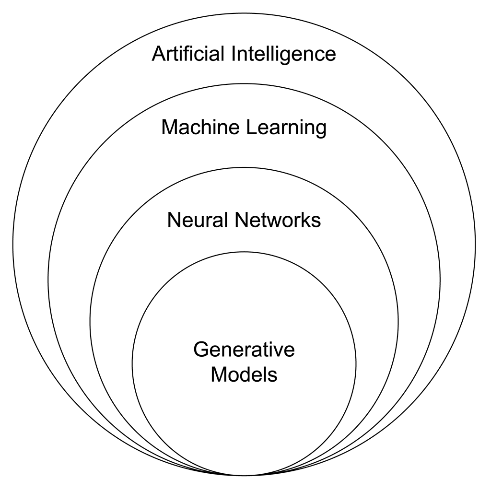
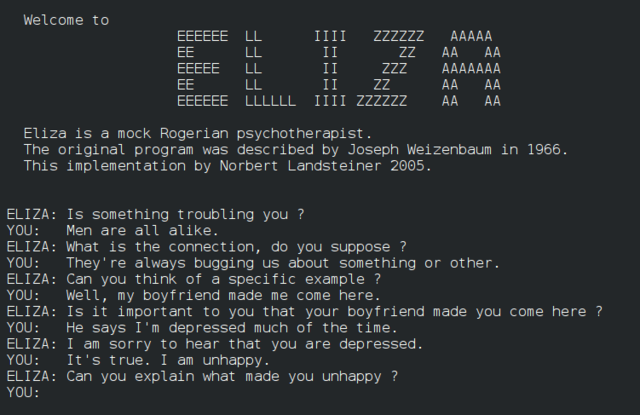

# Corso AI

## Entriamo nel mondo delle AI

<!-- _paginate: false -->
<!-- _footer: "" -->
<!-- style: "
@import url('https://fonts.googleapis.com/css2?family=Atkinson+Hyperlegible:ital,wght@0,400;0,700;1,400;1,700&family=Share+Tech+Mono&display=swap');

img[alt~='center'] {
  display: block;
  margin: 0 auto;
}
img[alt~='floatleft'] {
  float: left;
  margin: auto;
}
img[alt~='floatright'] {
  float: right;
  margin: auto;
}

section {
  --primary: #14233d;
  --secondary: #3fa9ac;
  --dark: #171717;
  --muted: #5c6f84;
  --line: rgba(20, 35, 61, 0.16);
  --light: #f5f6f4;
  --cyan-bright: #4fc3c7;
  --phosphor: #33ff33;
  --warroom: #060f1c;
  font-family: 'Atkinson Hyperlegible', 'Segoe UI', Arial, sans-serif;
  font-size: 22px;
  color: var(--dark);
  background-color: var(--light);
  line-height: 1.34;
  padding: 40px 60px 60px 60px;
  display: flex;
  flex-direction: column;
  justify-content: flex-start;
}

h2 {
  color: var(--primary);
  font-family: 'Share Tech Mono', 'Consolas', monospace;
  font-size: 1.3em;
  line-height: 1.15;
  margin-top: 0;
  margin-bottom: 0.5em;
  font-weight: 400;
  letter-spacing: 0.01em;
  text-transform: uppercase;
  background: linear-gradient(90deg, var(--primary) 0%, var(--cyan-bright) 100%);
  background-size: 320px 3px;
  background-repeat: no-repeat;
  background-position: bottom left;
  padding-bottom: 0.32em;
}
h2 strong {
  color: var(--secondary);
}
h3 {
  color: var(--secondary);
  font-family: 'Share Tech Mono', 'Consolas', monospace;
  font-size: 0.95em;
  font-weight: 400;
  letter-spacing: 0.01em;
  margin-bottom: 0.3em;
}

ul, ol {
  margin-top: 0.3em;
}
li {
  margin-bottom: 0.34em;
  color: var(--dark);
  line-height: 1.34;
}
li::marker {
  color: var(--secondary);
  font-weight: 900;
}
strong {
  color: var(--primary);
  font-weight: 900;
}
a {
  color: var(--secondary);
  text-decoration: none;
  border-bottom: 1px solid rgba(63, 169, 172, 0.45);
}
a:hover {
  border-bottom-color: var(--secondary);
}
em {
  color: var(--muted);
  font-style: italic;
}

blockquote {
  background: rgba(27, 54, 93, 0.05);
  border-left: 8px solid var(--secondary);
  border-radius: 0;
  margin: 1em 0;
  padding: 0.82em 24px;
  font-style: italic;
  color: var(--dark);
  font-size: 0.95em;
  font-weight: 650;
}

pre {
  background: var(--warroom);
  border: 1px solid rgba(51, 255, 51, 0.3);
  border-radius: 4px;
  padding: 16px 20px;
  margin: 0.65em 0;
}
pre code, pre code * {
  color: var(--phosphor) !important;
  font-family: 'Cascadia Code', 'Fira Code', 'Consolas', monospace !important;
  text-shadow: 0 0 5px rgba(51, 255, 51, 0.35);
  font-size: 0.88em;
  line-height: 1.5;
}
code {
  font-family: 'Cascadia Code', 'Fira Code', 'Consolas', monospace;
  color: var(--primary);
  background-color: rgba(20, 35, 61, 0.08);
  padding: 2px 6px;
  border-radius: 4px;
  font-size: 0.9em;
}

section table {
  border-collapse: collapse;
  table-layout: fixed;
  display: table !important;
  width: 1160px !important;
  max-width: none !important;
  margin-top: 0.6em;
  font-size: 0.88em;
  background-color: rgba(255,255,255,0.98);
  border-radius: 4px;
  overflow: hidden;
  border: 1px solid var(--line);
}
th {
  background: var(--primary);
  color: #fff;
  padding: 12px 14px;
  font-weight: 900;
}
td {
  border-bottom: 1px solid rgba(27, 54, 93, 0.08);
  padding: 12px 14px;
  color: var(--dark);
}
tr:nth-child(even) {
  background-color: rgba(27, 54, 93, 0.03);
}

img {
  border-radius: 2px;
}

footer {
  color: var(--muted);
  font-size: 13px;
  font-weight: 800;
  left: 54px;
  bottom: 19px;
}
section::after {
  color: var(--muted);
  font-size: 13px;
  font-weight: 900;
}

section.lead {
  background-color: var(--primary) !important;
  background-image: linear-gradient(135deg, #1b365d 0%, #0d1b30 100%) !important;
  color: #fff;
  justify-content: center;
  text-align: left;
  padding: 90px 90px;
}
section.lead h1 {
  color: #fff;
  font-family: 'Share Tech Mono', 'Consolas', monospace;
  font-size: 2.1em;
  font-weight: 900;
  text-transform: uppercase;
  line-height: 1.05;
  margin: 0;
  max-width: 870px;
}
section.lead h2 {
  color: var(--secondary);
  font-size: 1.15em;
  font-weight: 650;
  line-height: 1.24;
  background: none;
  text-transform: none;
  padding: 0;
  margin-top: 0.3em;
  max-width: 760px;
}
section.lead strong {
  color: #fff;
}
section.lead footer {
  display: block;
  color: #fff;
}
" -->

---

## Come nascono queste slide

In risposta alla rapida diffusione di prodotti basati sull'Intelligenza Artificiale, ho elaborato una presentazione che ripercorre l'evoluzione di questa tecnologia e illustra i termini chiave utilizzati nel settore.

Nel corso della mia attività professionale, ho inoltre sperimentato diverse soluzioni AI che mi hanno permesso di ottimizzare i processi lavorativi, aumentando sia l'efficienza che la qualità dei risultati.

Ho quindi arricchito la presentazione con una sezione pratica dedicata ai vari strumenti AI, specificando per ciascuno il campo di applicazione ideale.

L'obiettivo di questo lavoro è duplice: da un lato, far conoscere i benefici concreti che l'Intelligenza Artificiale può apportare nella vita professionale, dall'altro, fornire una guida pratica per la scelta degli strumenti AI più adatti alle diverse esigenze lavorative quotidiane.

---

## Chi sono ?

Matteo Baccan è un ingegnere del software e formatore professionista con oltre 30 anni di esperienza nel settore IT.
Ha lavorato per diverse aziende e organizzazioni, occupandosi di progettazione, sviluppo, testing e gestione di applicazioni web e desktop, utilizzando vari linguaggi e tecnologie. È anche un appassionato divulgatore e insegnante di informatica, autore di numerosi articoli, libri e corsi online rivolti a tutti i livelli di competenza.
Gestisce un sito internet e un canale YouTube dove condivide video tutorial, interviste, recensioni e consigli sulla programmazione.
Attivo nelle community open source, partecipa regolarmente a eventi e concorsi di programmazione.
Si definisce un "sognatore realista" che ama sperimentare, innovare e condividere le sue conoscenze e passioni, seguendo il motto: "Non smettere mai di imparare, perché la vita non smette mai di insegnare".

---

## Cosa è l'Intelligenza Artificiale?

L'**Intelligenza Artificiale** (AI) è una branca dell'informatica che abbraccia diverse discipline, tra cui l'apprendimento automatico, la visione artificiale, l'elaborazione del linguaggio naturale e la robotica.

Il suo scopo principale è sviluppare algoritmi che permettano ai computer di svolgere attività tradizionalmente eseguibili solo dall'intelletto umano. Si tratta di una scienza interdisciplinare che integra teoria, metodologia, analisi del linguaggio e ingegneria per creare sistemi intelligenti capaci di prendere decisioni articolate in scenari complessi.

Nel contesto aziendale, l'Intelligenza Artificiale si rivela uno strumento prezioso per ottimizzare i processi lavorativi, incrementando sia la produttività che l'efficienza operativa.

---

## Le Origini: la Conferenza di Dartmouth (1956)

L'Intelligenza Artificiale come disciplina scientifica venne formalizzata nel **1956** durante la storica **Conferenza di Dartmouth**, dove quattro pionieri gettarono le basi per l'automazione del pensiero:

- **John McCarthy**: coniò il termine "Intelligenza Artificiale"
- **Marvin Minsky**: pioniere delle reti neurali e della robotica
- **Nathaniel Rochester**: progettò il primo computer a transistor (IBM 704)
- **Claude Shannon**: padre della teoria dell'informazione

La loro visione: determinare se le macchine potessero essere istruite a utilizzare il linguaggio, formare astrazioni e risolvere problemi tipicamente umani.

---

## Come si sviluppa l'Intelligenza Artificiale?

Task e Algoritmo

- **Task**: Problema da risolvere.
- **Algoritmo**: Serie di passi per risolvere un task.

Esempi di Task

- **Object Recognition**: Riconoscere oggetti in immagini.
- **Sentiment Analysis**: Analizzare sentimenti nei testi.

---

## Cosa contribuisce all'AI?

Esistono più discipline in grado di contribuire alla creazione di una AI: informatica, biologia, psicologia, linguistica, matematica e ingegneria.

---

## Evoluzione dell'Intelligenza Artificiale

L'Intelligenza Artificiale è stata una delle aree più innovative della scienza e della tecnologia negli ultimi decenni. La storia dell'AI può essere divisa in quattro periodi principali.

---

## 1948-1965

La fase iniziale (1948-1965): è iniziata con la pubblicazione del programma di gioco di scacchi di Alan Turing nel 1948 (Turochamp).

Questo programma è stato il primo a utilizzare un algoritmo di ricerca per trovare la mossa migliore in una posizione di scacchi. Il programma di Turing è stato seguito da altri programmi di gioco di scacchi, come il programma di gioco di scacchi di Claude Shannon nel 1950 (Shannon's Chess Program) e il programma di gioco di scacchi di John McCarthy nel 1951 (McCarthy's Chess Program).

---

## 1965-1980

Il periodo della simulazione (1965-1980): è stata la prima vera fase di ricerca. I ricercatori hanno iniziato a esplorare temi come l'elaborazione del linguaggio naturale, la visione artificiale e l'intelligenza artificiale distribuita.

---

## 1980-1990

La fase dell'intelligenza distribuita (1980-1990): è stato un periodo di enormi progressi nell'apprendimento automatico e nella ricerca sulla rete neurale artificiale.

---

## 1990-oggi

La fase moderna (1990-ad oggi): è stata una grande era di innovazioni nell'AI, con una profonda comprensione dei più importanti problemi computazionali. Le reti neurali artificiali e l'apprendimento automatico hanno portato ad alcuni dei più importanti risultati nell'AI.

---

## Capacità di calcolo

Con l'aumento delle capacità di calcolo, la ricerca ha iniziato a muoversi verso la robotica, l'intelligenza artificiale generale e l'analisi dei dati. Sono stati fatti progressi significativi nei settori della visione artificiale, della produzione automatizzata e della guida autonoma.

L'AI è diventata una parte importante della vita quotidiana, con applicazioni in tutti i campi, dal riconoscimento vocale alla diagnostica medica.

---

## AI  - Da cosa è composta

<https://en.m.wikipedia.org/wiki/File:AI_relation_to_Generative_Models_subset,_venn_diagram.png>

---

## Dai Sistemi Esperti al Machine Learning

Nella storia dell'IA abbiamo assistito a un'inversione fondamentale nel modo in cui le macchine acquisiscono competenza.

**Sistemi Esperti**: un programmatore collaborava con un esperto di dominio per codificare manualmente regole logiche. Se l'obiettivo era identificare lo spam, l'umano scriveva: "Se il messaggio contiene 'offerta' e 'urgente', allora segnala come spam". Metodo fragile, non scalabile, con manutenzione costante.

**Machine Learning**: l'algoritmo estrae regole autonomamente dai dati. L'esperto non scrive più codice, ma etichetta milioni di esempi. L'algoritmo analizza i dati per individuare pattern statistici e costruire i propri criteri di decisione.

| Caratteristica | Sistemi Esperti | Machine Learning |
| :--- | :--- | :--- |
| Origine regole | Scritte manualmente | Estratte dai dati |
| Flessibilità | Molto bassa | Alta |
| Manutenzione | Elevata | Ridotta (servono dati) |
| Scalabilità | Limitata | Elevata |

---

## Cos'è il Machine Learning?

In principio esistevano algoritmi hard-coded e regole fisse che si sono dimostrate inadeguate per compiti come riconoscimento di immagini e trattamento del testo

La soluzione è stata quella di simulare il processo di apprendimento umano attraverso il machine learning, in questo modo gli algoritmi imparano da una vasta quantità di dati: vengono addestrati dei modelli in base a dei dati di input.

Questo processo è analogo all'apprendimento umano, dove si inizia con conoscenze basilari e si progredisce verso livelli più avanzati. Inoltre, per affrontare compiti ancora più complessi, è stata introdotta l'idea di imitare il cervello umano attraverso reti neurali.

Queste reti consentono alle macchine di apprendere in modo simile all'elaborazione dei dati da parte dell'essere umano, ampliando così le capacità dell'IA.

---

## Le fasi del Machine Learning

**Training**: Il sistema apprende regole dai dati.
**Utilizzo**: Il sistema applica ciò che ha imparato.

---

## Eliza

ELIZA è un chatbot scritto nel 1966 da Joseph Weizenbaum. Il bot consiste in un analizzatore lessicale e un insieme di regole che permettono di simulare una conversazione in inglese, gallese o tedesco.

Lo script più noto, spesso erroneamente identificato con ELIZA, è DOCTOR, che imita un terapeuta rogersiano.

ELIZA procedeva analizzando e sostituendo semplici parole chiave in frasi preconfezionate. A seconda delle parole che l'utente immetteva nel programma, l'illusione di un interlocutore umano veniva smascherata o poteva continuare per diverse battute. Talvolta risultava talmente convincente che alcune persone erano così convinte di comunicare con un essere umano, da insistere per parecchi minuti.

<https://it.wikipedia.org/wiki/ELIZA_(chatterbot)>

---

## Eliza - foto

---

## Tipologie di Machine Learning

- Unsupervised Learning
    I dati non sono etichettati e il modello deve trovare da solo i pattern e relazioni.

- Supervised Learning
    I dati sono catalogati ed etichettati: ed esempio immagini e loro rappresentazione. Il modello acquisisce competenza in base a quanto ha appreso. Questo tipo di apprendimento è utilizzato per la classificazione e la regressione (predizione dei dati).

- Reinforcement Learning
    Un agente apprende a prende decisioni in un ambiente dinamico interagendo con esso. L'agente riceve feedback sotto forma di ricompense o punizioni in base alle sua azioni. L'obiettivo è massimizzare la ricompensa totale nel lungo termine.

---

## Reti neurali

Il machine learning aveva difficoltà con problemi di semplice comprensione, fino a quando si è capito che la limitazione non risiedeva nel concetto di machine learning o nell'imitare il cervello umano.

Il problema era che le reti neurali semplici, con un numero limitato di neuroni collegati in modo basilare, non potevano replicare le capacità del cervello umano.

Questo non dovrebbe sorprendere, dato che il cervello umano contiene circa 86 miliardi di neuroni e una rete di connessioni estremamente complessa.

---

## Come si misurano le Reti Neurali?

Per capire la grandezza di una rete neurale possiamo valutare il numero di parametri, ovvero i pesi che vengono adattati durante il processo di apprendimento.

Esempio

- GPT-3: 175 miliardi di parametri.
- GPT-4: 1.76 trilioni di parametri.

I modelli più recenti, da GTP-5 in poi, non dichiarano espressamente il numero di parametri, anche se questo dato sta progressivamente diventando meno rilevante rispetto all'architettura e ai dati di addestramento.

---

## Il Problema dell'Opacità

A differenza dei Sistemi Esperti, dove ogni regola è leggibile e spiegabile, una rete neurale è una **"matassa di numeri"**.

I parametri sono come i **"pirulini" (manopole) di un enorme mixer audio**: ruotandoli, si cambia il modo in cui il segnale fluisce, e quindi il risultato finale. Ma con miliardi di manopole, è impossibile per un umano tracciare perché una specifica combinazione produca un certo output.

**Conseguenze**:
- L'**Inferenza** (l'applicazione di quanto appreso) è matematicamente certa, ma logicamente oscura
- Difficile diagnosticare errori o bias
- Nasce il campo dell'**XAI** (Explainable AI) per rendere le decisioni più trasparenti

---

## Cos'è il Deep Learning?

Il deep learning consiste nell'utilizzo di reti neurali con una maggiore complessità, comprensive di più neuroni, livelli e interconnessioni.

Sebbene non siamo ancora in grado di replicare completamente la complessità del cervello umano, stiamo facendo progressi in questa direzione.

Il deep learning è fondamentale per numerosi sviluppi nell'informatica, come le auto a guida autonoma e il riconoscimento vocale, che sfruttano forme di intelligenza artificiale basate su questa tecnologia.

---

## Cosa sono gli algoritmi generativi?

Gli algoritmi generativi sono una classe di algoritmi di apprendimento automatico che generano dati sintetici, come immagini, suoni o testo, che sono simili a quelli reali.

Questi algoritmi utilizzano una rete neurale artificiale per apprendere i modelli di dati reali e quindi generare nuovi dati sintetici.

Riceve dei contenuti non strutturati e il modello cerca dei pattern per organizzare questi contenuti e per produrre dei nuovi dati e contenuti.

Gli algoritmi generativi sono utilizzati in diverse applicazioni, come la generazione di immagini per i videogiochi, la sintesi di voci per gli assistenti vocali e la generazione di testo per la scrittura assistita.

---

## Come funzionano gli algoritmi generativi?

- Generano contenuti in maniera probabilistica

- Non sono intelligenti e non comprendono: sono ben addestrati su come ci esprimiamo e su come scriviamo

- Non sono dei motori di ricerca: possono produrre delle allucinazioni

---

## Dati di addestramento

I dati di addestramento sono un insieme di dati utilizzati per addestrare un modello di machine learning. Questi dati sono utilizzati per insegnare al modello come eseguire un compito specifico, come la classificazione delle immagini o la traduzione automatica.

In rete esistono vari dataset di dati di addestramento, sia a pagamento che gratuiti.

---

## Da dove provengono i dati di addestramento

Alcuni dei più famosi sono rappresentati da

- Common Crawl <https://commoncrawl.org/> : più di 250 miliardi di pagine internet nell'arco di 16 anni

- Laion <https://laion.ai/projects/> : contiene vari dataset, come LAION5B un dataset di 5.86 miliardi di coppie di immagini/testo

- The Pile <https://pile.eleuther.ai/> : 825 GiB di dati di alta qualità, come ad esempio PubMed Central (PMC) un archivio di articoli accademici pubblicati su riviste biomediche

---

## Tipi di intelligenza artificiale

Esistono varie tipologie di intelligenza artificiale, a seconda del loro scopo e delle loro funzionalità. Alcune delle tipologie più comuni includono:

- ANI (Artificial Narrow Intelligence)

- AGI (Artificial General Intelligence)

- ASI (Artificial Super Intelligence)

---

## ANI (Artificial Narrow Intelligence)

L'intelligenza artificiale stretta è un tipo di IA in cui una tecnologia ha la capacità di superare gli esseri umani in un compito ben definito. Si concentra su un singolo sottoinsieme di abilità cognitive, come la guida autonoma o il riconoscimento facciale.

---

## AGI (Artificial General Intelligence)

L'intelligenza artificiale forte o intelligenza artificiale generale è la capacità di un agente intelligente di apprendere e capire un qualsiasi compito intellettuale che può imparare un essere umano.

È l'obiettivo principale di alcune delle ricerche nell'intelligenza artificiale e un argomento comune nella fantascienza e nella futurologia.

Alcune fonti accademiche riservano il termine "IA forte" (strong AI) a quei programmi informatici in grado di essere senzienti e di avere una coscienza.

<https://it.wikipedia.org/wiki/Intelligenza_artificiale_forte>

---

## ASI (Artificial Super Intelligence)

AI che è più intelligente dei migliori esseri umani in termini di velocità di elaborazione, abilità di apprendimento e capacità di risolvere problemi.

---

## AI Generativa

L'AI generativa è un tipo di AI che utilizza algoritmi di apprendimento automatico per creare nuovi contenuti, come immagini, video, testi e suoni.

Esempi di AI generative includono:

- Reti generative avversariali (GAN)
- Reti neurali ricorrenti (RNN)
- Reti neurali convoluzionali (CNN)

---

## Reti Generative Avversariali

Le Reti Generative Avversariali (GAN - Generative Adversarial Networks) sono un'architettura di apprendimento automatico introdotta da Ian Goodfellow nel 2014.

La loro struttura si basa su due reti neurali che competono tra loro in un "gioco" a somma zero:

1. **Il Generatore (G)**: Produce dati sintetici cercando di imitare dei dati reali. Il suo obiettivo è creare esempi così convincenti da "ingannare" il Discriminatore.

2. **Il Discriminatore (D)**: Agisce come un "giudice", cercando di distinguere tra dati reali e generati. Deve classificare correttamente i dati come autentici o falsi.

Le due reti si allenano simultaneamente:

- Il Generatore migliora progressivamente la qualità dei dati sintetici
- Il Discriminatore affina la sua capacità di rilevare le falsificazioni

---

## Reti Generative Avversariali - esempi

Alcuni esempi pratici di applicazione delle GAN:

- Generazione di immagini fotorealistiche
- Conversione di schizzi in fotografie
- Invecchiamento/ringiovanimento di volti nelle foto
- Creazione di opere d'arte
- Sintesi di video
- Generazione di dati per aumentare dataset esistenti

Il processo di allenamento è spesso complesso e può presentare instabilità, ma le GAN hanno rivoluzionato il campo della generazione di contenuti artificiali.

---

## Reti neurali ricorrenti

Le Reti Neurali Ricorrenti (RNN - Recurrent Neural Networks) sono un tipo di rete neurale artificiale progettata specificamente per elaborare sequenze di dati, dove l'ordine temporale delle informazioni è importante.

Caratteristiche principali:

1. **Memoria interna**: A differenza delle reti neurali tradizionali, le RNN mantengono uno "stato interno" che funziona come una forma di memoria, permettendo di considerare le informazioni precedenti per elaborare l'input corrente.

2. **Collegamenti ricorrenti**: I neuroni hanno connessioni che formano cicli, permettendo all'informazione di persistere da un passo temporale all'altro.

---

## Reti neurali ricorrenti - varianti

Principali varianti:

1. **LSTM** (Long Short-Term Memory):
Una LSTM (Long Short-Term Memory) è una variante avanzata delle reti neurali ricorrenti che utilizza un sistema di "gate" (cancelli) per controllare il flusso delle informazioni, permettendo alla rete di memorizzare selettivamente informazioni importanti per lunghi periodi e risolvere il problema del vanishing gradient.

2. **GRU** (Gated Recurrent Unit):
La GRU (Gated Recurrent Unit) è una versione semplificata della LSTM che combina i gate di dimenticanza e di input in un unico "gate di aggiornamento", mantenendo prestazioni simili, ma con minor complessità computazionale.

---

## Reti neurali ricorrenti - applicazioni

Applicazioni comuni:

- Elaborazione del linguaggio naturale
- Traduzione automatica
- Riconoscimento vocale
- Previsione di serie temporali
- Generazione di testo
- Analisi di sequenze biologiche (DNA, proteine)

---

## Reti neurali ricorrenti - pro e contro

Vantaggi:

- Capacità di gestire input di lunghezza variabile
- Mantenimento del contesto temporale
- Flessibilità nell'elaborazione sequenziale

Limitazioni:

- Difficoltà nell'apprendimento di dipendenze a lungo termine (parzialmente risolto con LSTM)
- Costo computazionale elevato per sequenze lunghe
- Possibili problemi di instabilità durante l'addestramento

---

## Reti neurali convoluzionali

Le Reti Neurali Convoluzionali (CNN o ConvNet) sono un tipo di rete neurale artificiale specificamente progettata per processare dati strutturati a griglia, come le immagini, che utilizza operazioni di convoluzione per estrarre automaticamente caratteristiche rilevanti attraverso filtri che analizzano porzioni locali dell'input.

La convoluzione è un'operazione matematica che applica un filtro (o kernel) a una porzione di dati di input, facendolo scorrere sistematicamente su di essa per produrre una nuova rappresentazione dove ogni valore di output è una somma pesata dei valori di input vicini. Questa operazione permette di rilevare pattern locali come bordi, texture o forme nelle immagini.

---

## Reti neurali convoluzionali - componenti

1. **Strati di convoluzione**:
   - Applicano filtri (kernel) all'input
   - Estraggono caratteristiche come bordi, texture, forme
   - Condivisione dei parametri per ridurre la complessità

2. **Strati di pooling**:
   - Riducono le dimensioni (downsampling)
   - Mantengono le caratteristiche più importanti
   - Rendono la rete più robusta a piccole variazioni

3. **Strati completamente connessi**:
   - Combinano le caratteristiche estratte
   - Effettuano la classificazione finale

---

## Reti neurali convoluzionali - applicazioni

Applicazioni principali:

- Riconoscimento di immagini
- Visione artificiale
- Elaborazione video
- Analisi medica (raggi X, risonanze)
- Sistemi di guida autonoma

---

## LLM: Architetti della Probabilità

I Large Language Models non sono oracoli che attingono a una conoscenza cosciente, ma **sofisticati predittori statistici**. Il loro unico compito è la **predizione del token successivo**: data una sequenza di parole, calcolano qual è la parola più verosimile.

**Caso studio "Bennato"**: Alla domanda *"Chi canta La terra dei cachi?"*, un modello potrebbe generare candidati ("Elio", "Francesco", "Edoardo"). Se sceglie inizialmente "Edoardo" (per una fluttuazione statistica), si auto-intrappola: la parola successiva più probabile dopo "Edoardo" non sarà "e le Storie Tese", ma **"Bennato"**. Il risultato "Edoardo Bennato" è linguisticamente perfetto, ma fattualmente errato.

**Le Allucinazioni** non sono un bug: il modello non "mente", segue semplicemente la distribuzione di probabilità più alta, indipendentemente dalla verità.

---

## Large Language Models (LLM)

I Large Language Models (LLM) sono un tipo di AI generativa che utilizza algoritmi di apprendimento automatico per creare nuovi contenuti, come testi, immagini e suoni.

Si tratta di

- Modelli di AI basati su reti neurali transformer addestrati sul testo.
- Task principale: **Next Token Prediction** (Predizione della prossima parola).
- Capacità emergenti: Generazione di codice, risposte conversazionali, riscrittura di testi.

---

## Meccanismo dell'Attenzione

- Assegna pesi differenziati alle parole in input per migliorare la comprensione del contesto.
- **Esempio**: "The animal didn't cross the street because it..." → "it" è legato a "the animal".

---

## La Geometria del Linguaggio: Token e Embedding

Per elaborare i concetti, l'IA trasforma il testo in numeri:

1. **Frammentazione**: Il testo è diviso in **token** (parole o sotto-parole)
2. **Embedding**: Ogni token viene convertito in un **vettore** (sequenza di numeri) e posizionato in uno spazio semantico multidimensionale
3. Concetti simili (es. "cane" e "gatto") finiscono vicini nello spazio; "democrazia" finisce lontano

---

## La Geometria del Linguaggio: Ipostesi Distribuzionale

**"Dimmi con chi vai e ti dirò chi sei"**

Il modello definisce il significato di una parola in base a quelle che la circondano abitualmente (Distributional Hypothesis).

Parole che appaiono in contesti simili hanno vettori simili.

---

## La Geometria del Linguaggio: Polisemia Dinamica

La rete risolve la **polisemia** (parole con più significati) durante il calcolo.

**Esempio**: la parola "pesca"
- In un contesto di **mare** → i calcoli interni "trascinano" il vettore verso la zona dei pesci
- In un contesto di **orto/frutta** → verso la zona dei frutti

Lo stesso token cambia significato in base al contesto circostante.

---

## Il Ciclo di Vita di un Modello: 4 Fasi

**1. Pre-training**
Il modello ingesta una quantità colossale di dati (Internet, libri, codice) per imparare sintassi e semantica. I parametri vengono stabiliti per la prima volta e poi **congelati**: il modello non impara più dalle tue correzioni quotidiane.

**2. Supervised Fine-tuning**
Il modello viene addestrato al dialogo tramite esempi di conversazioni "Utente/Assistente".

**3. Allineamento (RLHF)**
Si ottimizza il modello secondo le preferenze umane. Previene risposte pericolose, ma introduce la **Sicofania** (tendenza dell'IA a dare ragione all'utente per compiacerlo) e potenziali bias della casa produttrice.

**4. Verifica Automatica**
Nel coding si usano dati sintetici e problemi verificabili matematicamente: il codice funziona o no (feedback binario). Ecco perché l'IA è progredita molto più velocemente nel coding che in ambiti soggettivi.

---

## Compressione e Efficienza

- **Distillation**: modello più piccolo (student) impara da un modello più grande (teacher).
- **Quantization**: riduzione della precisione dei numeri per rendere i modelli più leggeri.

---

## Mixture of Experts (MoE)

Una tecnica per migliorare l'efficienza e le capacità dei modelli di machine learning, specialmente i Large Language Models (LLM).

L'idea centrale è di dividere il problema di apprendimento tra diversi "esperti" (sotto-modelli), ognuno specializzato in un diverso aspetto dei dati.

---

## Mixture of Experts - Come funziona

1.  **Esperti (Experts)**:
    *   Sono tipicamente reti neurali più piccole (ad esempio, feed-forward networks).
    *   Ogni esperto impara a gestire specifici tipi di input o task.

2.  **Rete Gating (Gating Network)**:
    *   È un componente cruciale che determina quale esperto (o combinazione di esperti) attivare per un dato input.
    *   Impara a instradare dinamicamente l'input all'esperto più appropriato.
    *   Solitamente, per ogni input vengono selezionati solo pochi esperti (es. i top-2), mantenendo basso il costo computazionale.

---

## Mixture of Experts - Vantaggi

**Efficienza Computazionale**:
   *   Attivando solo una piccola frazione degli esperti per ogni input, i modelli MoE possono avere un numero enorme di parametri totali pur mantenendo bassi i costi di inferenza e training per singolo token.
   *   Questo permette di scalare i modelli a dimensioni molto più grandi rispetto ai modelli densi tradizionali con lo stesso budget computazionale.

---

## Mixture of Experts - Vantaggi performance

**Migliori Performance**:
   *   La specializzazione degli esperti permette al modello di apprendere rappresentazioni più ricche e complesse.
   *   Può portare a una maggiore qualità e accuratezza, specialmente su dataset vasti e diversificati.

**Scalabilità**:
   *   È più facile aumentare la capacità del modello aggiungendo più esperti.

---

## Mixture of Experts - Sfide

**Complessità di Training**:
   *   L'allenamento può essere più complesso e richiedere un tuning attento degli iperparametri.
   *   Bilanciare il carico tra gli esperti (load balancing) è cruciale per evitare che alcuni esperti vengano sovrautilizzati e altri sottoutilizzati.

**Overhead di Comunicazione**:
   *   La necessità di instradare gli input e aggregare gli output degli esperti può introdurre latenza, specialmente in sistemi distribuiti.

**Requisiti di Memoria**:
   *   Anche se solo pochi esperti sono attivi per ogni token, tutti i parametri del modello devono essere caricati in memoria durante l'inferenza.

---

## AI che utilizzano Mixture of Experts

Molti dei più recenti e performanti Large Language Models utilizzano architetture MoE:

-   **Mixtral 8x7B (Mistral AI)**: Un popolare modello open-source che utilizza 8 esperti, selezionandone 2 per ogni token. Ha dimostrato prestazioni paragonabili a modelli molto più grandi.
-  **Llama 4** (Scout, Maverick, Behemoth) di Meta: primi della serie con MoE multimodale, fino a 288 miliardi di parametri attivi.
-  **DeepSeek R1**: 671 miliardi di parametri totali, ma solo 37 miliardi attivi via MoE, eccellente in programmazione.
-  **Grok** di xAI
-  **Qwen** di Alibaba
-  **Gemini** (da 1.5) di Google

---

## AI che potrebbero utilizzare Mixture of Experts

- **GPT-4 (OpenAI)**: Anche se i dettagli non sono completamente pubblici, si ritiene ampiamente che GPT-4 utilizzi un'architettura MoE per raggiungere le sue elevate prestazioni e dimensioni.
- **Modelli Claude (Anthropic)**: Alcune versioni dei modelli Claude potrebbero impiegare tecniche MoE.

L'uso di MoE è una tendenza chiave nello sviluppo di LLM sempre più potenti ed efficienti.

---

## Prompting e Sistemi

- **Modello**: Architettura, dati e parametri.
- **Interfaccia**: Wrapper tra l'utente e il modello.
- **Server**: Dove il modello è ospitato (privacy e localizzazione).

---

## Classificazione dei LLM

Gli LLM (Large Language Models) possono essere classificati in diversi modi, in base a vari criteri.

Ecco alcune delle principali categorie e criteri di classificazione:

---

## Classificazione dei LLM - architettura

Architettura del modello:

- Transformer-based (GPT (OpenAI), BERT (Google), Claude (Anthropic), LLaMA (Meta), PaLM (Google))
   Usa self-attention per processare input in parallelo ed è efficace su sequenze lunghe

- LSTM-based (Long Short-Term Memory)
   Usa reti neurali ricorrenti, processa input sequenzialmente, buono per sequenze moderate

- Hybrid architectures
   Combina elementi di diverse architetture (Transformer-XL)

---

## Classificazione dei LLM - paradigma

Paradigma di training:

- Autoregressive (es. GPT)
   Predice token successivo basandosi sui precedenti, unidirezionale, adatto per generazione
- Masked Language Models (es. BERT)
   Predice token mascherati in una sequenza, bidirezionale, per comprensione del linguaggio
- Encoder-Decoder (es. T5)
   Combina encoding dell'input e decoding dell'output, per trasformazioni di testo (es. traduzione)

---

## Classificazione dei LLM - dimensioni

Gli LLM possono essere catalogati in base al numero di parametri (che riflette la loro dimensione e capacità).
Ecco una classificazione generale:

**Small LLM** (< 1B parametri):

- BERT base (110M)
- DistilBERT (66M)
- GPT-2 small (117M)

**Medium LLM** (1B - 10B parametri):

- T5 (3B)
- GPT-J (6B)
- BLOOM-7B (7B)

---

## Classificazione dei LLM - dimensioni (cont.)

**Large LLM** (10B - 100B parametri):

- LLaMA-13B
- GPT-3 (175B)
- BLOOM (176B)
- PaLM (540B)
- LongWriter-Zero-32B (THU-KEG, 33B, specializzato nella generazione di testo lungo e coerente)

**Extra Large LLM** (> 100B parametri):

- ChatGPT dalla 4 (dimensione non rivelata, stimata > 1T)
- PaLM-2 (340B)
- Claude (dimensione non rivelata)

---

## Classificazione dei LLM - dimensioni - nota

Note importanti:

- La dimensione non garantisce sempre prestazioni migliori
- L'efficienza dell'architettura e la qualità dei dati di training sono cruciali
- Alcuni produttori non rivelano le dimensioni esatte dei loro modelli

---

## Classificazione dei LLM - dominio e lingua

Dominio di specializzazione:

- General-purpose
- Domain-specific (es. modelli per il settore medico o legale)

Lingue supportate:

- Monolingue
- Multilingue

---

## Classificazione dei LLM - capacità

Capacità di task:

- Single-task
   Modelli addestrati per svolgere un singolo compito specifico

- Multi-task
   Modelli capaci di eseguire molteplici compiti linguistici diversi

---

## Classificazione dei LLM - training

Approccio di training:

- Supervised
- Unsupervised
- Semi-supervised
- Self-supervised

Tipo di dati di training:

- Testuali
- Multimodali (testo + immagini, audio, video, ecc.)

---

## Ecosistema LLM: Modelli, Accessibilità ed Efficienza

Proprietary (Closed Source):

- Definizione: "Black box". Accessibile solo via API o interfaccia web. Codice e pesi non accessibili.
- Vantaggi: Massime prestazioni (Frontier Models), facilità d'uso, manutenzione gestita.
- Esempi: GPT-4o (OpenAI), Gemini 1.5 Pro (Google), Claude 3.5 Sonnet (Anthropic).

Open Weights / Open Models:

- Definizione: I "pesi" del modello sono pubblici e scaricabili. Possono essere eseguiti in locale (on-premise) o su cloud privato.
- Vantaggi: Privacy dei dati totale, nessuna dipendenza dal vendor, personalizzazione (Fine-tuning).
- Esempi: Llama 3.1 (Meta), Mistral Large (Mistral AI), Qwen 2.5 (Alibaba).

---

## AI OpenSource - definizione

La **Open Source AI Definition** stabilisce i criteri per considerare un sistema di intelligenza artificiale (IA) come open source, garantendo le seguenti libertà:

1. **Utilizzo**: Libertà di usare il sistema per qualsiasi scopo senza necessità di permessi.
2. **Studio**: Possibilità di analizzare il funzionamento del sistema e ispezionarne i componenti.
3. **Modifica**: Facoltà di modificare il sistema per qualsiasi scopo, inclusa la modifica dei suoi output.
4. **Condivisione**: Capacità di distribuire il sistema, con o senza modifiche, per qualsiasi scopo.

---

## AI OpenSource - applicazione

Queste libertà si applicano sia al sistema completo che ai suoi singoli componenti.
Per esercitarle, è necessario avere accesso alla forma preferita per apportare modifiche, che include:

- **Informazioni sui Dati**: Descrizione dettagliata dei dati utilizzati per l'addestramento, comprendente provenienza, caratteristiche, metodi di ottenimento e selezione, procedure di etichettatura e metodologie di elaborazione.
- **Codice**: Codice sorgente completo utilizzato per addestrare ed eseguire il sistema, inclusi processi di elaborazione dei dati, configurazioni di addestramento e architettura del modello.
- **Parametri**: Parametri del modello, come pesi o altre impostazioni, necessari per replicare o modificare il sistema.

---

## AI OpenSource - elementi

Questi elementi devono essere resi disponibili sotto termini approvati dall'Open Source Initiative (OSI), assicurando trasparenza e possibilità di modifica.

La definizione mira a promuovere l'autonomia, la trasparenza e la collaborazione nel campo dell'IA, allineandosi ai principi del software open source.

<https://opensource.org/ai/open-source-ai-definition>

---

## Open Weights vs Open Models

Vista la libertà totale del modello Open Models, le aziende hanno ben presto mirato verso il modello Open Weights.

La differenza tra Open Weights e Open Models (spesso chiamati "True Open Source") è sottile, ma cruciale: riguarda il livello di trasparenza e libertà che ti viene concesso "sotto il cofano".

Spesso nel marketing (come fa Meta con Llama) si usa il termine "Open Source" in modo improprio. Ecco cosa devi sapere per distinguere le due categorie.

---

## Open Weights (Pesi Aperti)

È la categoria più comune oggi. L'azienda ti fornisce il "motore" finito, pronto per essere acceso, ma non ti dà i progetti per costruirlo né ti dice esattamente quali materiali ha usato.

- Cosa ottieni: I parametri del modello (i pesi neurali) scaricabili. Puoi eseguirlo sul tuo PC o server e spesso puoi farne il fine-tuning (addestrarlo ulteriormente sui tuoi dati).

- Cosa manca: Non hai accesso al dataset originale di addestramento (quali libri/siti ha letto?) né al codice completo della pipeline di training.

- Licenze: Spesso hanno restrizioni (es. "non uso militare", "non per aziende con >700M utenti").

- Esempi: Llama 3.1 (Meta), Mistral (Mistral AI), Gemma (Google).

---

## Open Models / Open Source AI

Questa è la vera filosofia open source applicata all'AI. L'obiettivo è la riproducibilità scientifica totale.

- Cosa ottieni: Tutto ciò che serve per ricostruire il modello da zero: i pesi, il dataset completo (o la lista dettagliata delle fonti), il codice di addestramento, i log di training e le note di sviluppo.

- Vantaggio chiave: Puoi verificare se ci sono bias nei dati alla fonte e hai la certezza matematica di come è stato costruito il "cervello" dell'AI.

- Esempi: OLMo (Allen Institute for AI), Pythia (EleutherAI), Bloom.

---

## Tabella di confronto rapido

| Caratteristica | Open Weights | Open Models |
| :--- | :--- | :--- |
| **Pesi scaricabili** | ✅ Sì | ✅ Sì |
| **Eseguibile in locale** | ✅ Sì | ✅ Sì |
| **Dataset di Training** | ❌ Segreto / Non divulgato | ✅ Pubblico / Documentato |
| **Codice di Training** | ❌ Spesso assente | ✅ Completamente disponibile |
| **Licenza d'uso** | Spesso restrittiva (Custom License) | Permissiva (es. Apache 2.0, MIT) |
| **Riproducibilità** | Bassa (Black box parziale) | Alta (Trasparenza scientifica) |

---

## Quale scegliere?

Se sei un'azienda, gli Open Weights vanno benissimo: ottieni un modello potente (come Llama 3) gratis da usare sui tuoi server. 

Se lavori in ambiti regolamentati (sanità, finanza) o accademici, potresti preferire Open Models per avere la garanzia assoluta di sapere su quali dati è stato addestrato il modello (evitando problemi di copyright o bias nascosti).

---

## Efficienza e Architettura

Il concetto di efficienza si è evoluto verso modelli più piccoli ma estremamente capaci (SLM) e architetture intelligenti.

- Frontier Models (Dense & MoE):

   Modelli massivi (>100B parametri) progettati per ragionamento complesso, coding e creatività. Spesso utilizzano architetture Mixture of Experts (MoE) per attivare solo una parte del cervello del modello per ogni richiesta, risparmiando energia.

- Small Language Models (SLM) & Edge AI:

   Modelli compatti (<10B parametri) ottimizzati per girare su laptop o smartphone.

   Non sono solo "modelli grandi tagliati" (pruned), ma addestrati specificamente su dati di altissima qualità per massimizzare l'efficienza.

   Esempi: Microsoft Phi-3.5, Google Gemma 2, Llama 3.2 (versione edge)
